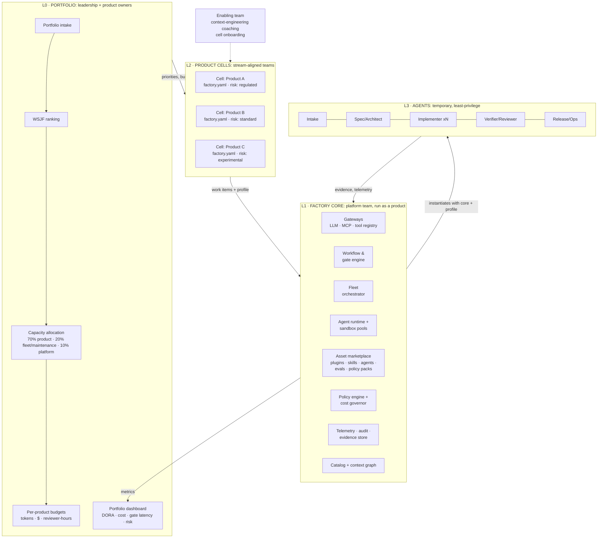
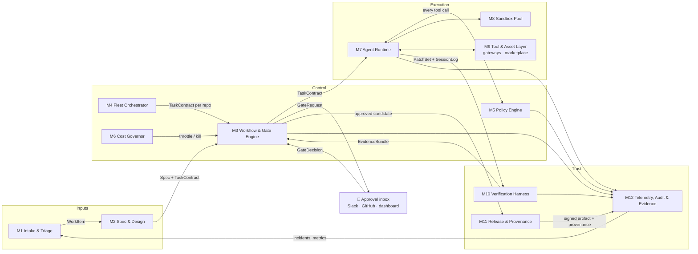
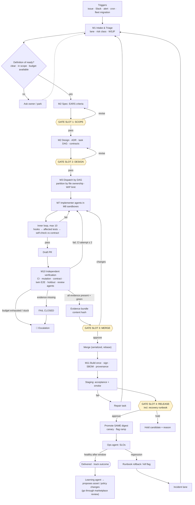
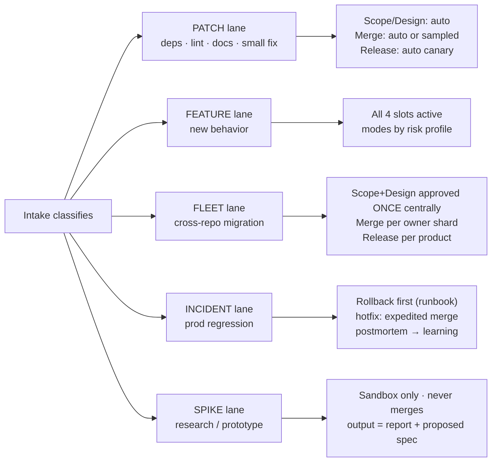
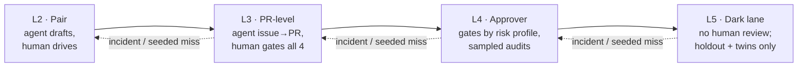
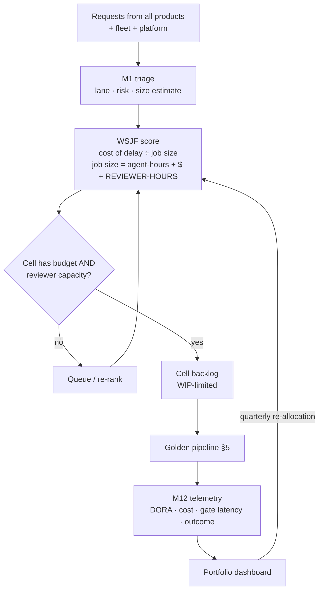
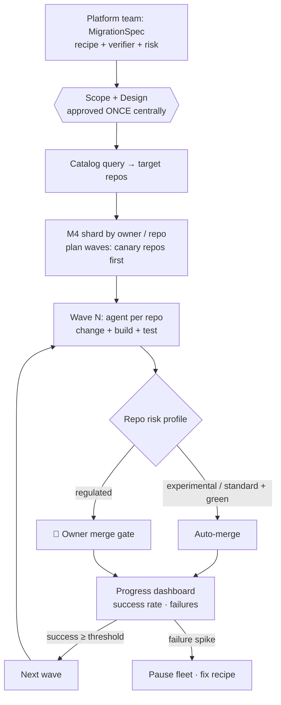
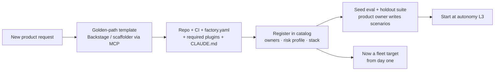
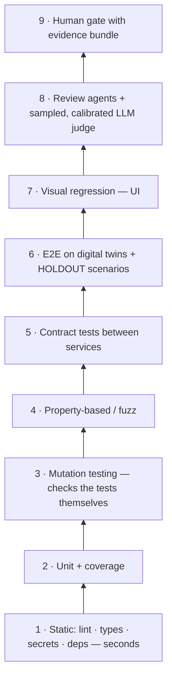
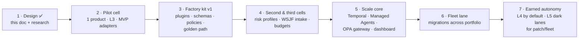

# Claude Software Factory — v3: Portfolio-Scale, Modular Design

> **Phase 1: Flow design** · **v3** · 2026-09-26
> **Idea:** autonomous Claude agents do the software work across a **portfolio** of products. They reach a human **only for approvals and escalations**, and the number of approvals depends on each product's risk.
> **Research basis:** [software-factory-research.md](software-factory-research.md) (55 years of software-factory thinking, about 150 sources). This version also reconciles the earlier Claude v2 design with [codex-software-factory.md](codex-software-factory.md).

**What changed from v2 → v3**

| v2 | v3 |
|---|---|
| One factory, one pipeline | **Four layers:** Portfolio → Factory Core → Product Cells → Agents |
| One set of gates, skippable by tier | **Four fixed gate slots** (Scope · Design · Merge · Release). Each **product risk profile** sets each slot's mode. |
| Components listed | **12 modules behind stable contracts, with swappable adapters** |
| One lane for everything | **Five lanes sized to the task** (patch, feature, fleet migration, incident, spike) |
| Evidence bundle | + **fail closed**, **approval tied to a content hash**, **signed immutable artifact** (from the Codex design) |
| Task = spec + DAG | **Typed contracts:** `factory.yaml`, Spec (EARS), Task Contract, Evidence Bundle, Gate Decision |
| Autonomy per action class | **Autonomy dial per product × action class**, on Shapiro's levels L0–L5 |
| — | **Fleet migrations, golden-path onboarding, WSJF portfolio intake, nested budgets** |

---

## 1. Design principles

These principles come from 55 years of factory attempts and 2025–26 practice.

1. **Shared core, product profiles.** Build one managed factory core and give each product a config profile, not its own platform. Shopify, Uber and Stripe work this way.
2. **Verification caps autonomy.** Build oracles the agents can't game before adding agents: holdout scenarios, mutation testing, digital twins.
3. **Contracts over conversations.** Every handoff between modules is a typed, versioned artifact.
4. **Separate fleet orchestration from the change agent.** Any agent can be dropped in, and the pipeline stays the same.
5. **Fixed gate slots, variable gate modes.** The structure is the same everywhere, and the strictness depends on risk.
6. **Fail closed.** Missing, skipped or unknown evidence counts as a fail. A timeout never approves.
7. **Agents never verify or approve their own work.** Tests, CI config and policies are read-only to agents.
8. **Human review is the scarce resource.** Set WIP limits from reviewer capacity, not compute.
9. **The ceremony matches the task size.** A typo fix doesn't go through the same process as a payment feature.
10. **Thinnest viable factory first.** Earn adoption, keep templates cheap to change, and version everything.

---

## 2. The four-layer operating model



| Layer | Owned by | Owns | Humans do |
|---|---|---|---|
| **L0 Portfolio** | Leadership, product owners | Priorities, capacity split, budgets, portfolio risk posture | Rank and fund work; review the dashboard |
| **L1 Factory core** | Platform team | Shared modules, golden paths, floor policy, marketplace | Build and run the factory; approve changes to policy and assets |
| **L2 Product cell** | Product owner + tech lead + 1–3 engineers | `factory.yaml`, backlog, specs, domain context, product evals, approvers | Own intent; approve at the gate slots; handle escalations |
| **L3 Agents** | Created from core + profile | One task at a time, in a sandbox | Nothing, unless something escalates |

### What is central, federated and local

| Concern | **Central** (core, not negotiable) | **Federated** (core default, a cell may *tighten* or extend) | **Local** (cell) |
|---|---|---|---|
| Model and tool access | LLM and MCP gateways, auth, PII redaction | The tool subset per cell | Product MCP servers (registered centrally) |
| Policy | Floor policy: secrets, licenses, no prod credentials for agents, forbidden actions | Risk-profile packs (regulated / standard / experimental). Overrides **can only tighten.** | Repo rules, CLAUDE.md, path-scoped rules |
| Assets | Marketplace, versioning, stable and beta channels, eval harness | Shared agents and skills (inner source) | Product skills, prompts, eval datasets |
| Gates | The gate engine, the 4 slots, fail-closed | Gate *modes* per risk profile | Approver names, acceptance criteria |
| Budgets | Pricing, attribution, hard caps, kill switch | Per-product allocation from L0 | Spend within its own queue |
| Priority | WSJF framework, capacity split | Quarterly allocation | Backlog order |
| Change scope | Fleet migrations (orchestrator, sharding by owner) | Opt-in waves; auto-merge eligibility by tier | Feature work |
| Scaffolding | Golden-path templates | Per-stack template variants | Instantiated repo + `factory.yaml` |
| Observability | Telemetry, audit, portfolio dashboard | Shared SLOs, DORA metrics | Product KPIs |

---

## 3. Modular architecture: 12 modules, stable contracts, swappable adapters

Every module sits behind a **contract**, and every external dependency sits behind an **adapter**. You can swap Claude Code for another agent, GitHub for GitLab, or E2B for Managed Agents, and the rest of the factory doesn't change. This reuses the "triple adapter" pattern from Composio and dewantrie.



| # | Module | Responsibility | Contract in → out | MVP adapter | Scale adapter |
|---|---|---|---|---|---|
| M1 | **Intake & Triage** | Normalize requests; dedupe; set the lane, risk class and WSJF inputs | Event → `WorkItem` | GitHub Issues + Haiku agent | + Slack, Linear, Sentry, cron |
| M2 | **Spec & Design** | EARS/Gherkin spec, design/ADR, task DAG | `WorkItem` → `Spec`, `TaskContract[]` | Spec Kit / OpenSpec files in repo, Opus agent | Same + spec registry |
| M3 | **Workflow & Gate Engine** | Lane state machine; the 4 gate slots; durable waits; retries | `TaskContract`, `EvidenceBundle` → `GateRequest`, state | GitHub labels + Actions + Environments | **Temporal** (or Step Functions) |
| M4 | **Fleet Orchestrator** | Cross-repo changes: target → shard by owner → waves → track | `MigrationSpec` → `TaskContract` per repo | Script over the catalog + Actions matrix | Fleetshift/Rosie-style service |
| M5 | **Policy Engine** | auto / notify / approve / forbid for each action | `ActionRequest` → `Decision` | PreToolUse hooks + managed settings | OPA/Cedar at the tool gateway |
| M6 | **Cost Governor** | Nested budgets; attribution; escalation 50→75→90→100% | usage events → throttle, kill | `max_turns` / `max_budget_usd` | LLM gateway (LiteLLM etc.) + tagging |
| M7 | **Agent Runtime** | Run role agents against a task | `TaskContract` → `PatchSet`, `SessionLog` | `claude -p` / Agent SDK | Claude Managed Agents, worker pool |
| M8 | **Sandbox Pool** | Isolated, disposable workspaces | create / exec / snapshot / destroy | git worktree + Docker | Managed Agents sandboxes / E2B / Modal, pre-warmed |
| M9 | **Tool & Asset Layer** | MCP gateway, skills, plugins, agents, policy packs | registry lookups | `.claude/` + one plugin marketplace repo | MCP gateway + registry with stable and beta channels |
| M10 | **Verification Harness** | The 9-layer pyramid; holdout scenarios; independent verifier | `PatchSet` → `EvidenceBundle` | CI + reviewer agent | + mutation testing, digital twins, sampled LLM judge |
| M11 | **Release & Provenance** | Build once, sign, promote the same digest; canary; runbook | candidate → signed artifact → deploy | GitHub Actions + Environments | + SLSA L3, Sigstore, progressive delivery |
| M12 | **Telemetry, Audit & Evidence** | OTel traces, immutable audit, evidence store, dashboards | all events → metrics | Claude Code OTel → Grafana/Langfuse | + portfolio dashboard, cost attribution |

---

## 4. Core contracts (the modular "API" of the factory)

### 4.1 `factory.yaml`: the product cell profile

Every repo in the portfolio carries one of these. The core reads it to configure agents, gates, budgets and policies.

```yaml
# factory.yaml — lives at the root of each product repo
product: billing-api
cell:
  product_owner: "@alice"
  tech_lead: "@bob"
  approvers: { scope: ["@alice"], design: ["@bob"], merge: ["@bob", "@carol"], release: ["@bob"] }
risk_profile: regulated          # regulated | standard | experimental (see §6)
autonomy_level: L3               # current Shapiro level; promoted by metrics (see §6.3)
stack: python-fastapi
golden_path: backend-service@v4  # template it was scaffolded from
plugins:
  required: ["factory-core@stable", "python-stack@stable", "security-pack@stable"]
  optional: ["pci-pack@stable"]
lanes_enabled: [patch, feature, fleet, incident, spike]
gates:                           # may only TIGHTEN the risk-profile defaults
  release: two_human
budgets:
  monthly_usd: 1500
  per_run_usd: 15
  reviewer_hours_per_week: 10    # → WIP limit
verification:
  required: [lint, types, unit, mutation, contract, e2e_twin, holdout]
  mutation_score_min: 0.70
  holdout_suite: evals/holdout/
forbidden_paths: ["infra/prod/**", ".github/workflows/**", "tests/holdout/**"]
```

### 4.2 Spec (spec-anchored, EARS acceptance criteria)

```markdown
# specs/billing/rate-limit.md  (v3)
## Intent
Protect billing API from abuse without harming normal customers.
## Requirements (EARS)
- R1: WHEN a client exceeds 100 requests/min per api_key, THE SYSTEM SHALL respond 429 with a Retry-After header.
- R2: WHILE a client is under the limit, THE SYSTEM SHALL add < 2 ms p95 latency.
## Non-goals
- Per-endpoint limits.
## Scenarios (holdout suite lives separately; agents cannot read it)
```

### 4.3 Task contract

This merges the Codex task contract with the research findings.

```yaml
task_id: BILL-4821
lane: feature
objective: "Add rate-limit middleware returning 429 + Retry-After"
refs: { spec: "specs/billing/rate-limit.md@v3", adr: "docs/adr/017.md", base_commit: "<sha>" }
depends_on: []
scope:
  allowed_paths: ["services/billing/**", "tests/billing/**"]
  forbidden_paths: ["services/auth/**", "infra/**", "tests/holdout/**"]
acceptance_criteria:
  - { id: R1, check: "pytest tests/billing/test_rate_limit.py::test_over_limit" }
  - { id: R2, check: "bench/rate_limit_latency.py --p95-max-ms 2" }
  - { id: REG, check: "pytest services/billing --cov-fail-under=90" }
budgets: { max_inner_iterations: 10, max_ci_attempts: 2, max_minutes: 30, max_usd: 5 }
definition_of_ready: [spec_frozen, criteria_executable, no_open_questions]
definition_of_done: [criteria_pass, mutation_score>=0.70, static_checks_pass, evidence_bundle_signed]
escalation: { on_ambiguity: ask_owner, on_budget: halt_and_report, on_scope_violation: block }
max_diff_lines: 400
```

### 4.4 Evidence bundle and gate decision

```yaml
evidence_bundle:
  task_id: BILL-4821
  content_hash: "sha256:…"        # approval is tied to this; any change voids it
  diff: "<raw diff link>"         # raw, not only an AI summary
  checks: { lint: pass, types: pass, unit: pass, mutation: 0.78, contract: pass, e2e_twin: pass, holdout: 47/48 }
  missing_checks: []              # anything here = FAIL (fail closed)
  risk: { class: approve, rule_fired: "policy/regulated/payments.rego#L12", blast_radius: ["billing-api"] }
  rollback: { runbook: "runbooks/billing-rollback.md", tested: true }
  cost: { usd: 3.12, tokens: 1.4M, cache_hit: 0.88 }
  provenance: { untrusted_inputs_read: ["issue #4821 body"], agent_versions: {implementer: "implementer@2.3.0"} }

gate_decision:
  gate: merge
  decision: approve               # approve | edit | reject | hold
  approver: "@bob"
  content_hash: "sha256:…"        # must match the bundle
  reason: "…"
  timestamp: "…"
```

---

## 5. The golden pipeline: four gate slots and five lanes

### 5.1 Master pipeline



Each ⬡ **gate slot** runs in the mode set by the product's risk profile (§6): `auto`, `sampled`, `human` or `two_human`. The **structure never changes**; only the mode does.

### 5.2 Five lanes, sized to the task



---

## 6. Risk profiles, gate modes and the autonomy dial

### 6.1 Gate modes by risk profile (defaults)

| Gate slot | Experimental | Standard | Regulated (PII, payments, auth) |
|---|---|---|---|
| **Scope** | auto | human (PO) | human (PO) |
| **Design** | auto | sampled (TL audits 1 in 5) | human (TL + security) |
| **Merge** | auto if green | human (1) | two_human |
| **Release** | auto canary + auto-rollback | human (1), unless low-risk and within the error budget | two_human + change record |

A cell can **tighten** these in `factory.yaml`, but it can never loosen them. The core floor policy (§8) applies to every profile.

### 6.2 Action-class tiers (policy engine M5)

| Action class | Default tier |
|---|---|
| Docs, comments, test-only changes, lint/format | ✅ auto |
| Patch/minor dependency bumps (signed, CI green, no license change) | ✅ auto |
| Small refactor or bug fix behind a flag, with the full pyramid green | ✅ auto → 🔔 notify |
| New feature behind a default-off flag | 🔔 notify, then 🧑 approve before the flag goes above 0% |
| Major or new dependency, CI/CD edits | 🧑 approve (batched daily) |
| Additive schema migration | 🧑 approve + rollback plan |
| Destructive migration, data deletion or backfill | 🧑🧑 two approvers, expand/contract pattern only |
| Auth/authz, crypto, sessions, payments | 🧑 approve + security reviewer (🧑🧑 for payments) |
| Infra/IaC apply | 🧑 approve with a plan artifact |
| Rotate or create credentials, widen IAM | 🧑🧑 two approvers |
| Spend above budget, new paid service | 🧑 approve; hard kill at the cap |
| Read prod secrets or prod data, force-push to main, disable tests, **edit tests/holdout, CI config or own policy**, egress to hosts not on the allowlist | ⛔ forbidden |

### 6.3 Autonomy dial (Dan Shapiro's levels), earned per product and action class



**Promotion criteria**, all required over a rolling window:
- N clean runs in the action class
- change-failure rate below the threshold
- holdout pass rate at or above the target
- human rejection rate above 0 and stable
- no escaped Sev-1/2 incidents

**Demotion** is automatic after an incident, or after a reviewer misses a seeded item that should have been rejected. L5 is allowed **only for the patch and fleet lanes of experimental or standard products**, never for regulated ones.

---

## 7. Portfolio flows

### 7.1 Portfolio intake → delivery → re-prioritization



### 7.2 Fleet migration (one change across many repos)



### 7.3 New product onboarding (golden path)



---

## 8. Security baseline (floor policy for every product)

These rules come from real incidents and the OWASP Agentic Top 10 (2026).

1. **No prod credentials or prod data for agents.** Deployments go through M11, which holds its own identity.
2. **Tests, CI config, holdout suites and policies are read-only to agents.** They change only through human-reviewed PRs.
3. **An independent verifier recomputes pass/fail** from source. It never trusts logs the agent reports.
4. **Untrusted text (issues, PRs, web) never meets secrets or egress.** This breaks the "lethal trifecta" of private data + untrusted content + a way to send data out. Short-lived, scoped tokens.
5. **Budgets are enforced outside the agent** by M6, with an automatic kill.
6. **Work is partitioned by file ownership,** and merges are serialized with a rebase.
7. **Every agent has its own identity.** The audit log is immutable, and the kill switch is tested.
8. **Approvals show the raw diff and action,** not only an AI summary. An approval is tied to a content hash.
9. **Supply chain:** pinned and signed plugins and MCP servers; SBOM; SLSA provenance; build once and promote the same digest.
10. **Changes to factory assets** (agents, skills, policies) go through marketplace review + an eval regression before reaching the stable channel.

---

## 9. Verification pyramid (M10)



Checks run cheapest first, and each layer runs only if the one below it passed. Which layers are required is set per product in `factory.yaml`.

---

## 10. Budgets and economics

| Level | Budget | Enforcement |
|---|---|---|
| Step | Max tokens per tool loop | Agent SDK `max_turns` |
| Run / task | $5–25, up to 10 inner iterations, 2 CI attempts | `max_budget_usd` + M6 |
| Product (monthly) | From L0 allocation | Gateway tags (product, repo, cost center). Untagged requests are rejected. |
| Portfolio | Quarterly | Dashboard; re-allocation |

- **Escalation:** 50% inform → 75% notify owner → 90% switch to a cheaper model → 100% reject.
- **Forecast on p95**, because agent usage has heavy tails.
- **Model routing:** `claude-haiku-4-5` for triage and docs, `claude-sonnet-5` for implementation, security and QA, `claude-opus-5-5` for spec, architecture, final review and learning.
- **Levers:** prompt caching (about 90% off cached input), Batch API for non-urgent fleet work (about 50% off), pre-warmed sandboxes.
- **The real constraint is reviewer-hours,** so they are budgeted in `factory.yaml` and drive WIP limits.

---

## 11. Metrics

| Group | Metrics |
|---|---|
| **DORA (5)** | Change lead time · deployment frequency · failed-deployment recovery time · change fail rate · **deployment rework rate** |
| Factory flow | Issue → prod lead time · % of work with no human touch · escalations per week · time waiting at each gate slot |
| Quality | First-pass CI rate · mutation score · holdout pass rate · escaped defects · **churn and duplication** (GitClear-style) |
| Oversight health | Rejection rate (should be above 0) · approval latency · seeded-item catch rate · review minutes per PR |
| Cost | $ per *accepted* change · tokens per task · cache hit rate · spend vs budget per product |
| Reuse | Usage of marketplace assets · contributions from cells (Toshiba-style reuse metrics) |
| Outcome | The product KPI defined at the Scope gate, the thing the work was meant to achieve |

**Lines of code and PR counts are not success metrics.**

---

## 12. Claude implementation stack

| Module | Claude / ecosystem implementation |
|---|---|
| M7 Agent runtime | `claude -p --output-format json` → Agent SDK (`query()`, `agents` map) → **Claude Managed Agents** at scale |
| Role agents | `.claude/agents/*.md` with `model`, `tools`, `isolation: worktree`, **distributed as plugins** |
| M9 Assets | **Plugin marketplace repo** with `factory-core`, `<stack>-stack`, `security-pack`, `pci-pack`, and stable/beta channels = two marketplaces pinned to different refs |
| Central governance | Managed settings: `enabledPlugins`, `extraKnownMarketplaces`, `strictKnownMarketplaces`, `allowManagedHooksOnly` |
| M5 Policy | PreToolUse hooks (exit code 2 = block + reason to Claude) → OPA at the tool gateway; `canUseTool` for approvals |
| M3 Gates | MVP: `anthropics/claude-code-action` (label, assignee and `@claude` triggers) + labels + GitHub Environments with required reviewers. Scale: Temporal signals. |
| Scheduled work | **Routines** (`/schedule`) for nightly triage, dependency updates, flaky tests and fleet waves |
| Notifications | Notification hook → Slack; interactive approval buttons → signed webhook → resume |
| M12 Telemetry | Claude Code OpenTelemetry export → Langfuse or Grafana; usage and cost per session |
| Cost | `max_turns`, `max_budget_usd`, automatic prompt caching, Batch API |

### Factory kit repository layout

```text
factory-kit/                         # the L1 core's asset marketplace (one git repo)
├── .claude-plugin/marketplace.json  # lists plugins; stable/beta = different refs
├── plugins/
│   ├── factory-core/                # agents: intake, spec, architect, implementer, verifier, release, ops, learning
│   │   ├── agents/  skills/  hooks/  .mcp.json
│   ├── python-stack/  node-stack/   # stack rules, skills, test commands
│   ├── security-pack/               # security reviewer agent, SAST skills, PreToolUse guards
│   └── pci-pack/                    # regulated-profile extras
├── policies/                        # OPA/Rego: floor + experimental/standard/regulated packs
├── lanes/                           # lane definitions (patch, feature, fleet, incident, spike)
├── schemas/                         # factory.yaml, task-contract, evidence-bundle, gate-decision JSON Schemas
├── templates/                       # golden paths (backend-service, web-app, worker)
├── evals/                           # regression suite for the factory's own agents/prompts
└── workflows/                       # reusable GitHub Actions (MVP gate engine)
```

---

## 13. Roadmap with exit criteria



| Phase | Build | Exit criteria |
|---|---|---|
| **1 Design** (now) | This doc; choose the pilot product; name gate owners | The team can trace one feature, one failed check and one prod failure through the flow **with no undefined owner or transition** |
| **2 Pilot cell** | 1 repo, `factory.yaml`, feature and patch lanes, claude-code-action, Environments, verification layers 1–3 | One small feature goes end to end with linked evidence; rollback rehearsed; fail-closed shown working |
| **3 Factory kit v1** | Plugin marketplace, schemas, floor policy, 1 golden path, eval suite for the agents | Pilot runs entirely from kit plugins; a kit version bump passes the eval regression |
| **4 Multi-cell** | 2–3 more products with different risk profiles; WSJF intake; budgets | Each cell onboarded in under 1 day through the golden path; cost attributed per product |
| **5 Scale core** | Temporal, Managed Agents sandboxes, OPA gateway, portfolio dashboard | Interrupted runs resume without duplicate side effects; gates wait days with no worker running |
| **6 Fleet lane** | Fleet orchestrator, owner sharding, waves | One migration across all repos with auto-pause on a failure spike |
| **7 Earned autonomy** | Promotion and demotion automation, seeded audits, holdouts and twins | Autonomy promoted by metrics, with stability (DORA) not falling |

---

## 14. Decisions to settle before Phase 2

| Decision | Proposed starting position |
|---|---|
| Pilot product | A small web app or API with a measurable outcome and a *standard* risk profile |
| Portfolio inventory | List every product with its owner, stack, repo and risk profile, as the seed for the catalog |
| Repo topology | Keep existing repos; use a catalog + fleet orchestrator. Consider a monorepo only for new products. |
| Gate owners | Name the PO, TL, maintainer, release owner and incident owner **per product** |
| Workflow engine | GitHub labels + Actions for the MVP; Temporal from Phase 5 |
| Sandbox | Worktree + Docker for the MVP; Managed Agents sandboxes at scale |
| Budgets | $15 per run and $1,500 per product per month as initial caps; calibrate from pilot data |
| Autonomy start | **L3 everywhere**; promote only from metrics |

---

## 15. Key sources

Full list (about 150 sources): [software-factory-research.md §9](software-factory-research.md#9-sources).

- [Uber: managed software factory](https://newsletter.port.io/p/how-uber-built-a-software-factory) · [Spotify: Honk + Fleetshift](https://engineering.atspotify.com/2026/6/code-with-claude-coding-is-no-longer-the-constraint) · [Shopify: Aquifer](https://shopify.engineering/under-the-river) · [Stripe Minions](https://stripe.dev/blog/minions-stripes-one-shot-end-to-end-coding-agents-part-2) · [Google LSC/Rosie](https://abseil.io/resources/swe-book/html/ch22.html)
- [Dan Shapiro: Five levels](https://www.danshapiro.com/blog/2026/01/the-five-levels-from-spicy-autocomplete-to-the-software-factory/) · [StrongDM factory](https://www.strongdm.com/blog/the-strongdm-software-factory-building-software-with-ai) · [Osmani: Software factories](https://addyosmani.com/blog/software-factories/) · [BCG Platinion](https://www.bcgplatinion.com/insights/the-agentic-software-factory) · [Anthropic AI-native SDLC](https://claude.com/blog/how-anthropic-secures-its-ai-native-software-development-lifecycle)
- [Cusumano: The Software Factory](https://www.gregorystrachta.com/resources/Touchstones/swp-3268-23661042.pdf) · [GAO-23-105611](https://www.gao.gov/assets/gao-23-105611.pdf) · [Team Topologies: platform](https://teamtopologies.com/platform-engineering)
- [Fowler/Böckeler: SDD](https://martinfowler.com/articles/exploring-gen-ai/sdd-3-tools.html) · [Spec Kit](https://github.com/github/spec-kit) · [OpenSpec](https://github.com/Fission-AI/OpenSpec/) · [Agent Contracts](https://arxiv.org/pdf/2601.08815) · [SLSA](https://slsa.dev/spec/v1.2/build-track-basics)
- [DORA 2025](https://dora.dev/dora-report-2025/) · [METR RCT](https://metr.org/blog/2025-07-10-early-2025-ai-experienced-os-dev-study/) · [Faros](https://www.faros.ai/blog/lab-vs-reality-ai-productivity-study-findings) · [OWASP Agentic Top 10](https://genai.owasp.org/resource/owasp-top-10-for-agentic-applications-for-2026/)
- [Claude Code plugins for orgs](https://code.claude.com/docs/en/plugins/org) · [Agent SDK permissions](https://code.claude.com/docs/en/agent-sdk/permissions) · [claude-code-action](https://github.com/anthropics/claude-code-action) · [Managed Agents](https://platform.claude.com/docs/en/managed-agents/overview) · [Temporal HITL](https://docs.temporal.io/ai/cookbook/human-in-the-loop-python)
- [dewantrie/ai-software-factory](https://github.com/dewantrie/ai-software-factory) · [Composio agent-orchestrator](https://github.com/ComposioHQ/agent-orchestrator) · [genai-jerry/claude-software-factory](https://github.com/genai-jerry/claude-software-factory)
