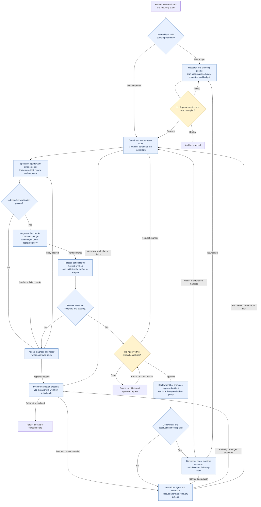
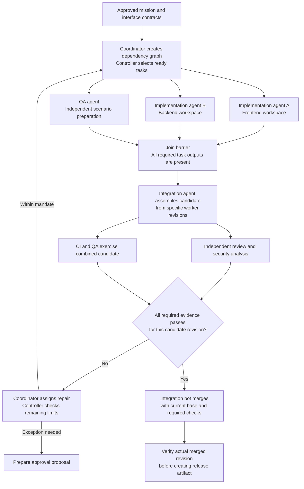
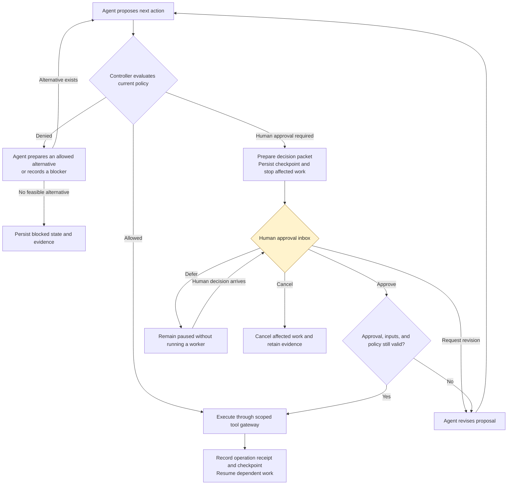
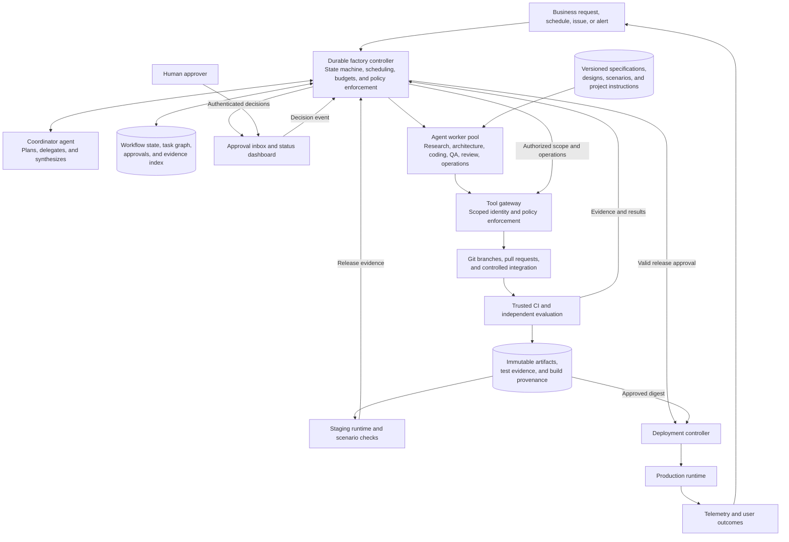

# Codex Software Factory — Autonomous Agents with Human Approvals

Research updated: **26 September 2026**  
Phase: **Workflow and architecture design**  
Status: **Proposed design; the factory is not implemented yet.**

**The intended factory:** a coordinated team of autonomous agents and automation bots researches, plans, builds, tests, reviews, integrates, releases, and operates software. Humans supply the business intent and approve prepared decisions. Agents carry out the work between those decisions, including diagnosing and repairing failures.

The normal human interaction is an **approval inbox**: approve a mission, approve a production release, or approve a proposed exception. Routine task assignment, implementation choices, test execution, code review, merge preparation, and troubleshooting belong to the factory.

This document is a proposed synthesis of primary-source research by three parallel research agents plus a review of official OpenAI documentation. Source links distinguish documented capabilities and reported experiments from this design's recommendations. The first product is assumed to be a web application or API; the runtime and release steps can be adapted later.

## 1. Operating model

There are three cooperating parts:

| Part | Responsibility |
| --- | --- |
| **Agent team** | Research, reason, propose plans, write code, design tests, evaluate results, repair failures, and prepare decisions |
| **Factory controller** | Persist workflow state, schedule work, enforce dependencies and budgets, check permissions, validate evidence, pause for approvals, and resume execution |
| **Human approver** | Approve outcomes, commitments, production releases, and proposed changes to the factory's authority |

The coordinator agent decides how to pursue an approved goal. The controller enforces what is authorized. An agent's completion message is an input to verification, not permission to merge or deploy.

**Recommended default:** approve the mission and execution plan once; allow autonomous work and routine merges within that mandate; require approval for each production release and for actions outside the mandate. A standing maintenance mandate can cover repeated dependency updates or defect repair without a fresh kickoff approval every time.

The mandate identifies the outcome, acceptance scenarios, architectural constraints, repositories, data access, spending limit, concurrency, allowed environments, release policy, and recovery actions. Agents draft these details from the initial intent and existing context before presenting them for approval. Preliminary research uses a preconfigured discovery allowance; H1 authorizes the proposed implementation scope and budget.

## 2. Main factory flow

Yellow diamonds are human decisions. Blue boxes and diamonds belong to agents, bots, or the controller. The exception path applies throughout the workflow.

Every transition remains subject to the approved scope and policy. Integration conflicts, combined-test failures, or failed builds enter the same bounded repair path. The factory rechecks permissions and evidence before a side effect even when the diagram shows a direct arrow.

**Expected human experience:** receive a concise plan for approval, let the agents execute, then receive a working preview and release proposal. An unresolved issue arrives as a concrete decision with alternatives and a recommendation.

## 3. Agent and bot responsibilities

These are logical roles. Several roles can share a runtime, and workers start only when needed. An agent uses model reasoning; a bot can perform deterministic actions such as running CI or promoting an artifact.

| Role | Autonomous work | Required output |
| --- | --- | --- |
| **Research / product agent** | Research the domain, inspect existing systems, identify requirements and assumptions, draft acceptance scenarios | Sourced findings, product specification, assumptions, proposed success criteria |
| **Architecture / planning agent** | Define interfaces, data model, implementation approach, task dependencies, and recovery design | Design decisions, interface contracts, task graph, cost estimate |
| **Coordinator agent** | Delegate tasks, assess progress, synthesize results, diagnose blocked work, propose replanning | Work assignments, progress record, consolidated approval proposals |
| **Implementation agents** | Build independent frontend, backend, data, or infrastructure changes in isolated workspaces | Branches or patches, implementation tests, documentation, execution evidence |
| **QA / scenario agent** | Prepare acceptance checks from approved intent and exercise the product independently | Scenario suite, browser/API results, regressions, reproducible failures |
| **Review / security agent** | Inspect diffs, assess design conformance, analyze scan results, identify correctness and security problems | Structured findings linked to code and evidence |
| **Integration bot / agent** | Collect verified changes, resolve conflicts, run combined checks, and merge eligible work | Verified integration revision and traceable merge record |
| **Release / deployment bot** | Build artifacts, deploy staging, prepare the release packet, execute approved production rollout | Artifact digest, staging preview, release evidence, deployment receipt |
| **Operations agent** | Observe service health, investigate incidents, execute approved recovery, create improvement tasks | Incident evidence, recovery results, proposed fixes, outcome report |

The controller, approval service, CI results, and permission enforcement remain outside worker-controlled instructions. Workers cannot grant themselves broader access, approve their own release, or weaken required checks.

## 4. Fan-out, verification, and integration

The coordinator creates a dependency graph. The controller runs only ready tasks, with explicit file ownership and concurrency limits. Research, independent modules, test design, and review can run in parallel. Tasks sharing a schema or interface wait for the relevant contract.

The join and verification gates are **AND conditions**: every required predecessor must finish successfully. A single completed worker or favorable review cannot advance the workflow. If the base branch changes, refresh the integration candidate and rerun affected checks before merging.

Workers write in separate workspaces. A worktree separates edits; an execution sandbox restricts access. Conflicts become integration-agent repair tasks and go through verification again. Routine merge authority is granted to the integration bot by the approved policy, without a separate human code review for every pull request.

Keep acceptance criteria and release policies in protected, versioned records. Implementation agents can add tests but cannot silently redefine acceptance or remove failing checks. The QA agent evaluates against the approved criteria, including user journeys and failure cases. Independent agent opinions can still share blind spots; executable tests, external service behavior, and production observations provide additional evidence.

OpenAI documents parallel subagents and cautions that simultaneous code edits add coordination costs. Its multi-agent cookbook demonstrates a manager coordinating designer, developer, and tester roles through artifacts. These support the decomposition pattern; reliable integration and enforcement remain factory responsibilities. [OpenAI: Subagents](https://learn.chatgpt.com/docs/agent-configuration/subagents), [OpenAI: Multi-agent development workflow](https://developers.openai.com/cookbook/examples/codex/codex_mcp_agents_sdk/building_consistent_workflows_codex_cli_agents_sdk)

## 5. Humans are contacted for approvals

### Approval policy

| Situation | Default behavior | Human decision, if needed |
| --- | --- | --- |
| New mission | Agents prepare specification, design, scenarios, boundaries, and estimates | **H1:** approve the proposed mission and execution plan |
| Research, planning refinements, code, tests, reviews, documentation, and repairs within mandate | Agents proceed automatically | None |
| Routine integration or merge with verified evidence | Integration bot proceeds under repository policy | None; protected/high-impact categories can explicitly require an exception |
| Staging or preview deployment within budget and access limits | Release bot proceeds automatically | None |
| Production release | Release bot prepares a preview, evidence, and recovery plan | **H2:** approve the specific artifact, configuration, and environment |
| Scope expansion, new service/data access, higher budget, policy changes, or an unapproved destructive migration | Factory prepares a concrete proposal before crossing the boundary | **HX:** approve a specific change to authority or plan |
| Unhealthy rollout covered by an approved recovery policy | Controller stops rollout; operations agent executes authorized recovery | None |
| Recovery outside approved authority, exhausted repair budget, or a consequential unresolved assumption | Agent researches alternatives and prepares a resolution proposal | **HX:** approve a proposed alternative, defer, or cancel |

The factory should batch related choices into a reviewable proposal. It should resolve ordinary technical choices from established conventions and evidence. If a business decision is missing, propose an explicit assumption or alternative for approval; keep unknown facts identified as unknown. Approval cannot make an unsupported technical claim true.

### Durable approval workflow

This applies to H1, H2, and HX. The factory's policy service makes the routing decision; a worker's own risk assessment is supporting input.

The decision packet contains:

- The exact decision, recommendation, alternatives, impact, and estimated cost.
- A demo or preview where applicable, plus the changes and acceptance evidence.
- Mission/specification revision, commit, artifact digest, configuration version, environment, policy version, and recovery plan as applicable.
- Request ID, intended operation ID, approver identity, expiry, and current preconditions.

Approval means executing the reviewed proposal. Changes to relevant inputs invalidate it. The controller authenticates the approver, records the decision, checks current policy, and permits only the identified operation. Duplicate decisions or retries cannot authorize unrelated work. Silence, timeout, and a missing approver never mean approval.

Approval persistence and resumption are documented in both the OpenAI Agents SDK and LangGraph. The exact artifact binding and approval record above are requirements of this proposed factory, not automatic guarantees provided by those frameworks. [OpenAI: Guardrails and human review](https://developers.openai.com/api/docs/guides/agents/guardrails-approvals), [LangGraph: Interrupts](https://docs.langchain.com/oss/python/langgraph/interrupts)

## 6. Supporting architecture

The persistent controller is the backbone. Agent sessions and execution environments are replaceable workers. The approval inbox is the primary human interface; a status dashboard can show progress without requiring intervention.

Production credentials are available only to the deployment controller. Workers receive scoped identities for their tasks. The tool gateway and delivery services enforce approval decisions independently of prompts or repository text. New credential authority, wider access, or policy edits follow HX. Issuance and rotation of short-lived credentials within an existing grant remain automatic.

Persist task results and evidence by reference. An agent conversation is working context; the authoritative state is the versioned specification, task graph, repository revisions, workflow history, approval records, and execution receipts. Record model, prompt, tool, and harness versions so behavior changes can be evaluated.

### Practical Codex implementation direction

| Capability | Proposed starting choice | Reason |
| --- | --- | --- |
| Coding workers | Codex SDK workers in isolated execution environments | Start, continue, and resume coding sessions programmatically |
| Agent coordination | One coordinator with explicit specialist task contracts | Match the fan-out/join workflow while keeping delegation inspectable |
| Durable lifecycle | A persisted state machine; evaluate Temporal for durable jobs or LangGraph with a durable checkpointer for graph execution | Survive crashes, wait for approvals, and resume without losing state |
| Approval surface | A small authenticated inbox linked to the controller | Present decisions, evidence, and previews in one place |
| Repository and CI | Existing Git provider and CI, with a trusted integration bot | Reuse checks, review artifacts, and merge controls |
| Evidence and releases | Artifact registry plus durable evidence storage | Tie each release to the exact tested artifact |
| Policy evaluation | Versioned rules in the controller; consider OPA as rules grow | Keep permission decisions explicit and separate from agent reasoning |
| Operations | Existing telemetry and deployment platform | Observe outcomes and execute approved recovery |

Select one authoritative lifecycle engine. These alternatives are not a requirement to install multiple overlapping orchestrators. The SDK controls Codex sessions; the factory still needs its own durable jobs, approval service, scheduling, and delivery integrations. [OpenAI: Codex SDK](https://learn.chatgpt.com/docs/codex-sdk)

Non-interactive Codex subagents can surface an error when a fresh tool approval cannot be obtained. The controller must convert that boundary into a persisted approval request and resume after authorization. Agent permissions are not removed to avoid an approval prompt. OpenAI also notes that Agents SDK applications do not automatically inherit Codex Auto-review. [OpenAI: Subagent approvals](https://learn.chatgpt.com/docs/agent-configuration/subagents), [OpenAI: Guardrails and human review](https://developers.openai.com/api/docs/guides/agents/guardrails-approvals)

## 7. Work contracts, recovery, and completion

Every task needs a contract before dispatch:

| Contract element | Purpose |
| --- | --- |
| Mission ID, task ID, run ID, parent task, and dependencies | Track ownership and determine when work is ready |
| Objective, acceptance criteria, and specification revision | Define the requested behavior and completion conditions |
| Base commit, allowed paths, interfaces, and owned outputs | Bound edits and coordinate parallel workers |
| Available tools, data, credentials, and environment scope | Limit execution to authorized capabilities |
| Required checks and evidence locations | Let the controller verify results independently |
| Runtime, repair, spend, and concurrency limits | Bound autonomous execution |
| Output revision, operation receipts, and next state | Resume safely and integrate the correct result |

Use separate limits for transient infrastructure retries and code-repair attempts. A proposed pilot starts with at most two simultaneous implementation workers and two repair attempts per task, plus explicit task and mission spending ceilings. These are tunable design defaults, not published performance benchmarks. An exhausted allowance produces an HX proposal; a new worker or task ID must not reset the mission's total allowance.

| Failure | Autonomous response | When human approval is needed |
| --- | --- | --- |
| Build, test, review, or security finding | Diagnose, patch, and repeat affected verification | Proposed resolution exceeds approved limits or changes scope |
| Merge conflict or stale base | Integration agent refreshes the candidate and reruns checks | Resolution requires a material change to approved intent |
| Worker crash or temporary service failure | Replace worker, restore checkpoint, retry with backoff | Continuing requires more budget or different authorized access |
| Unknown result of a deployment/API call | Reconcile operation receipt and actual target state before retrying | Recovery would exceed existing authority |
| Production degradation | Stop rollout and execute the approved recovery plan | A different recovery action or destructive data operation is proposed |
| No feasible solution within constraints | Preserve evidence and prepare reduced-scope or alternative-plan options | Approve an alternative, defer, or cancel; remain blocked if none is viable |

Durable execution does not make side effects exactly-once. Use stable operation IDs and idempotency where available; reconcile uncertain outcomes before repeating them. Temporal documents activity retries and idempotency, while LangGraph notes that an interrupted node restarts when resumed. [Temporal: Error handling](https://docs.temporal.io/develop/python/best-practices/error-handling), [LangGraph: Interrupts](https://docs.langchain.com/oss/python/langgraph/interrupts)

Build a release artifact from the verified merged revision and promote the same digest through staging and production. A fix after merge starts a new branch and passes integration checks again. Missing, skipped, or inconclusive mandatory verification blocks release. An application rollback may leave database changes in place, so the approved recovery plan must cover migrations and data compatibility explicitly.

Each task completes against its own contract so dependent tasks can begin. A delivery mission is complete only after the deployed artifact passes its specified observation window. Ongoing maintenance continues under its standing mandate. Improvements to prompts, scenarios, tools, and policies are themselves versioned changes: agents may propose them, but cannot silently weaken the factory's evaluation or approval rules.

## 8. What the internet research establishes

These sources provide patterns, products, and implementation experience. The full workflow above is our architecture proposal; it is not a claim that any cited product already supplies the complete factory.

| Primary source | Verified observation | Design implication and evidence limit |
| --- | --- | --- |
| [StrongDM: Software Factories and the Agentic Moment](https://factory.strongdm.ai/) — February 2026 | Reports a non-interactive factory driven by specifications and scenarios, with agents generating code and running validation. Describes scenarios outside the codebase and behavioral service replicas. | Closest published match to this goal. Use independent acceptance validation. This is a vendor-reported implementation, not independent proof of general reliability. |
| [StrongDM: Shift Work](https://factory.strongdm.ai/techniques/shift-work) | Describes end-to-end non-interactive execution for fully specified work. | Let agents prepare explicit intent and obtain approval before execution; account for performance, availability, and other constraints. |
| [Cursor: Scaling long-running autonomous coding](https://cursor.com/blog/scaling-agents) — January 2026 | Describes planner/worker coordination and problems with shared coordination, contention, and long-running agent behavior. | Give workers bounded ownership and a controlled integration path. Large experiments are not production-readiness guarantees. |
| [Cursor: Long-running agents research preview](https://cursor.com/blog/long-running-agents) — February 2026 | Describes agents proposing a plan for approval, then executing with multiple agents checking the work. | Direct precedent for approval followed by autonomous execution. The report covers reviewable coding results, not a complete autonomous production-release system. |
| [Anthropic: Building effective agents](https://www.anthropic.com/engineering/building-effective-agents) — December 2024 | Describes orchestrator/worker, parallelization, and evaluator/optimizer patterns, with environmental feedback and stopping conditions. | Combine autonomous workers with explicit lifecycle controls and bounded repair. These are reusable patterns, not an end-to-end factory specification. |
| [Anthropic: Effective harnesses for long-running agents](https://www.anthropic.com/engineering/effective-harnesses-for-long-running-agents) — November 2025 | Reports benefits from structured feature tracking, progress artifacts, incremental work, and verification; discusses premature completion claims. | Persist state outside conversations and verify completion. Its research leaves specialized multi-agent superiority as an open question, so measure the value of each role. |
| [Anthropic: Harness design for long-running application development](https://www.anthropic.com/engineering/harness-design-long-running-apps) — March 2026 | Reports a planner, generator, and evaluator arrangement using testable contracts and product-level evaluation. | Supports agent-written specifications and independent validation. The experiments required evaluator calibration; separating roles alone does not establish correctness. |
| [OpenAI: Run long horizon tasks with Codex](https://developers.openai.com/blog/run-long-horizon-tasks-with-codex) — February 2026 | Describes an extended coding experiment with iterative validation, repair, and durable project documentation. | Codex can serve as an execution worker. The article explicitly describes an experiment, not a production rollout. |
| [OpenAI: Multi-agent development workflow](https://developers.openai.com/cookbook/examples/codex/codex_mcp_agents_sdk/building_consistent_workflows_codex_cli_agents_sdk) | Demonstrates specialist roles, manager-directed handoffs, and artifact checks. | Useful coordination reference; extend it with durable approvals, strong validation, and deployment enforcement. |
| [OpenAI: Guardrails and human review](https://developers.openai.com/api/docs/guides/agents/guardrails-approvals), [LangGraph: Interrupts](https://docs.langchain.com/oss/python/langgraph/interrupts) | Document pausing for approval and resuming saved execution state. | Approvals should be durable workflow events. Authentication, expiry, and exact artifact binding remain application responsibilities. |
| [Temporal: Error handling](https://docs.temporal.io/develop/python/best-practices/error-handling) | Documents retry behavior and the need for idempotent activities. | Separate recovery from agent reasoning and protect against duplicate external effects. |
| [Open Policy Agent documentation](https://www.openpolicyagent.org/docs) | Separates policy evaluation from policy enforcement. | Evaluate allow/deny/approval decisions outside worker prompts and enforce them at action boundaries. |
| [OpenHands: Security and action confirmation](https://docs.openhands.dev/sdk/guides/security) | Documents action confirmation and paused execution, while identifying direct tool execution paths that bypass those checks. | Approval must cover every execution route. SDK confirmation and execution isolation serve different purposes. |
| [Argo Rollouts: Analysis](https://argo-rollouts.readthedocs.io/en/stable/features/analysis/) | Analysis results can continue, abort, or pause a rollout. | Approve rollout and recovery policy together. This is a Kubernetes implementation option; Kubernetes is not a factory prerequisite. |

For a GitHub implementation, required checks and deployment environments can enforce integration and release controls. Required status checks may accept skipped or neutral conclusions, so the factory's evidence gate must separately require actual success where mandated. Deployment approval availability depends on plan and repository visibility. [GitHub: Protected branches](https://docs.github.com/en/repositories/configuring-branches-and-merges-in-your-repository/managing-protected-branches/about-protected-branches), [GitHub: Deployment environments](https://docs.github.com/en/actions/reference/workflows-and-actions/deployments-and-environments)

## 9. Build the factory in phases

| Phase | Deliverable | Proof required before expansion |
| --- | --- | --- |
| **1 — Define the autonomous workflow** | This design, one pilot product, agent contracts, approval policy, and measurable acceptance scenarios | Walk through success, rejection, stale approval, repeated failure, worker crash, and production recovery with no undefined transition |
| **2 — Prove the full loop** | Coordinator, durable controller, coding worker, independent evaluator, CI, approval inbox, staging, and production gate | Complete one small feature with humans only approving the mission and release; demonstrate restart after an approval wait |
| **3 — Add bounded fan-out** | Parallel independent workers, task graph, integration bot, structured evidence, repair budgets | Independent tasks converge into one tested release without duplicate side effects or human debugging |
| **4 — Add continuous operation** | Operations agent, monitoring triggers, approved recovery, recurring maintenance mandates | A controlled failure is detected, recovered, and turned into a verified repair proposal |
| **5 — Scale demonstrated capabilities** | More repositories and specialist workers, reusable templates, evaluated model/prompt upgrades | Improved accepted outcomes and delivery speed without increased escaped defects or uncontrolled cost |

The first implementation should be one complete autonomous delivery loop. Logical roles can initially run sequentially; expand concurrency where tasks are independent and measurements justify it.

Measure **human interventions outside approvals**, approvals per delivered change, approval waiting time, acceptance success, escaped defects, recovery time, total cost per accepted outcome, and failed/blocked runs. Count autonomy only when verification passes; count blocked work as well as successful work. Delivery metrics should also track change lead time, deployment frequency, failed deployment recovery time, change fail rate, and deployment rework rate. [DORA: Software delivery performance metrics](https://dora.dev/guides/dora-metrics/)

**Phase 1 acceptance criterion:** every routine engineering step has an agent or bot owner; every human touchpoint is an explicit approval decision; every consequential action has enforceable authority, evidence, and a defined recovery path. The next implementation milestone is a small feature moving from approved intent to verified production without a human assigning subtasks, editing code, or debugging the pipeline.

All four diagrams use standard Mermaid flowcharts. Open this file in a Markdown viewer with Mermaid support. [Mermaid: Flowchart syntax](https://mermaid.js.org/syntax/flowchart.html)
