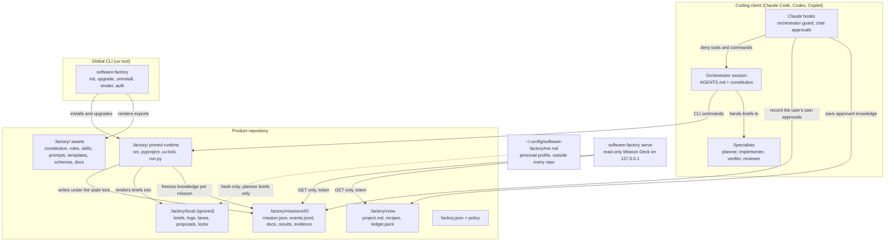
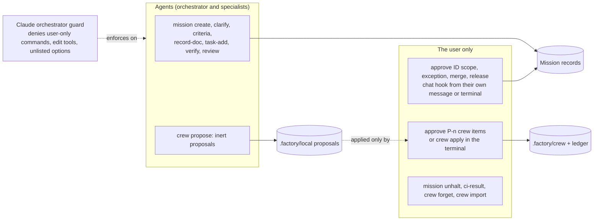

# Software Factory architecture

This describes the Python/uv package as of 0.3.9 (the knowledge, options and retro design arrived in 0.3.3; automatic commits and publishing in 0.3.8; per-role models in 0.3.9) and supersedes the 0.2.x architecture set. What the factory is: a repository-local workflow kernel that coding agents (Claude Code, Codex, GitHub Copilot) drive through a CLI. It records missions, briefs specialists, runs the project's own checks, and refuses readiness until the evidence holds. What it is not: a server, a scheduler, an agent runtime, an authentication service or a sandbox. Every record is local and unattested (*Honest records*); the coding client's permissions and the user's authorization stay authoritative.

## 1. Components

| Module | Responsibility |
| --- | --- |
| `cli.py`, `installation.py`, `transactions.py`, `rendering.py` | Global bootstrap, pinned dispatch, journaled install and upgrade with ownership manifests, native exports for each client |
| `workflow.py` | Mission state machine, tasks, criteria, briefs, scope acceptance, decisions and the readiness gate |
| `evidence.py`, `checks.py`, `civerify.py` | Candidate fingerprints over the Git view, configured checks run as evidence, optional CI verification through `gh` |
| `events.py`, `watch.py` | Hash-chained mission event log; HALT kill switch, stale missions, notify hook |
| `lanes.py`, `workspaces.py` | A Git worktree per parallel task and per parallel mission, with overlap refusal |
| `crew.py`, `options.py`, `retro.py` | Project knowledge with consent, graded options, retros and lessons (0.3.3) |
| `serve.py` + `data/deck/index.html` | The read-only Mission Deck |
| `models.py`, `routing.py`, `jev.py`, `semantic.py`, `triage.py`, `auth.py`, `redaction.py` | Model metadata and optional JEV assistance; advisory only |

## 2. A mission, end to end (FORGE)

0.3.3 builds Crew's FORGE loop into the mission: **F**eed context, **O**utcome, **R**everse interview, **G**enerate then grade, **E**xport the win.

```mermaid
flowchart TD
  REQ(["User request"]) --> MODELS["Setup and models confirmed?<br/>else setup propose, approve S-n setup"]
  MODELS --> CREATE["mission create<br/>verbatim request, optional confirmed recipe<br/>freezes crew-context.md, binds the model map"]
  CREATE --> CTX["F: context brief<br/>codebase map, saved knowledge, profile as evidence"]
  CTX --> INT["R: interview in rounds, no limit<br/>round 0 recipe defaults, an unconsidered question,<br/>contradictions as open ambiguities"]
  INT --> AS["Assessment<br/>blockers, concerns with evidence, risks"]
  AS --> LANE{"Lane"}
  LANE -- "patch" --> PLAN1["Plan brief<br/>spec, criteria, plan, recovery"]
  LANE -- "feature or maintenance" --> SPECB["O: spec brief<br/>spec.md and AC-n quoting the user"]
  SPECB --> OPT["G: options brief<br/>two or more real approaches"]
  OPT --> GRADE["G: grade brief to a separate reviewer<br/>0 to 5 per option per criterion"]
  GRADE --> PLAN2["Plan brief<br/>Chosen option, weaknesses fixed"]
  PLAN1 --> APPROVE
  PLAN2 --> APPROVE{"User: approve ID scope<br/>chat hook or terminal"}
  APPROVE --> ACCEPT["accept-scope binds spec, criteria,<br/>context, assessment, plan, knowledge, options, grading"]
  ACCEPT --> LANES["Tasks in parallel lanes<br/>worktree per task, integrate one at a time"]
  LANES --> VERIFY["verify: commits the task's files on factory/ID,<br/>then runs the configured checks as evidence"]
  VERIFY --> REVIEW["Independent reviews by lane and risk<br/>code, acceptance, adversarial"]
  REVIEW --> GATE{"Readiness gate"}
  GATE -- "pass" --> READY(["READY_PR (local evidence)<br/>mission records committed"])
  GATE -- "reasons" --> LANES
  READY --> RETRO["E: retro offered on signals<br/>records only, typed lessons with evidence"]
  RETRO --> LESSON{"User approves items<br/>approve P-n crew 1,3"}
  LESSON --> KNOW[(".factory/crew<br/>project rules, recipes, ledger")]
  KNOW -. "next mission" .-> CREATE
  READY --> MERGE["approve ID publish: push + PR<br/>mission sync: CI, approve ID merge, MERGED"]
```

Mission states: PROPOSED → PLANNED (accept-scope) → IMPLEMENTING → VERIFYING → REVIEWING → READY_PR → MERGED, with PAUSED and BLOCKED holds, CANCELED, and optional delivery states after MERGED. Transitions come from `workflow.json`; every write of `mission.json` appends a hash-chained event.

Every step of a build under the hood (hooks, commands, transitions, what is written and committed), what `init` does step by step, what every file under `.factory/` is for and who reads it, and where parallel work happens are in the installed guide, [src/software_factory/data/docs/architecture.md](../src/software_factory/data/docs/architecture.md) (copied to `.factory/docs/architecture.md` in every project).

## 3. Authority: who may record what

`mission decision` refuses the human kinds; `mission approve` and `crew apply` need an interactive terminal and a typed ID; the chat hook reads only the user's submitted prompt. These are guardrails, not authentication: records authenticate no one, and the enforcement map (`.factory/docs/runbooks/constitution-enforcement.md`) states what each rule is and is not enforced by.

## 4. Knowledge with consent (0.3.3)

| Layer | File | Written by | Reaches |
| --- | --- | --- | --- |
| Project | `.factory/crew/project.md` | `crew apply` of a user-approved proposal | Frozen per mission into `crew-context.md` (bound at scope); planner briefs whole; implementer: Must not break, Off-limits, Rules; code review: Must not break, Off-limits |
| Recipes | `.factory/crew/recipes/<name>.md` | same | Round 0 defaults; known pitfalls to implementer and code review |
| Ledger | `.factory/crew/ledger.jsonl` | every apply and forget, hash-chained | `crew status`, `doctor`, the Deck |
| Personal | `$XDG_CONFIG_HOME/software-factory/me.md` | the user's terminal only | Planner briefs only, from a private per-mission snapshot; missions record only its hash |

Rules that keep knowledge from becoming an injection channel: it is evidence, never authority (constitution *Learning with consent*); `.factory/crew/**` is a protected path, so product work cannot change it; proposals are size-capped, secret-scanned and refuse invisible characters, HTML comments and approval-shaped lines; recipes are data and can never grant tools; lessons need evidence that resolves against the mission record; requests from a contributor or anonymous author get no recipes and produce no lessons; acceptance, adversarial and verify briefs receive no knowledge, and the profile never enters a brief the gate re-renders.

## 5. Evidence and the gate

The gate re-derives readiness from the files now: the candidate fingerprint (content, governing inputs and the Git view), verify runs bound by hash, task results per attempt, reviews bound to their brief hashes, decisions bound to what they approve, the constitution hash, the event chain, protected paths, graded options, and scope documents bound at acceptance. READY_PR is local evidence only; MERGED needs a CI result for the committed candidate (optionally verified through `gh`) and the merge commit on the trunk.

## 6. Boundaries

- No Node at runtime; the distribution is a wheel and sdist, and each product repository pins its own runtime under `.factory/`.
- Live client behaviour (Claude hooks, Codex and Copilot discovery) is verified only when observed in a live client; tests exercise the hooks offline.
- The Mission Deck binds 127.0.0.1, serves GET only, needs the per-session token and checks the Host header.
- JEV, model recommendations and grading are advice (*Advice is not verification*): they never satisfy a check, review or decision.
