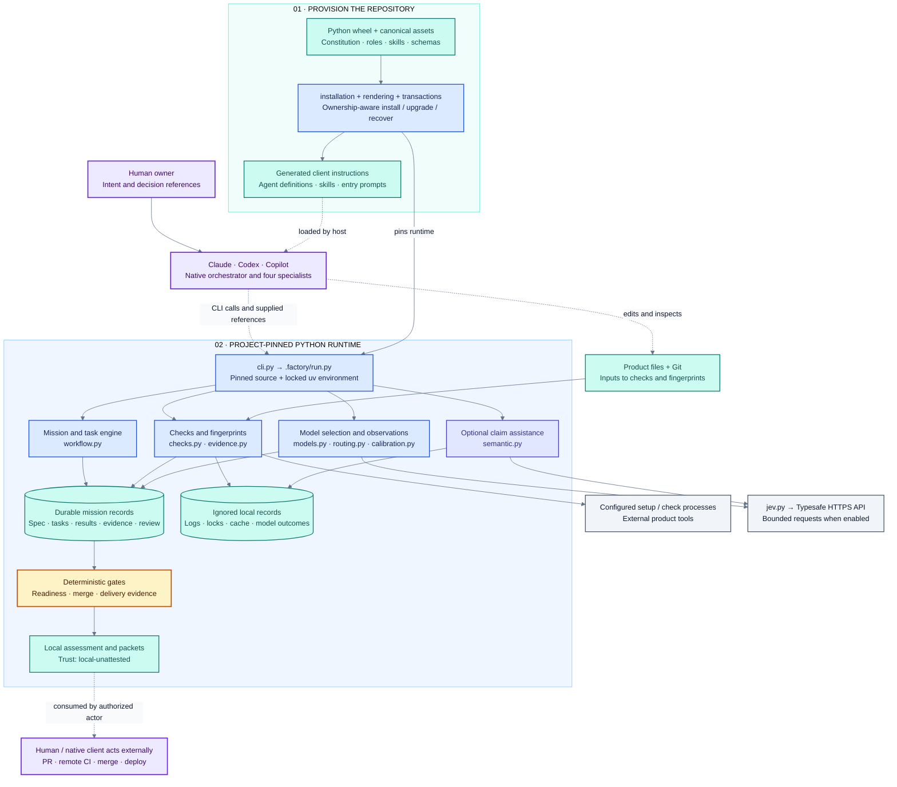
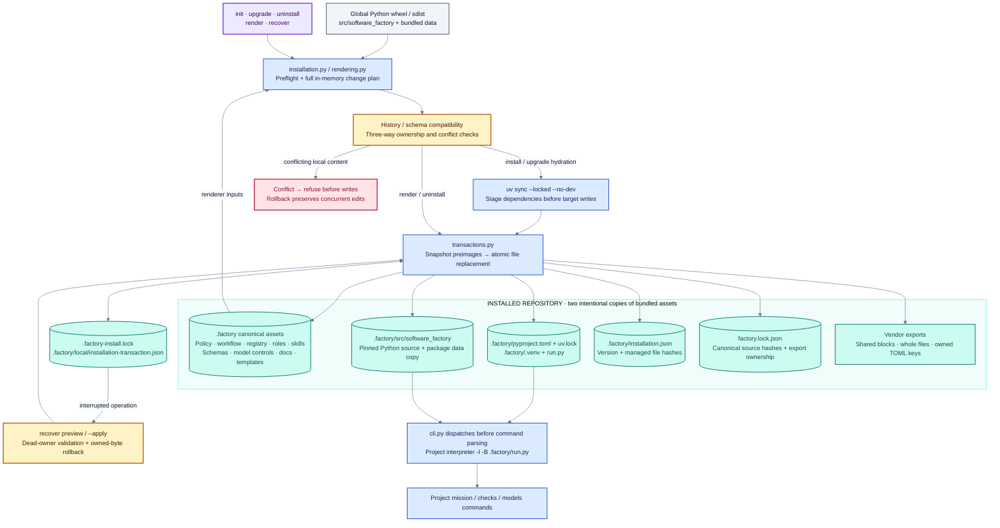
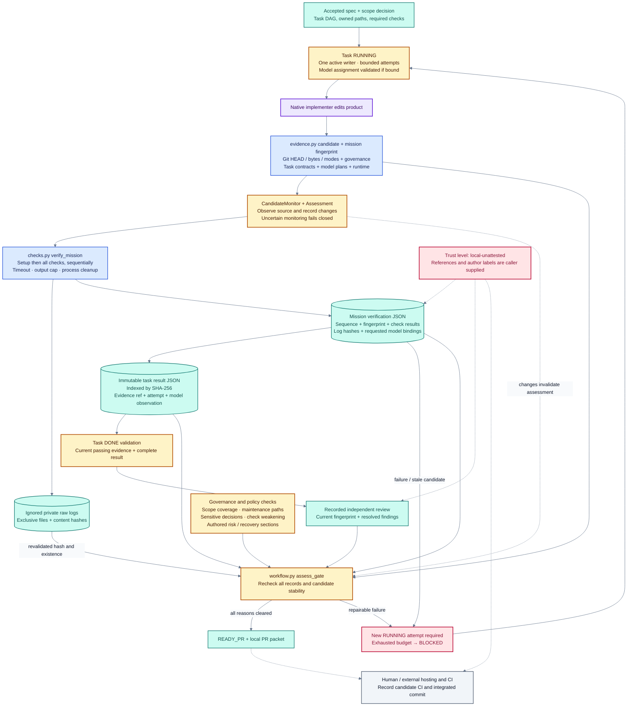
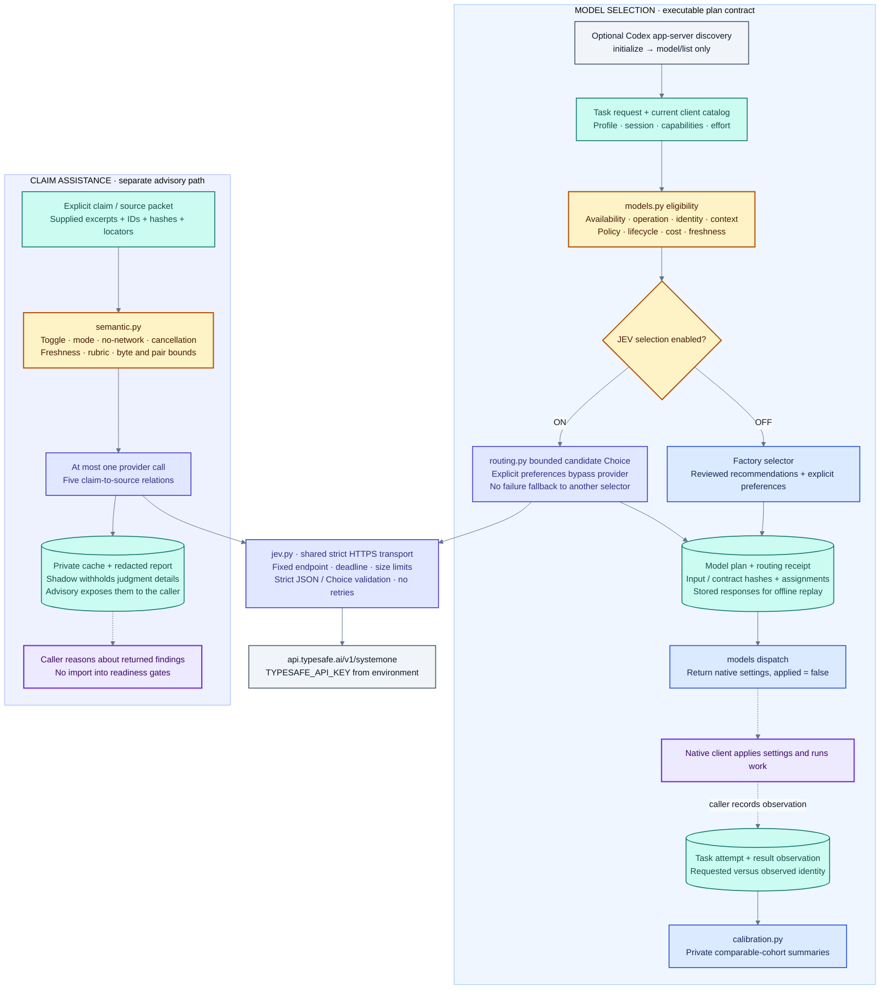

# Software Factory — architecture derived from the implementation

Reviewed 2026-09-27 against the Python/uv source in this workspace, including the concurrent 0.2.4 installation changes and subsequent 0.2.5 version/comment update. The [file-by-file review](architecture-review.md) accounts for all 107 pre-existing first-party files; its [source manifest](architecture/source-review.json) identifies the exact reviewed bytes. Existing architecture docs were treated as claims to check against code.

**Credential update in 0.2.8:** the diagrams below retain the reviewed 0.2.5 snapshot. The environment-only JEV credential label is superseded by the shared user credential store and environment override in [the current authentication architecture](../src/software_factory/data/docs/runbooks/authentication.md#credential-architecture). Global `auth` commands bypass project dispatch; product checks disable automatic credential lookup.

Software Factory is a repository-local workflow and evidence system operated through a Python CLI. A native Claude, Codex, or Copilot session supplies the orchestrator and specialist execution. Python installs their instructions, manages mission/task state, executes configured checks, validates evidence, and produces local handoff/release packets. Files and Git are its persistence layer. There is no factory server, database, autonomous agent scheduler, or deployment executor in this implementation.

## Reading the diagrams

| Color | Meaning |
|---|---|
| Purple | Human or native-client actor |
| Blue | Implemented Python processing |
| Teal | Files, records, or resulting state |
| Amber | Deterministic validation / transition gate |
| Indigo | Optional JEV processing |
| Slate | External process, client, or service |
| Rose | Hold, failure, recovery, or trust limitation |

Solid arrows show implemented processing or data dependencies. Dashed arrows show actions performed by the host/human, advisory consumption, or explicitly labeled cross-cutting conditions. Arrows are architectural relationships, not a claim that every operation runs in one invocation. Labels and shapes carry meaning independently of color.

## 1. System boundaries

[Editable Mermaid source](architecture/01-system.mmd) · [Rendered SVG](architecture/01-system.svg)

The source modules are organized around commands, not separately deployed services. Several imports are deliberately inside functions to resolve dependencies between workflow, checks, models, and calibration. The box boundaries above describe responsibilities, not process isolation.

| Implemented component | Responsibility and actual dependency |
|---|---|
| [`__init__.py`](../src/software_factory/__init__.py), [`__main__.py`](../src/software_factory/__main__.py) | Package version and `python -m software_factory` entry point. |
| [`cli.py`](../src/software_factory/cli.py) | Root discovery, project-runtime dispatch, command parsers, inspection and doctor diagnostics. |
| [`core.py`](../src/software_factory/core.py) | Safe repository paths, atomic JSON writes, installed-asset lookup, Draft 7 schema validation, Git commands, shared-ignore validation, runtime fingerprint. |
| [`installation.py`](../src/software_factory/installation.py) | Defaults, canonical/runtime payload, upgrade compatibility, dependency staging, install and uninstall ownership. |
| [`rendering.py`](../src/software_factory/rendering.py) | Native-client exports; source hashes; whole-file, marked-block and TOML-key ownership; deleted-export relinquishment. |
| [`transactions.py`](../src/software_factory/transactions.py) | Installation/render transaction lock, preimages, per-file atomic replacement, journal and explicit crash recovery. |
| [`workflow.py`](../src/software_factory/workflow.py) | Missions, task DAGs, attempts, state locks, results, reviews, decisions, model binding, readiness/merge/delivery assessment, packets. |
| [`checks.py`](../src/software_factory/checks.py) | Bounded subprocess execution, check suites, persisted verification, current-evidence validation. |
| [`evidence.py`](../src/software_factory/evidence.py) | Git/source/governance snapshots, mission fingerprints, transient-change monitoring. |
| [`models.py`](../src/software_factory/models.py) | Request/catalog contracts, eligibility, deterministic plans, native settings reports, task observations, Codex model inventory discovery. |
| [`routing.py`](../src/software_factory/routing.py) | JEV model selection, selection-contract hashes, receipts and offline replay validation. |
| [`jev.py`](../src/software_factory/jev.py) | Shared bounded HTTPS transport and strict Choice-response validation. |
| [`semantic.py`](../src/software_factory/semantic.py) | Explicit claim/source evaluation, modes, privacy checks, cache and advisory reports. |
| [`calibration.py`](../src/software_factory/calibration.py) | Immutable private model-outcome records and comparable-cohort summaries. It does not automatically retune selection. |

## 2. Installation and project runtime

[Editable Mermaid source](architecture/02-installation.mmd) · [Rendered SVG](architecture/02-installation.svg)

The global command handles installation lifecycle operations. For ordinary project commands, `cli._dispatch` finds the installed runtime and dispatches **before parsing project command syntax**, allowing a pinned project version to understand commands the global version does not know. The launcher uses the project's Python with `-I -B` and inserts `.factory/src` on its import path. POSIX uses process replacement; Windows uses a subprocess path. Missing dependencies prevent ordinary execution; selected diagnostic commands can report the incomplete installation.

Installation deliberately produces both editable canonical `.factory` assets and a pinned package under `.factory/src/software_factory`, including its packaged data. Installed canonical assets take precedence. Required missing installed assets are errors; they are not silently replaced with the global package's defaults.

Before writing, install/upgrade computes an ownership-aware plan, checks relevant existing records against changed schemas, and stages locked dependencies. A durable journal supports rollback and `recover --apply`. Atomic replacement applies to each file; this is not a database transaction covering every factory operation. Mission state and semantic calls have their own locks.

Uninstall removes unchanged owned content and preserves edited user content. In the reviewed 0.2.4 implementation, a drifted shared block with unambiguous markers retains its text while its marker lines are removed; reinstall can then append a fresh factory block. Ambiguous markers are preserved for explicit resolution. Edited whole-file exports become relinquished, and edited TOML keys remain user-owned. A conflicting existing Codex `agents.enabled` value causes an actionable refusal.

| Installed location | Architectural purpose |
|---|---|
| `factory.json` | Project configuration: profiles, check argv/cwd/timeouts, limits, owners, delivery settings, model-selection mode, JEV settings. |
| `.factory/CONSTITUTION.md`, `policy.json`, `workflow.json` | Governance text, path/decision controls, and allowed mission/task transitions. |
| `.factory/roles`, `skills`, `prompts`, `registry.json` | Canonical client instruction content and its export registry. These are prompts, not Python agent implementations. |
| `.factory/schemas`, `models`, `vendors` | Record contracts, reviewed model controls/rubric, and vendor descriptors. Vendor adapter logic lives in Python. |
| `.factory/templates`, `.factory/docs` | Mission scaffolding and installed guidance. Several templates are reference material rather than runtime packet renderers. |
| `.factory/src`, `run.py`, `pyproject.toml`, `uv.lock`, `.venv` | Pinned Python runtime and locked dependencies. |
| `.factory/installation.json` | Installation version and managed payload hashes. |
| `factory.lock.json` | Rendering source hashes, generated ownership records and relinquished paths. |
| `.factory/missions/<id>/` | Durable mission records and authored mission documents. |
| `.factory/local/` | Shared-ignore-protected local logs, locks, journal, semantic reports/cache and model calibration outcomes. |

The four direct runtime dependencies are `jsonschema` for contracts, `PyYAML` for front matter, `tomlkit` for preserving TOML configuration, and `watchdog` for file monitoring. Python 3.11+ and uv are required by packaging. `pytest` and `ruff` belong to the development environment. No Node runtime is shipped.

### Native-client export boundary

| Profile | Files emitted by `rendering.plan_render` | Execution boundary |
|---|---|---|
| All profiles | Managed block in `AGENTS.md`; constitution and session entry guidance. | The native session reads and follows these instructions. |
| Claude | `CLAUDE.md`; `.claude/agents/factory-<role>.md`; `.claude/skills/<name>/SKILL.md`. | Four specialist definitions carry capability-dependent tools and assigned skills; the main session reads orchestrator guidance. |
| Codex | `.codex/agents/factory-<role>.toml`; `.agents/skills/<name>/SKILL.md`; entry-skill `agents/openai.yaml`; owned keys in `.codex/config.toml`. | Read-capability roles get `sandbox_mode = "read-only"`; the host applies its permissions and scheduling. |
| Copilot | `.github/copilot-instructions.md`; `.github/agents/factory.agent.md`; specialist `.agent.md` files. | Main factory agent lists allowed specialists; specialists have `agents: []`. The renderer uses `factory-copilot-` specialist names when Claude is also selected. |
| Copilot skills | `.github/skills` when Copilot is the only selected profile. | Mixed profiles rely on shared skill-tree discovery; actual native discovery remains a separate client validation task. |

The registry names four entry prompts (`factory-build`, `factory-blueprint`, `factory-resume`, `factory-status`), twelve workflow skills, and four specialists. `orchestrator.md` defines the coordinating role. Generated settings and prompt permissions are requests to the native client; the factory does not implement the client's agent runtime.

## 3. Evidence, readiness and repair

[Editable Mermaid source](architecture/03-evidence.mmd) · [Rendered SVG](architecture/03-evidence.svg)

A mission begins from a real Git commit and captures its base, branch, profile, constitution and governance snapshot. Accepting a spec requires a decision reference bound to the current spec hash. Tasks define owned paths, dependencies and check requirements. The workflow permits only one `RUNNING` or `VERIFYING` task across missions in the same workspace. This is a cooperative factory-state rule, not an operating-system prohibition on other editors.

The dependable completion order is: start the task, implement, move it to verification, run `verify`, record the completed result against that verification, mark the task done, record a current review, then assess readiness. Provisional or blocked results can exist earlier. A failed task verification marks repair as required; obtaining a later passing check alone does not erase that marker. Reopening `RUNNING` creates another execution attempt. Exhaustion blocks the task and mission. A bounded material replan can reset the budget once; reopening a completed task also invalidates its downstream dependents.

`checks` runs an ephemeral suite; `verify` writes mission verification records and private raw logs. Setup runs before checks. Commands are argv arrays with no implicit shell, bounded output and timeouts. They execute with ordinary host permissions and inherit most of the environment; `TYPESAFE_API_KEY` is removed from these check subprocesses. The check runner is not a general process sandbox.

Evidence has two related identities: the product candidate snapshot and the mission-enriched fingerprint. Inputs include source bytes and modes, Git HEAD, governed hidden files, runtime/dependency identity, accepted scope, task contracts and model plans. Recognized metadata is excluded to avoid self-reference; arbitrary files under a mission directory are not automatically exempt. Source symlinks, submodules and hidden-index conditions are rejected where evidence collection requires a trustworthy snapshot.

`CandidateMonitor` observes transient writes, including write-then-restore events. `Assessment` also guards the mission records used by a gate. Linux inotify loss has explicit handling; equivalent real macOS/Windows behavior was not validated in this review. A failed or uncertain observation cannot be claimed as a clean assessment.

The gate joins current checks, existing raw logs with matching hashes, indexed results, accepted scope, task attempts/model observations, latest review and unresolved findings. It also checks source ownership, protected paths, sensitive-path decisions, weakened check definitions and authored risk/recovery content. Protected-path rules combine current policy, accepted baseline policy and a hardcoded minimum; changing today's policy cannot remove that minimum.

Decisions and reviews used by gates live in `mission.json`. Authored `decisions.md` is not itself an authenticated approval feed. Results are separate immutable JSON files with an index of their hashes. Reviewer independence rejects the configured maintainer's author label, but `owners.reviewer` is not an enforced identity allowlist. These records explicitly remain **local-unattested**.

## 4. Model selection and claim assistance

[Editable Mermaid source](architecture/04-intelligence.mmd) · [Rendered SVG](architecture/04-intelligence.svg)

Both paths use the same `jev.enabled` switch and HTTPS transport, but they have different effects:

| Behavior | Model selection | Claim assistance |
|---|---|---|
| Command family | `models` | `semantic` (`jev` alias) |
| Inputs | Explicit request, current session catalog, policy, reviewed recommendations/rubric. | Explicit claims and supplied source excerpts, IDs, hashes, locators and timestamps. |
| OFF behavior | Deterministic factory selector remains available. | Skip before credentials, packet reads or cache/provider work. |
| ON behavior | Hard eligibility first, then bounded JEV selection for automatic assignments. Explicit preferences can bypass the provider. | Validate a bounded packet; evaluate claim/source relations in shadow or advisory mode. |
| Provider failure | Report failure; no silent fallback selector. Abstention can yield an unresolved plan. | Return unavailable/skipped assistance; ordinary caller reasoning can continue. |
| Persistence | Plan and routing receipt can be registered under the mission and bound to tasks. | Redacted private reports/cache; raw excerpts and the key are not stored in those reports. |
| Authority | Plan validity and bound-task identity are enforced locally. `models dispatch` returns `applied: false`; the host must apply settings. | Findings have no readiness/merge/release gate authority. Shadow mode withholds judgment details from the caller. |
| Feedback | Recorded requested/observed identities support private calibration. | No automatic model calibration or policy update. |

Codex discovery starts a supplied native binary in app-server mode and requests its model inventory. It does not send an inference turn. Claude/Copilot catalog paths provide unavailable/manual templates rather than equivalent automatic discovery. Catalogs and observation provenance describe what the caller or native client reports; they do not authenticate paid model execution.

JEV requests use a fixed HTTPS endpoint, strict JSON parsing, validated Choice probabilities/model identity, response-size bounds and an overall deadline. There are no transport retries. Routing sends compact task/model decision metadata; semantic assistance sends the explicitly supplied packet excerpts. Neither path independently crawls the repository or fetches cited URLs. Enabled operations can make live requests; none were made for this review.

## 5. Mission lifecycle and external actions

[Editable Mermaid source](architecture/05-lifecycle.mmd) · [Rendered SVG](architecture/05-lifecycle.svg)

```mermaid
%%{init: {"theme":"base","look":"classic","fontFamily":"Arial, sans-serif","themeVariables":{"fontFamily":"Arial, sans-serif","fontSize":"15px","lineColor":"#64748B","primaryTextColor":"#0F172A","edgeLabelBackground":"#F8FAFC"},"flowchart":{"curve":"basis","htmlLabels":true,"nodeSpacing":35,"rankSpacing":60,"wrappingWidth":280}}}%%
flowchart LR
  subgraph local["LOCAL MISSION PROGRESSION"]
    proposed["PROPOSED"]:::data --> planned["PLANNED"]:::data
    planned --> implementing["IMPLEMENTING"]:::runtime
    implementing --> verifying["VERIFYING"]:::runtime
    verifying --> reviewing["REVIEWING"]:::gate
    reviewing -->|readiness gate| ready["READY_PR"]:::gate
    verifying -->|repair| implementing
    reviewing -->|repair| implementing
    ready -->|repair / recorded CI failure| implementing
  end
  subgraph delivery["EXTERNAL EVIDENCE REQUIRED · state changes do not execute deployments"]
    merged["MERGED"]:::data --> staging["STAGING"]:::data
    staging --> awaiting["AWAITING_RELEASE"]:::gate
    awaiting --> deploying["DEPLOYING"]:::data
    deploying --> observing["OBSERVING"]:::data
    observing -->|healthy observation| delivered["DELIVERED"]:::data
    deploying --> recovering["RECOVERING"]:::stop
    observing -->|unhealthy / recovery path| recovering
    recovering --> recovered["RECOVERED"]:::data
  end
  ready -->|accepted candidate CI + merge decision<br/>locally validated integrated Git commit| merged
  holds["Eligible nonterminal states<br/>See exact transition table"]:::gate
  paused["PAUSED<br/>Suspends active task without new attempt"]:::stop
  blocked["BLOCKED<br/>Reason / repair exhaustion"]:::stop
  resume["Explicit resume + resolution<br/>Reconcile previous state / eligible repair<br/>Revalidate applicable evidence and budgets"]:::gate
  canceled["CANCELED"]:::stop
  holds -.-> paused & blocked
  paused & blocked --> resume
  resume -.->|eligible previous state| holds
  holds -.->|only where graph permits| canceled
  paused & blocked --> canceled
  style local fill:#EFF6FF,stroke:#93C5FD,stroke-width:1px
  style delivery fill:#F8FAFC,stroke:#94A3B8,stroke-width:1px

  classDef actor fill:#EDE9FE,stroke:#6D28D9,color:#3B0764,stroke-width:2px;
  classDef runtime fill:#DBEAFE,stroke:#1D4ED8,color:#172554,stroke-width:1.5px;
  classDef data fill:#CCFBF1,stroke:#0F766E,color:#134E4A,stroke-width:1.5px;
  classDef gate fill:#FEF3C7,stroke:#B45309,color:#451A03,stroke-width:2px;
  classDef external fill:#F1F5F9,stroke:#475569,color:#0F172A,stroke-width:1.5px;
  classDef advisory fill:#E0E7FF,stroke:#4338CA,color:#312E81,stroke-width:1.5px;
  classDef stop fill:#FFE4E6,stroke:#BE123C,color:#881337,stroke-width:2px;
```

The main arrows are exact normal/rework edges. Hold-state edges are compressed for legibility; this table records the complete graph from `data/workflow.json`. `resume` is a separate reconciliation command with additional Python checks.

| State | Allowed direct next states |
|---|---|

| `PROPOSED` | `PLANNED`, `PAUSED`, `BLOCKED`, `CANCELED` |

| `PLANNED` | `IMPLEMENTING`, `PAUSED`, `BLOCKED`, `CANCELED` |

| `IMPLEMENTING` | `VERIFYING`, `PAUSED`, `BLOCKED`, `CANCELED` |

| `VERIFYING` | `IMPLEMENTING`, `REVIEWING`, `PAUSED`, `BLOCKED`, `CANCELED` |

| `REVIEWING` | `IMPLEMENTING`, `READY_PR`, `PAUSED`, `BLOCKED`, `CANCELED` |

| `READY_PR` | `IMPLEMENTING`, `MERGED`, `PAUSED`, `BLOCKED`, `CANCELED` |

| `MERGED` | `STAGING`, `PAUSED`, `BLOCKED` |

| `STAGING` | `AWAITING_RELEASE`, `PAUSED`, `BLOCKED` |

| `AWAITING_RELEASE` | `DEPLOYING`, `PAUSED`, `BLOCKED`, `CANCELED` |

| `DEPLOYING` | `OBSERVING`, `RECOVERING`, `PAUSED`, `BLOCKED` |

| `OBSERVING` | `DELIVERED`, `RECOVERING`, `PAUSED`, `BLOCKED` |

| `RECOVERING` | `RECOVERED`, `PAUSED`, `BLOCKED` |

| `DELIVERED` | None — terminal |

| `RECOVERED` | None — terminal |

| `PAUSED` | `CANCELED` |

| `BLOCKED` | `CANCELED` |

| `CANCELED` | None — terminal |

Task graph: `TODO → RUNNING → VERIFYING → DONE`; `TODO`, `RUNNING`, and `VERIFYING` may enter `BLOCKED`; `VERIFYING`, `DONE`, and `BLOCKED` may return to `RUNNING`, subject to the attempt, state, dependency and repair rules above.

`READY_PR` is a local assessment. Recording successful CI requires a clean candidate and binds the supplied reference to the candidate HEAD/fingerprint and accepted verification. The merge path checks local Git commit/trunk relationships and integrated candidate content, allowing appropriate squash/fast-forward cases. It does not call the hosting provider to authenticate the CI URL or execute a merge.

Post-merge staging/release/deploy/observe/recovery transitions require enabled delivery configuration and their corresponding digest/reference/decision fields. A healthy observation is required for `DELIVERED`; recovery has its own references and follow-up fields. The factory records and validates these claims without running configured deployment command fields. Generated packets are local files. Packet content is assembled by `workflow.create_packet`, not by reading the shipped pull-request/release template files.

## What is proven and what remains external

| Boundary | Implemented guarantee | Limit |
|---|---|---|
| Ownership | Hash-based managed content, preimage checks, rollback and preservation of local edits. | Not a global lock on every filesystem writer. |
| Pinned runtime | Project dispatch, source/dependency fingerprinting, doctor drift diagnostics. | Runtime-drift diagnosis is not an unconditional integrity gate before every command. |
| Evidence | Current fingerprints, immutable results, check/log hashes, monitored assessment. | Local records and the host remain trusted inputs; logs must still exist locally. |
| Model use | Eligibility, receipt validation, bound attempts and observation contract. | Native execution/settings and observed identity are not remotely attested. |
| Review / CI / delivery | Matching local references, expected states and Git relationships. | No authentication of human identity or remote success; no CI/deploy executor. |
| Native exports | Correct generated structure and ownership checks in Python tests. | Interactive client discovery and real Windows/macOS behavior remain unverified. |

The [review record](architecture-review.md) lists concrete documentation discrepancies and validation results. The diagrams describe the reviewed implementation; they do not adopt broader claims from the older runbooks.
