# Crew in the software factory: final design

Status: design, not built. Date: 2026-09-30.
Method: a draft design was reviewed independently by three models (Opus, Fable, Sonnet). Each checked it against the code of `/home/reshif/crew` and this repository, and each wrote its own final design. This document merges them. Where they disagreed, the decision and its reason are recorded in [§11](#11-how-the-three-reviews-were-reconciled).

User decisions this design keeps:
- Crew is built directly into the factory.
- **There is no limit on interview questions or rounds.**

## 1. What Crew adds, and what the factory already has

Crew is the FORGE loop: Feed context, Outcome, Reverse interview, Generate then grade, Export the win. All three reviews checked the code and found that the factory already does most of O and R, and does them more strictly than Crew:

| FORGE | Already in the factory | What this design adds |
|---|---|---|
| **F** Feed context | A context.md for each mission, gathered again from the repo every time | **Lasting**, human-approved knowledge the repo can't show: purpose, users, what must not break, what's off-limits, rules, and how you work. Loaded once, hashed, reused. |
| **O** Outcome | Verbatim request.md, assessment "What I understood", AC-n criteria that quote the user's exact words | Nothing new (two prompts in the spec template) |
| **R** Reverse interview | Rounds, one at a time, suggested defaults accepted with "ok", another round when answers raise new questions, `C-n` concerns | Recipe defaults as round 0, the question you probably haven't considered, contradictions with saved knowledge, and a recorded question-plus-default next to each answer |
| **G** Generate, then grade | One plan. Independent review happens only after the build. | 2 or more genuinely different approaches, graded against AC-n by a separate reviewer session **before** you approve scope |
| **E** Export the win | Nothing (handoffs only capture state) | Retro → typed lessons → your approval item by item → project rules and recipes, with a hash-chained ledger |

Build order follows value and risk: **F and E are the core, G is smaller, R is mostly wording.**

One existing line contradicts the no-limit decision and gets removed. `roles/orchestrator.md` step 3 says "A patch gets two or three questions". It is replaced by a stopping rule, not a cap:

> Ask in as many rounds as the answers require, with no limit. A round ends when no remaining question would change the result, or when the user says go. Anything still unanswered becomes a marked assumption in the assessment. Every round offers "go".

## 2. Files: who writes each one, and how it's protected

### Committed project knowledge: `.factory/crew/`

| Path | Written by | Contents | Protection |
|---|---|---|---|
| `project.md` | only `crew apply` (human) | Fixed sections: Purpose, Users, Must not break, Definition of done, Off-limits, Rules, Exemplars (repo paths, checked to exist) | `.factory/crew/**` joins `PROTECTED_FLOOR` and the default policy. A product mission that touches it fails the brief and the gate. Size cap 8 KB (apply refuses beyond it; nothing is silently truncated). |
| `recipes/<name>.md` | only `crew apply` | Front matter: `name`, `lane`, `trigger`, `created`, `updated`, `source_missions`. Sections: Use when, Defaults (question, answer, the mission and date it was confirmed), Criteria patterns, Known pitfalls, Exemplars. Cap 4 KB. | Same. The front matter is parsed with `yaml.safe_load` against a key allowlist, and **no tool keys**: a recipe is data, never a skill. |
| `ledger.jsonl` | only `crew apply` / `crew forget` | Append-only, hash-chained like `events.jsonl`: `{n, proposal, item, destination, text_sha256, base_sha256, mission, evidence, source_trust, via: terminal|chat, reference, at, prev, sha256}` | Same. `doctor` verifies the chain. Hand edits are allowed (it's your repo) but flagged as "unledgered". |

Dropped on purpose: `LIBRARY.md` (`crew library` builds the list from the recipe files), the `examples/<kind>/` folders (replaced by Exemplars, which point at real files in the repo) and a SessionStart hook (`doctor` and `factory-start` already run at the start of every session, in every client).

### Mission records: `.factory/missions/<ID>/`

| File | Written by | Notes |
|---|---|---|
| `crew-context.md` | the CLI at `mission create` and `mission recipe` (nobody types it) | A frozen, deterministic snapshot of the project.md sections and the selected recipe, with item ids. Contains nothing personal. Bound in `SCOPE_DOCS`, so knowledge applied later doesn't silently change a mission that's already scoped. |
| `options.md` | planner, through `record-doc --doc options` | PROPOSED or PLANNED only. Bound in `SCOPE_DOCS`. |
| `grading.md` | a separate reviewer session, through `record-doc --doc grading` | Same. |
| `retro.md` | planner, through `record-doc --doc retro` | Allowed from READY_PR on, **including CANCELED and DELIVERED**. This is the one stated exception to terminal-state immutability, because failed missions teach the most. Not bound to scope. |

All four names must be added to `evidence.MISSION_RECORD`, `MISSION_DOCS` and `serve.DOCS`. Without the `MISSION_RECORD` entry, the gate reports them as unrecognized candidate files and every feature mission fails. All three reviews caught this.

### Private, not committed: `.factory/local/crew/`

- `proposals/P-nnnn.json` holds inert proposals from `crew propose`, named by their sha256.
- `me-<ID>.md` is a snapshot of the personal profile a mission used. Only its hash is committed.
- `deferrals.json` records "not now" (14 days) and "never". It only silences offers and never affects a gate. The name `decline` is already a decision kind, so the command is `crew defer`.

### User level

`$XDG_CONFIG_HOME/software-factory/me.md` (default `~/.config/software-factory/me.md`). There is an env override, `SOFTWARE_FACTORY_ME`, for tests. Details are in [§9](#9-the-two-open-questions-answered).

### Install and uninstall safety

`.factory/crew/**` is user data, not installed files. `installation.py` refuses to let any manifest own it (the same rule as `.factory/missions/`). Upgrade never touches it, and uninstall lists it under "retained". `init` never creates it; the first `crew apply` does. Tests check each of these.

### Package

The new logic lives in a new `src/software_factory/crew.py`. `workflow.py` is already about 5,000 lines, so it only gets narrow edits.

## 3. The mission flow

```mermaid
flowchart TD
    A([Your request]) --> B{Recipe fits}
    B -- "you confirm" --> C[mission create with recipe<br/>request stored first, crew-context frozen]
    B -- "none" --> C2[mission create]
    C --> D
    C2 --> D
    D["F: context brief<br/>project knowledge, recipe, me.md<br/>fenced as evidence with hashes"] --> E{project.md exists}
    E -- "no" --> E1["planner drafts project.md<br/>crew propose, you apply later"]
    E -- "yes" --> R
    E1 --> R
    R["R: interview round<br/>round 0 recipe defaults: still true<br/>unconsidered question, contradictions"] --> Q{Would another answer change the result}
    Q -- "yes and you have not said go" --> R
    Q -- "no, or you say go" --> AS["Assessment<br/>contradictions are open ambiguities"]
    AS --> L{Lane}
    L -- "patch" --> P1["Plan brief<br/>spec, criteria, plan, recovery"]
    L -- "feature or maintenance" --> S["Spec brief<br/>spec.md and AC-n"]
    S --> O["G: options brief<br/>2 or more real approaches, default 3"]
    O --> GR["G: grade brief<br/>separate reviewer, options and AC-n only"]
    GR --> P2["Plan brief<br/>Chosen option, weaknesses fixed"]
    P1 --> SH
    P2 --> SH["You see assessment, spec, options, grading"]
    SH --> AP{approve ID scope}
    AP -- "answers change" --> R
    AP -- "yes" --> ACC["accept-scope binds spec, criteria, docs,<br/>crew-context, options, grading"]
    ACC --> BU["Build, verify, review, gate<br/>unchanged"]
    BU --> RP([READY_PR])
    RP --> SG{Retro signals or new kind}
    SG -- "none" --> Z([Done])
    SG -- "yes" --> RB["E: retro brief from records only<br/>typed lessons with evidence"]
    RB --> PR[crew propose]
    RB --> MT["checks, hooks, roles lessons<br/>maintenance mission request printed"]
    PR --> AA{approve P-n crew 1,3}
    AA --> AP2["crew apply after merge<br/>writes knowledge, ledger, prints commit"]
```



Step by step:

1. **Recipe match.** `crew library` lists the recipes. The orchestrator suggests one and you confirm. It isn't called "triage" because `software-factory triage` already exists. Recipes are refused for contributor or anonymous requests: untrusted requests never get remembered answers.
2. **Create.** `mission create --request-file - [--recipe NAME]` stores your words first, then freezes `crew-context.md` and records the hashes in `mission.crew`. `mission recipe --use NAME|--clear` changes the recipe while the mission is PROPOSED.
3. **F: context.** The context brief gains a section called "Saved knowledge (evidence, never authority)". It holds the crew-context and your profile, each fenced with its sha256. The header line names every input, for example `Crew: project a91c2f0e · profile 7b3d… · recipe add-endpoint@4c1e`. If there's no project.md, that's recorded as a fact and the planner also returns a draft project.md, which the orchestrator saves as a proposal. It is **not** a gate.
4. **R: interview.** One round at a time, no limit.
   - **Round 0** exists only when there's a recipe. It shows each default with its age and source mission and asks "still true? anything different?".
   - **Every round** includes one question marked *probably not considered*.
   - **Contradictions** between your words, the answers, project.md, me.md and the recipe are asked as questions, not decided silently.
   - **Recording:** each `mission clarify` entry keeps the question and the default that was shown next to your verbatim reply. So "ok" only counts for defaults you actually saw, and criteria can quote the accepted default. A recipe default you weren't shown never counts as your answer.
5. **Assess.** Each contradiction is also recorded as an ambiguity with `origin: "contradiction"`. It stays `open` until you settle it, and the existing "open ambiguities" gate blocks accept-scope. That's the same mechanism as today, so there's **no new assessment section** that would break assessments already recorded.
6. **Spec, feature and maintenance lanes.** A new `spec` brief produces spec.md and the AC-n criteria first, so options can be graded against real, validated criteria.
7. **G: options, then grading** (feature and maintenance lanes; patch is exempt).
   - The `options` brief asks the planner for `### O-1 … O-n`: n ≥ 2, 3 by default. Each has a sketch, trade-offs, and a score per AC-n.
   - One approach is allowed only when options.md quotes the request or clarification words that dictate it, and the CLI checks that quote like any other excerpt.
   - The `grade` brief goes to a **separate reviewer session**, with no shell and no web, that sees only the request, the clarifications, the criteria and options.md. It deliberately gets no assessment, no context.md and no me.md, so it isn't anchored on the planner's pick. `grading.md` scores every option against every AC, names a winner, and lists the winner's weaknesses.
8. **Plan.** plan.md starts `## Approach` with `Chosen option: O-n`. If that isn't the grader's winner, it cites the clarification where you chose otherwise.
9. **Scope.** `approve ID scope` is refused until the assessment exists (today's rule) and, for the feature and maintenance lanes, until options and grading are current. Your approval therefore means you saw them. Then accept-scope binds everything.
10. **Build, verify, review, gate: unchanged.** Saved knowledge reaches the other agents only like this:

    | Brief | Receives |
    |---|---|
    | Implementer | Must not break, Off-limits, Rules, the recipe's Known pitfalls |
    | Code review | Must not break, Off-limits, pitfalls framed as extra things to check |
    | Acceptance, adversarial, verify | **Nothing**, so their independence stays intact |
    | me.md | Only the context, assess, spec, options, plan and retro briefs |

    me.md has to stay out of the reviewer briefs: the gate re-renders those and compares their hashes, so machine-local text there would make gate results depend on the machine.
11. **E: retro** (timing in [§9](#9-the-two-open-questions-answered)).
    - `crew retro-signals --mission ID` works out deterministically whether to offer a retro.
    - The retro brief is built **from records only**: the event timeline, repair attempts, blockers, review findings and how they were resolved, gate reasons, clarification rounds, concerns you overrode, and decisions. It includes **no diff, raw logs or source text**, which are the main routes for hostile text.
    - The planner returns retro.md (prose) plus a typed lessons JSON, and `crew propose --mission ID --input -` validates it (see §6).
12. **Apply.**
    - **Your approval:** in chat, `approve P-0003 crew 1,3`. The existing chat hook applies exactly those items, bound to the proposal's hash, and echoes the stored text back. In a terminal, `crew apply P-0003 --items 1,3` with typed confirmation.
    - **What apply refuses:** a bare "approve all"; a target that changed since the proposal was made; and any run while a **pre-merge product mission is open in this worktree**, because the apply would put a protected path into that mission's diff and break its gate.
    - **Lesson types that apply never writes:** Checks, hooks, roles, CI and policy lessons print a ready-to-submit request for a **maintenance** mission. A patch mission can't touch those protected paths. Preference lessons are printed for you to add to me.md.
    - **After apply:** you commit, and apply prints the exact command.

## 4. CLI

The orchestrator guard denies unknown commands by default, so each command is added on purpose, either with its exact options to `FACTORY_SUBCOMMANDS` or to `HUMAN_ONLY`.

| Command | Who | Effect |
|---|---|---|
| `crew status [--json]` | agent, read-only | Layers present, their hashes, the ledger chain, unledgered edits, exemplar paths that no longer exist, stale defaults (over 90 days), pending proposals, active deferrals. Summarized in `doctor`. |
| `crew library` | agent, read-only | Recipe index built from the files: trigger, lane, age, source missions |
| `crew show ITEM` | agent, read-only | One knowledge item and its ledger entry |
| `crew retro-signals --mission ID` | agent, read-only | The signals in §9 |
| `crew propose --target project\|recipe:<name>\|personal --input -` | agent | An inert proposal: validated, secret-scanned, carrying the target's base hash. Used by onboarding and project bootstrap. |
| `crew propose --mission ID --input -` | agent | Retro lessons turned into a proposal |
| `crew proposals` / `crew withdraw P-n` | agent | List proposals, or withdraw one |
| `crew defer KEY not-now\|never --reference TEXT` | agent, with your quoted words | Silences offers only. `--clear` undoes it. |
| `crew apply P-n [--items …]` | **human**: terminal with typed confirmation, or the chat line `approve P-n crew 1,3` (project and recipe items only) | Writes the knowledge, appends the ledger, prints the commit command. **me.md items are terminal-only**, so a hook never writes outside the project. |
| `crew forget ITEM` | **human** | Removes an item and appends a tombstone entry to the ledger |
| `crew import --from ~/crew` | **human** | One-time migration. `context/me.md` becomes a personal proposal, `context/projects/<repo>.md` a project proposal, and each fitting `library` workflow a recipe proposal. Shown before anything is applied. It never writes to `~/crew`. |
| `mission create … --recipe NAME`, `mission recipe --use NAME\|--clear` | agent | PROPOSED only; refused for untrusted sources |
| `mission brief --kind spec\|options\|grade\|retro` | agent | New brief kinds |
| `mission record-doc --doc options\|grading\|retro` | agent | New doc kinds, with the state rules in §2 |
| `/factory-onboard [project\|personal]`, `/factory-retro [ID]` | user-invoked entry prompts (`/` in Claude and Copilot, `$` in Codex) | Onboarding is a **chat interview** with no question limit that ends in `crew propose`. Only you apply it. |

## 5. Gate and rule changes

| # | Change | Why | Effect on gates |
|---|---|---|---|
| G1 | `.factory/crew/**` joins the protected floor and the default policy | It steers every later brief, so product work must not be able to rewrite it | Stricter |
| G2 | options, grading, retro and crew-context join `MISSION_RECORD` and `MISSION_DOCS`. crew-context, options and grading join `SCOPE_DOCS` | Otherwise they count as product changes, or could change after scope unnoticed | None |
| G3 | Feature and maintenance lanes: accept-scope and `approve scope` require a current `options.md` and `grading.md` | Crew's G, bound the way reviews already are | New gate |
| G4 | "Current" means: grading records `Options-sha256` equal to options.md now and `Criteria-hash` equal to the criteria now; every O-n is scored against every AC-n; the winner exists; the `Grader` differs from the options author and from `owners.maintainer` | Stale or partial grading is refused. The author fields are self-reported, so the enforcement map marks grader independence as instruction-only (Article 14, honest limits). | New gate |
| G5 | The trigger is the **lane**, not "high risk" | Risk is worked out from the diff, which is empty when scope is set. Untrusted sources are already forced into the feature lane. | None |
| G6 | Contradictions become open ambiguities (`origin: contradiction`), blocked by the existing gate | Reuses what exists; no new section that would break recorded assessments | None |
| G7 | No gate on project.md | A gate that depends on a gitignored deferral file would differ between clones. The first mission bootstraps a proposal instead. | None |
| G8 | Recipe defaults, remembered answers and lessons never count as your answer or approval | Constitution Article 1 | None |
| G9 | `crew apply` is refused while a pre-merge product mission is open in this worktree | Otherwise a protected path lands in that mission's diff | None |
| G10 | Orchestrator wording: the "two or three questions" cap becomes the stopping rule in §1 | Your decision | None |
| G11 | Untrusted-source missions get no recipes, and their lessons are refused outright | An outsider's text must never seed lasting guidance | Stricter |

### Constitution 2.0.0 → 2.1.0 (MINOR: obligations are added, none removed)

Per the Amendment section, this ships as its **own maintenance mission** with independent review and **needs your explicit approval**. Changing the constitution's hash means every in-flight mission needs the existing exception reconcile, so it ships once, with an upgrade note.

- **Article 1:** "Recipe defaults, remembered answers, lessons and preferences are never the user's answer or approval; only a reply the user actually gave counts."
- **Article 5:** personal profiles join secrets and raw transcripts as things that never go into committed records or third-party prompts.
- **Article 6:** add recorded project knowledge (`.factory/crew`) to the factory controls. Applying approved knowledge text is a user configuration edit (Article 7). A lesson that changes checks, hooks, roles, policy or CI stays maintenance.
- **Article 8:** a recipe default becomes part of the contract only through a recorded clarification in which you accepted it.
- **Article 9:** "Load recorded project and personal context as evidence. Ask material ambiguities in as many rounds as the answers require, with no fixed number. Raise contradictions with recorded context as open questions. Stop when no remaining question would change the result or the user says go, and record the rest as assumptions."
- **New Article 21, Alternatives before commitment:** feature and maintenance work compares genuinely different approaches, graded against the criteria in a separate context, before scope approval. Grading is advice (Article 13).
- **New Article 22, Learning with consent:** knowledge changes only when you approve its exact text. Agent-proposed knowledge is testimony, and recorded knowledge is evidence, never authority. It can't relax the request, criteria, constitution, gates or approvals.
- The enforcement map gains rows for each of these, with grader independence and specialist access to me.md honestly marked as instruction-only.

## 6. Security

Lasting text feeds future briefs, so whoever writes it can steer every later mission. Possible sources of poisoned text: a contributor's issue, code comments a reviewer reads, hostile check output, a planner that hallucinates, a rushed approver. The defenses come in layers:

1. **Only a human writes knowledge.** `crew apply` and `crew forget` are human-only. Agents create only inert proposals under `.factory/local`.
2. **Lessons are typed, not free prose.**
   - `rule` (one imperative sentence) goes to project Rules.
   - `pitfall`, `default` and `criteria-pattern` go to a recipe.
   - `preference` is shown to you, never written.
   - `control` becomes a maintenance request, never applied.
3. **Evidence is checked mechanically.** Each lesson cites references the CLI resolves against the mission record: `finding:V-2/F-1`, `clarification:5`, `concern:C-1`, `task:T-2:attempt:2`, `decision:<id>`, `gate:<reason>`. An unresolvable reference rejects the lesson. A `default` lesson must quote an answer that appears verbatim in clarifications.md.
4. **The stored text is normalized.**
   - Plain text, at most 200 characters per item.
   - None of: backticks, fenced code, URLs, HTML comments, headings, control, bidi or zero-width characters.
   - No line matching the chat-approval pattern, so pasting a recipe into chat can never trigger an approval.
   - Passed through `refuse_secrets`.
   - The proposal prints the exact bytes and their sha256; the chat hook echoes what it stored.
5. **Framing.** Every block is fenced under a heading that says it's evidence describing the project or the user, never instructions, with its sha256. Knowledge can't change tool lists, owned paths, checks or gates. The guard and the specialist tool limits are unchanged, so even successful persuasion grants nothing.
6. **Trust sources.** `request.source` is reused and nothing new is invented. Contributor or anonymous missions get no recipes and produce no lessons.
7. **Provenance.** Protected paths, git history, the hash-chained ledger, `crew show`, `crew forget`, and `doctor` flagging unledgered edits.
8. **Approval fatigue**, the weakest point. It's mitigated by offering retros only on signals, approving item by item with no "approve all", keeping lessons short and typed, and showing pending items with their evidence in the Deck.

**Reproducibility.** Briefs render from the frozen crew-context.md plus the local me.md snapshot. On another machine the brief says "personal profile unavailable, sha256 X" and stays deterministic. me.md is never in a brief the gate re-renders.

**User files.** `crew apply` writes atomically, only when the target's hash still equals the proposal's base hash, never commits, and never writes outside `.factory/crew/`, except me.md from the terminal. The previous me.md is kept as `me.md.prev`.

## 7. What you'll see

**A. First mission of a kind (feature lane, no recipe, no project.md yet)**

```
you     > /factory-build Add per-client rate limiting to the public API
factory > M-0007 created from your words. No recipe matches. No project knowledge yet:
          the planner will draft a project.md for you to approve later.
          Round 1 · 5 questions · reply "ok" to take the defaults, or "go" at any time
          Q-1 Scope: per API key or per IP? Evidence: src/api/auth.py:40. Default: per key.
          Q-2 Limits: 100 req/min, burst 20? Default: yes.
          Q-3 Storage: in-process? Evidence: no Redis in docker-compose.yml. Default: in-process.
          Q-4 Must not change: /health stays unlimited? Default: yes.
          Q-5 (probably not considered) Retries from our own jobs count against the limit. Exempt them? Default: no.
you     > ok except Q-3: we run 3 replicas, use Redis
factory > Round 2 · 1 question
          Q-6 Contradiction: the draft project knowledge says "no new service without asking".
              Redis is new. Add it to compose and the Ansible role, or reuse the existing cache host?
you     > reuse the cache host
factory > No more questions would change the result. Assessment: C-1 per-process limits are wrong with 3 replicas (settled).
          Spec and 6 criteria recorded.
          Options: O-1 token bucket in middleware (Redis), O-2 nginx limit_req, O-3 library X.
          Grader (separate session): O-1 wins. Weakness: clock skew on AC-4, fixed in the plan.
          Reply `approve M-0007 scope` when you've read the assessment, spec, options and grading.
```

**B. The same kind again, with the recipe**

```
you     > /factory-build Add rate limiting to the admin API too
factory > Recipe rate-limit-endpoint (from M-0007, 12 days old) fits. Use it? → yes
          Round 0 · still true?
            Scope: per API key · Limits: 100/min, burst 20 · Storage: Redis on the cache host · 429 + Retry-After
you     > still true, but admin gets burst 50
factory > Recorded. Round 1 · 1 question
          Q-1 (probably not considered) Admin tokens live for 30 days. Alert when an admin hits the limit?
          Known pitfalls from last time: clock skew (AC-4), freeze time in limiter tests.
          … assessment, spec, options (grader: O-1 again) … reply `approve M-0012 scope`
```

**C. Retro (M-0007 reached READY_PR with 2 review findings and a repair on T-2)**

```
factory > Retro offered (signals: 1 blocking finding, T-2 needed 2 attempts; first mission of this kind).
          Built from records only: no diff, no logs.
          1 rule     "/health stays unauthenticated and unlimited."                 evidence: finding:V-code/F-2
          2 pitfall  "Freeze time in limiter tests or they flake."                  evidence: task:T-2:attempt:2
          3 default  Storage → "reuse the cache host" (your words)                   evidence: clarification:2
          4 control  Add `ruff --select ASYNC` → maintenance mission request printed, not applied
          5 preference "Show the grading table before the prose" → for you to add to me.md
          Nothing is saved until you approve. After merge, reply:  approve P-0003 crew 1,2,3
you     > approve P-0003 crew 1,2,3
factory > Applied: project.md (+1 rule), recipes/rate-limit-endpoint.md (new), ledger #4.
          Commit: git add .factory/crew && git commit -m "crew: lessons from M-0007"
```

The Mission Deck gains a small read-only **Knowledge** panel: project knowledge, recipes with their age and pitfalls, and the ledger. Pending proposals appear under **Needs you** with their exact `approve P-n crew …` line.

## 8. Build plan

Each phase is one mission in this repository and one commit. Every phase runs `uv sync --locked`, `uv run pytest`, `uv run ruff check`, `uv build` and an isolated wheel install check. Live chat-hook behaviour is reported as **not run** until it has actually run.

| Phase | Builds | Key tests |
|---|---|---|
| 0 · Constitution 2.1.0 (maintenance, needs your approval) | The amendments in §5, the no-cap orchestrator wording, the factory-specify stopping rule, enforcement map rows | Hash and version change; in-flight missions follow the reconcile path; "two or three questions" is gone from every rendered file |
| 1 · F: knowledge store | `crew.py`, `crew status/library/show/propose/proposals/withdraw/defer/apply/forget`, ledger, protected floor, installer refusal, guard entries, chat hook `crew` kind, `mission.crew`, crew-context.md, `MISSION_RECORD`, `SCOPE_DOCS`, the `factory.json` `crew` block | Guard denies apply and forget. The hook applies only the named items. Apply refuses: a stale base, a secret, an approval phrase, an oversized file, an open pre-merge mission in the worktree. Tampering with the ledger is detected. Uninstall and upgrade leave `.factory/crew` byte-identical. A product mission touching project.md fails the brief and the gate. |
| 2 · F in briefs | Knowledge fenced into briefs per the table in §3 step 10, me.md snapshot, project.md bootstrap proposal | Brief bytes are identical across two renders. me.md never appears in any gate-re-rendered brief (property test over `BRIEF_KINDS`). A me.md containing a secret is withheld. A project.md change after scope fails the scope checks. |
| 3 · R | `--recipe` / `mission recipe`, round 0, clarify recording the question and default, `origin` on ambiguities, contradiction handling | A default you weren't shown is never an answer. An open contradiction blocks accept-scope. No code path limits the number of questions. Untrusted source plus a recipe is refused. |
| 4 · G | `spec`, `options` and `grade` briefs, `record-doc options/grading`, G3/G4, `Chosen option` | Feature lane refused without options and grading; patch lane exempt; stale hashes refused; missing AC scores refused; the grade brief contains no assessment, context or me.md; the gate doesn't report options.md as unrecognized |
| 5 · E | `retro-signals`, retro brief (records only), `record-doc retro` in terminal states, typed lessons, evidence resolution, recipe writer, maintenance requests | Unresolvable evidence refused. A `default` must quote a clarification verbatim. An untrusted mission produces no lessons. Retro allowed in CANCELED while spec still isn't. The retro brief contains no diff or logs. |
| 6 · Deck, import, docs | Knowledge panel and Needs-you items, `serve.DOCS`, `crew import --from ~/crew`, `/factory-onboard`, `/factory-retro`, the runbook and README | Deck stays GET-only and token-gated. Import is a dry run until confirmed and never writes to `~/crew`. Renders for all three vendors. |

**Upgrade safety:** existing installs have `crew.enabled` off until you turn it on or `.factory/crew/` exists, so upgrading never silently changes briefs. A 0.3.1 factory can't read a mission with a `crew` field; this goes in the upgrade notes.

## 9. The two open questions, answered

**Where me.md lives: `$XDG_CONFIG_HOME/software-factory/me.md`.** All three reviews agree.
- It describes you, not the repo, so it must never be committed; `doctor` warns if it sits inside a git worktree.
- The guarded orchestrator can't read or write absolute or `~` paths, so the CLI is the only way in. That's where the size cap (4 KB), the secret scan and the hash live.
- It goes only into planner briefs (see §3 step 10). A snapshot is taken per mission and only its hash is committed.
- A repository can turn it off with `crew.personal: false` in factory.json, for shared team repos.
- For specialists with a Write tool, "read-only" is instruction-only, and the enforcement map says so.
- The project-specific lines in your current `~/crew/context/me.md` (uv only, `make check`) belong in project.md, and `crew import` suggests moving them.

**Retro timing: drafted at READY_PR, offered on signals, applied after merge.**
- **Why not every merge:** that trains reflexive approval, which is the path to poisoning. It also misses missions that stop at READY_PR (the default completion target), get cancelled, or stall.
- **Signals**, computed by the CLI:
  - repair attempts;
  - a blocking finding;
  - a BLOCKED or PAUSED hold;
  - a concern you overrode;
  - a scope reset;
  - a gate failure;
  - clarifications after planning;
  - a recipe default you changed;
  - the first feature mission of a kind with no recipe (a one-time "capture a recipe?" offer).
- **Also offered:** before CANCELED, since failures teach the most, and always on request with `/factory-retro`.
- **Settings:** `crew.retro: signals|always|off` in factory.json.
- **Why apply waits until after merge:** applying earlier would put a protected path into that mission's own diff.

## 10. Top risks

1. **Approval fatigue turning into poisoning.** A rubber-stamped lesson biases every later planner. Mitigated by offering retros only on signals, per-item approval, short typed lessons, checked evidence and the echo of exact text. This remains the weakest point, so keep lesson volume low.
2. **Unlimited interviews are expensive.** No cap is your call and it's honored. The protections are the stopping rule, "go" in every round, the round number and open-question count shown each round, prior Q&A listed in every brief so repeated questions are visible, and assumptions recorded when you say go. Also, every clarification moves the request chain head, so exclusion decisions have to be re-recorded after the last one.
3. **What G costs, and graded "theatre".** Two extra agent runs per feature mission, and graded designs are weaker evidence than built results (Crew says so itself). Mitigations: patch lane exempt, a single approach allowed when it's dictated by a quote, the `crew.options` setting, and grading treated as advice. Measure whether it changes decisions before tightening it.
4. **Stale knowledge.** Defaults and rules drift away from the code. `crew status` flags defaults over 90 days old and exemplar paths that no longer exist. Planners are told the repo wins, and a mismatch becomes a contradiction question.
5. **Interference with missions in flight.** Applying knowledge touches protected, bound inputs. Handled by G9, the frozen crew-context per mission, and keeping me.md out of re-rendered briefs. The constitution amendment forces a one-time reconcile.

## 11. How the three reviews were reconciled

| Question | Opus | Fable | Sonnet | Decision |
|---|---|---|---|---|
| Where lesson approvals are recorded | Ledger | New `lessons` mission decision kind | Ledger | **Ledger.** Terminal missions can't be written to, and knowledge belongs to the repo. |
| What options are graded against | AC-n, with the spec split out first | AC-n | A new R-n rubric, because ACs don't exist yet | **AC-n with the spec brief first.** It reuses validated criteria and fixes the ordering problem Sonnet raised. |
| When options are required | Feature lane | Feature, maintenance, untrusted | Feature lane | **Feature and maintenance lanes.** Untrusted sources are already feature lane. |
| Require project.md at scope | No | Yes, unless deferred | No | **No.** A bootstrap proposal instead. |
| Contradictions | Open ambiguity | New assessment section | Inside Concerns | **Open ambiguity plus a concern.** No new section, and the existing gate blocks. |
| Examples folder | Exemplar paths | Keep | Drop | **Exemplar paths** in project.md and recipes |
| Recipe selection | `create --recipe` | `mission recipe --use` | `create --recipe` | **Both.** `create` still stores the request first. |
| Recipe defaults as answers | Only once recorded via clarify | `--confirms-recipe` flag | Question and default recorded next to the reply | **Sonnet's recording format.** It also makes "ok" meaningful today. |
| Lessons from untrusted missions | Terminal-only apply | No recipes plus a warning | Refused outright | **Refused outright** |
| Writing me.md | Terminal or chat | Terminal or chat | Terminal only | **Terminal only.** A hook never writes outside the project. |
| Retro timing | At MERGED and before cancel, on signals | From READY_PR, nudged on signals | Drafted at READY_PR on signals, applied after merge | **Sonnet's, plus a retro before cancel** |
| Name clashes | `decline` → `defer`; avoid "triage" | — | — | **Adopted** |

All three reviews agreed on these:
- the factory's existing no-cap interview, with the orchestrator's cap removed;
- `.factory/crew/**` protected;
- the `MISSION_RECORD` trap;
- recipes are data, never skills;
- lessons that touch checks, hooks or guards go to a **maintenance** mission, never a patch mission;
- no LIBRARY.md, no SessionStart hook;
- me.md under XDG and kept out of reviewer briefs;
- constitution 2.1.0 as its own maintenance mission.
