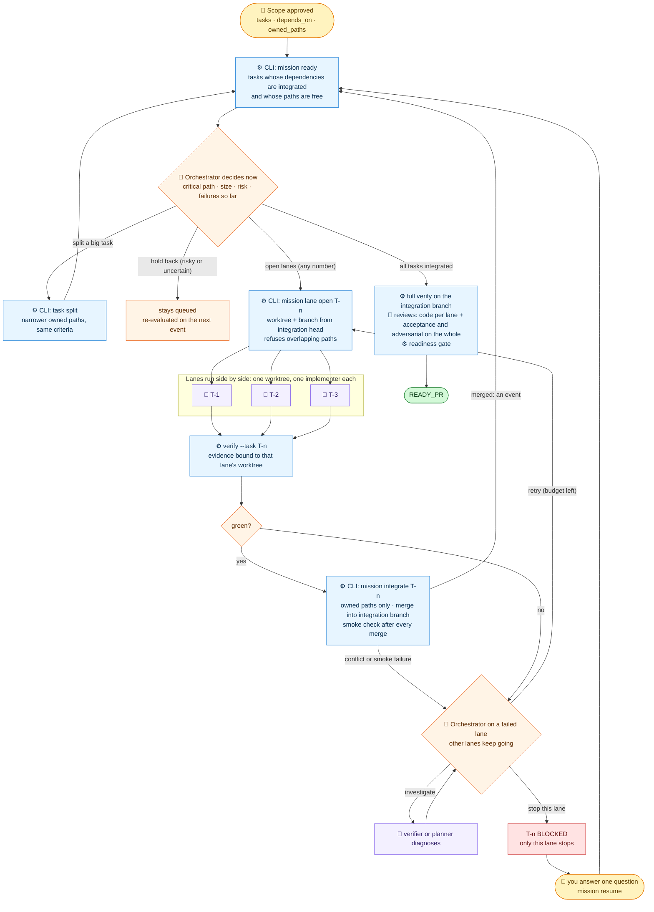
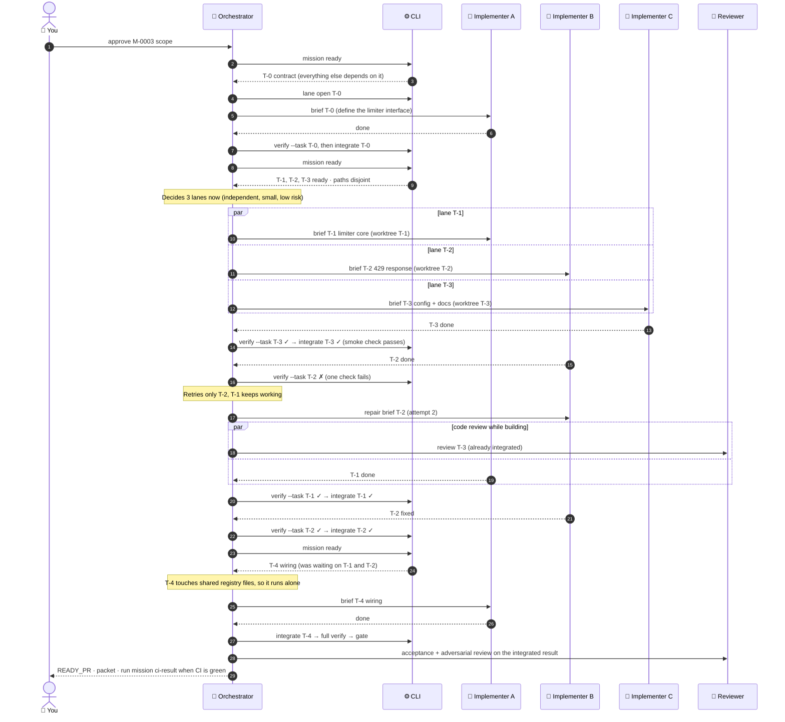
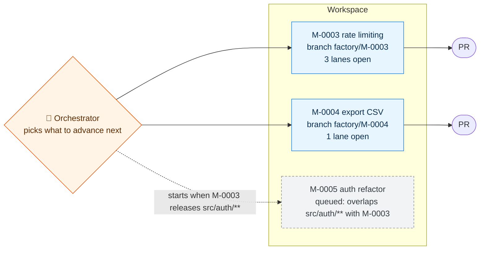

# Parallel Assembly Lines: Design

This is a proposal; none of it is implemented yet.

**Problem.** Today one implementer works one task at a time:

- `limits.parallel_writers` is fixed at `1`.
- `task-transition` refuses a second RUNNING task anywhere in the workspace.

**Principle.** There is **no worker pool and no fixed lane count**:

- The **orchestrator decides on the fly** how many lanes to open, which tasks to start, and whether to split, hold or re-order work, based on the task graph and on what is happening.
- The **CLI only enforces invariants**, so a decision can be fast without being unsafe.

| The orchestrator decides (judgment) | The CLI enforces (deterministic) |
|---|---|
| How many lanes to open right now | A lane starts only when its dependencies are integrated |
| Which ready task goes first (critical path, risk, size) | Running lanes never own overlapping paths |
| Splitting a big task into narrower lanes, or merging small ones | A split keeps the same criteria, so scope is unchanged |
| Retry, investigate, or block a failing lane | A lane may integrate only its own owned paths |
| When to ask for reviews | Repair budget per lane; gate on the integrated result |
| Holding a lane back (too risky, too uncertain) | Optional circuit breaker `limits.lane_fuse` against runaway spend (a fuse, not a pool) |

---

## 1. The orchestrator's decision loop

---

## 2. One mission over time, with lanes opened on the fly

---

## 3. The time it saves

The same six tasks, of about 20 minutes each, run first in sequence and then as assembly lines.

```mermaid
gantt
    title Same mission: one line vs. lanes opened on the fly
    dateFormat HH:mm
    axisFormat %H:%M

    section Today (one implementer)
    T-0 contract          :s0, 10:00, 15m
    T-1 limiter core      :s1, after s0, 25m
    T-2 429 response      :s2, after s1, 20m
    T-3 config + docs     :s3, after s2, 15m
    T-4 wiring            :s4, after s3, 15m
    Reviews + gate        :s5, after s4, 15m

    section Assembly lines
    T-0 contract          :p0, 10:00, 15m
    T-1 limiter core      :p1, after p0, 25m
    T-2 429 (1st try)     :crit, p2, after p0, 20m
    T-2 repair            :p2b, after p2, 10m
    T-3 config + docs     :p3, after p0, 15m
    Review T-3 early      :p3r, after p3, 10m
    T-4 wiring            :p4, after p1, 15m
    Final reviews + gate  :p5, after p4, 10m
```

- **Today:** about **105 minutes**.
- **Assembly lines:** about **65 minutes**, and the gap grows with more independent tasks.

---

## 4. Many missions at once

Missions run in parallel too, each on its own integration branch. The orchestrator decides which to advance. The CLI only refuses to start a mission whose owned paths overlap an active mission's.

---

## 5. What the planner must do so lanes are possible

1. **Contract first.** A small T-0 fixes any shared interface, so later lanes build against it, not against each other.
2. **Disjoint ownership.** Tasks that could run together never share a file, and each owns its own tests.
3. **Shared hot spots in one wiring task.** Registries, `__init__.py`, lockfiles and dependency changes go in a single serial task.
4. **`## Lanes` in `plan.md`.** It lists the dependency graph, the critical path and the likely lanes. It guides the orchestrator; it doesn't bind it.

`accept-scope` checks the graph: no dependency cycles, every changed file owned, and no overlap between tasks that could run at the same time.

## 6. New CLI surface

All of these commands are deterministic, and only the orchestrator runs them.

| Command | Purpose |
|---|---|
| `mission ready` | Tasks that could start now, with why the others must wait |
| `mission lane open T-n` | Create the worktree and branch and write the brief. Refused when paths overlap a running lane |
| `verify --mission M --task T-n` | Checks in that lane's worktree; evidence bound to it |
| `mission integrate T-n` | Owned-paths-only merge, then a smoke check on the integration branch, then DONE |
| `mission task split T-n` | Split into narrower lanes with the same criteria (no scope change) |
| `mission lane close T-n` | Abandon a lane and remove its worktree; the task returns to TODO |

**Unchanged:** your approvals, the assessment, scope binding, and one gate on the integrated result. The rule "one writer per workspace" becomes "one writer per worktree", and mission records stay serialized by the CLI's state lock.
