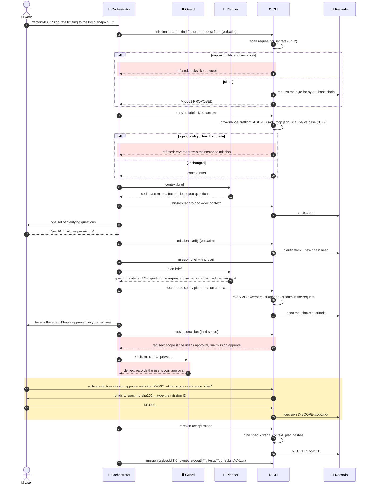
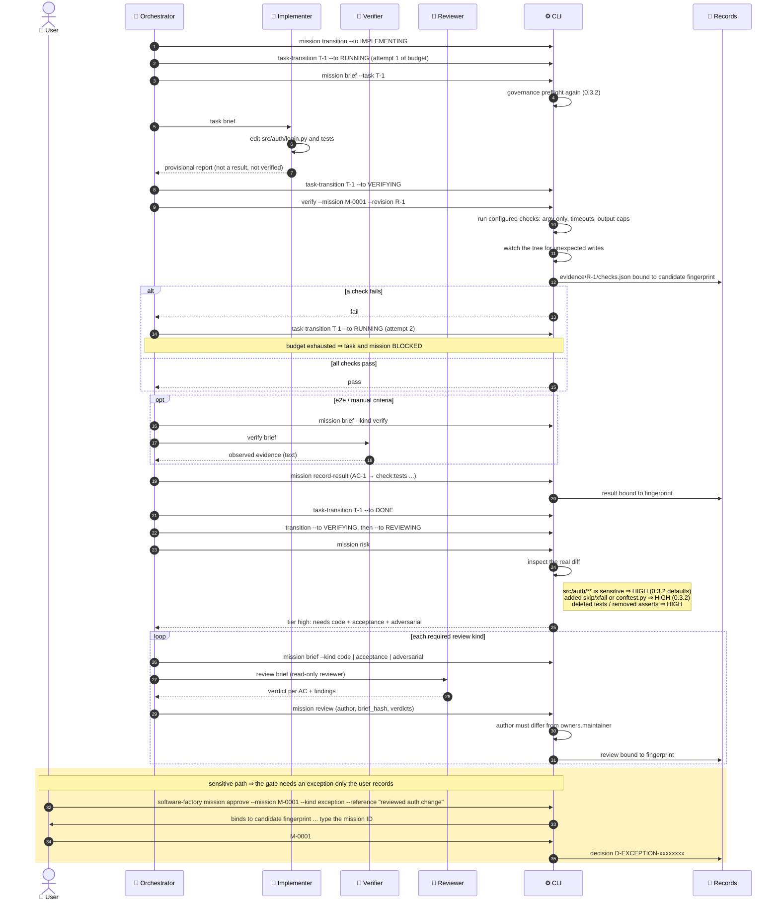
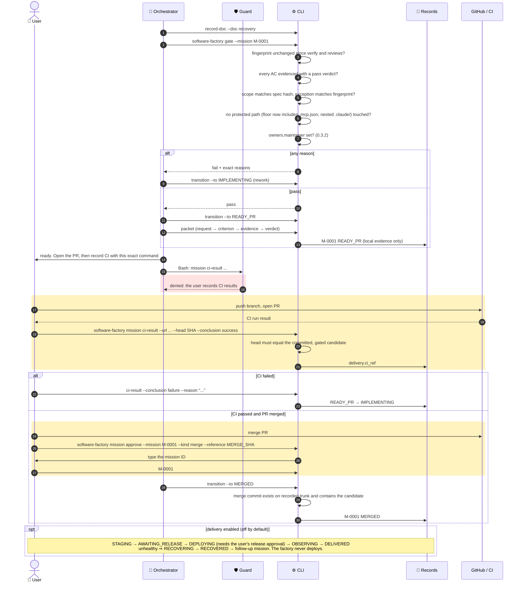
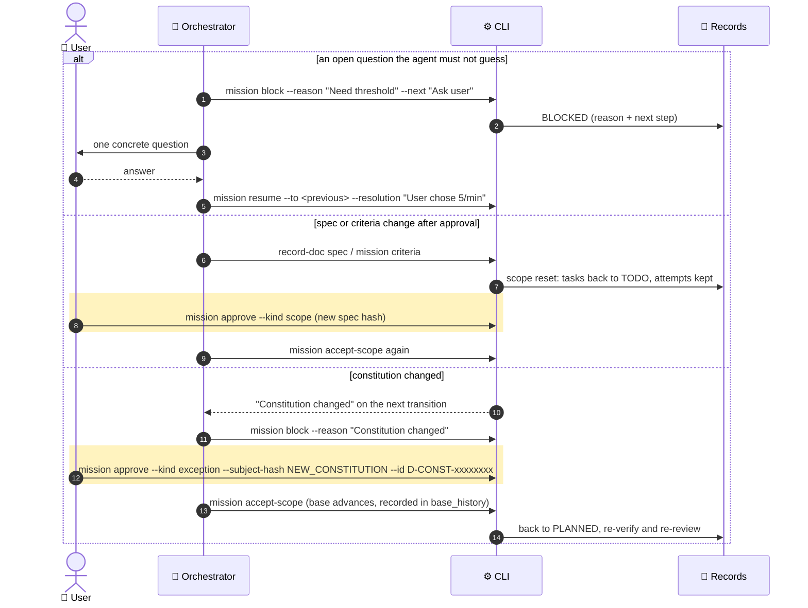

# Request Lifecycle (0.3.2)

How one user request moves through software-factory 0.3.2, from intake to merge.

**Example request.** *"Add rate limiting to the login endpoint in src/auth/login.py"*. It touches auth code, so it also exercises the 0.3.2 sensitive-path and approval rules.

**Participants**

| Participant | Role |
|---|---|
| 🧑 **User** | Types commands in their own terminal and approves |
| 🤖 **Orchestrator** | The coding client (Claude Code / Codex / Copilot) following the factory role. Coordinates only and never edits files |
| 🛡️ **Guard** | Opt-in Claude PreToolUse hook. Denies the orchestrator file edits, `mission approve` and `mission ci-result` |
| 👷 **Planner / Implementer / Verifier / Reviewer** | Specialists that return text. Only the implementer edits files |
| ⚙️ **CLI** | `software-factory`: deterministic records, checks and refusals |
| 📁 **Records** | `.factory/missions/M-0001/` (request, spec, plan, evidence, decisions, reviews) |

Diagrams: **⓪** one-page flow · **①** intake to approved scope · **②** implement, verify and review · **③** gate, CI and merge · **④** holds and resets.

---

## ⓪ One-page flow

**How to read it**
- **Boxes:** grey boxes are mission states.
- **Colored fills:**
  - 🟩 green are checks the CLI enforces.
  - 🟨 yellow are steps only you can do.
  - 🟥 red are refusals and holds.
  - 🟦 blue is agent work.
- **Arrows:**
  - Solid arrows are the normal path.
  - Dotted arrows loop back or wait for you.

```mermaid
flowchart TB
    classDef state fill:#f1f3f5,stroke:#495057,color:#212529,font-weight:bold
    classDef agent fill:#e7f5ff,stroke:#1c7ed6,color:#0b2e4f
    classDef check fill:#d3f9d8,stroke:#2b8a3e,color:#0b3d17
    classDef human fill:#fff3bf,stroke:#e67700,color:#5c3b00
    classDef stop fill:#ffe3e3,stroke:#c92a2a,color:#5c0a0a
    classDef done fill:#343a40,stroke:#212529,color:#ffffff

    REQ(["🧑 Request<br/>'Add rate limiting to the login endpoint'"]):::human
    SEC{"Secret in the request?"}:::check
    REFUSE1["Refused: remove the secret"]:::stop
    PROPOSED["PROPOSED<br/>request.md stored verbatim + hash chain"]:::state

    PRE{"Agent config changed?<br/>AGENTS.md, .mcp.json, .claude/"}:::check
    REFUSE2["Brief refused<br/>revert, or use a maintenance mission"]:::stop
    CTX["👷 Planner: context map"]:::agent
    CLAR["🤖 One set of clarifying questions<br/>answers stored verbatim"]:::agent
    SPEC["👷 Planner: spec · criteria · plan · recovery"]:::agent
    QUOTE{"Every criterion quotes<br/>the request exactly?"}:::check

    APPROVE_S["🧑 mission approve --kind scope<br/>type the mission ID in your terminal"]:::human
    AGENT_NO["Agent tries to approve<br/>⛔ CLI refuses · guard denies"]:::stop
    PLANNED["PLANNED<br/>spec, criteria, context, plan hashes bound"]:::state

    IMPL["IMPLEMENTING<br/>👷 Implementer edits owned paths only"]:::state
    VERIFY{"verify<br/>checks pass, bound to the code fingerprint?"}:::check
    BUDGET{"Repair budget left?"}:::check
    RESULTS["🤖 Record results<br/>evidence per criterion"]:::agent
    REVIEWING["REVIEWING"]:::state
    RISK{"Risk from the real diff<br/>sensitive path · skip/xfail · test config ·<br/>deleted tests · protected path"}:::check
    REV_LOW["👷 code review<br/>(+ acceptance in feature lane)"]:::agent
    REV_HIGH["👷 code + acceptance + adversarial reviews"]:::agent
    APPROVE_E["🧑 mission approve --kind exception<br/>(sensitive or check change)"]:::human

    GATE{"Gate<br/>fingerprint unchanged · every AC passes ·<br/>approvals match hashes · no protected path ·<br/>maintainer set · reviewer ≠ maintainer"}:::check
    READY["READY_PR<br/>local evidence only + PR packet"]:::state

    CI["🧑 Open PR, CI runs<br/>🧑 mission ci-result"]:::human
    CIOK{"CI passed?"}:::check
    MERGE["🧑 Merge PR<br/>🧑 mission approve --kind merge"]:::human
    MERGECHK{"Real merge commit on trunk<br/>contains the candidate?"}:::check
    MERGED(["MERGED"]):::done
    DELIVERY["Optional delivery (off by default)<br/>🧑 release approval → DEPLOYING → OBSERVING → DELIVERED"]:::state

    BLOCKED["BLOCKED / PAUSED<br/>reason + next step recorded"]:::stop
    RESUME["🧑 answers or fixes<br/>mission resume --resolution"]:::human

    REQ --> SEC
    SEC -- "yes" --> REFUSE1
    SEC -- "no" --> PROPOSED --> PRE
    PRE -- "yes" --> REFUSE2
    PRE -- "no" --> CTX --> CLAR --> SPEC --> QUOTE
    QUOTE -. "no: planner revises" .-> SPEC
    QUOTE -- "yes" --> APPROVE_S
    AGENT_NO -. "cannot bypass" .-> APPROVE_S
    APPROVE_S --> PLANNED --> IMPL --> VERIFY
    VERIFY -- "fail" --> BUDGET
    BUDGET -- "yes: next attempt" --> IMPL
    BUDGET -- "no" --> BLOCKED
    VERIFY -- "pass" --> RESULTS --> REVIEWING --> RISK
    RISK -- "low" --> REV_LOW --> GATE
    RISK -- "high" --> REV_HIGH --> APPROVE_E --> GATE
    REV_LOW -. "findings" .-> IMPL
    REV_HIGH -. "findings" .-> IMPL
    GATE -. "fail: rework" .-> IMPL
    GATE -- "pass" --> READY --> CI --> CIOK
    CIOK -. "no: back to work" .-> IMPL
    CIOK -- "yes" --> MERGE --> MERGECHK
    MERGECHK -- "yes" --> MERGED --> DELIVERY
    CLAR -. "open question" .-> BLOCKED
    BLOCKED --> RESUME
    RESUME -. "back to previous state" .-> IMPL
    SPEC -. "spec changed after approval:<br/>scope reset, approve again" .-> APPROVE_S
```

---

**Colors:** 🟨 yellow bands are human-only actions. 🟥 red bands are refusals added in 0.3.2.

---

## ① Intake → approved scope

---

## ② Implement → verify → review

---

## ③ Gate → READY_PR → CI → merge

---

## ④ Holds and scope resets (can happen at any step)

---

## What these diagrams do not show (limits in 0.3.2)

- **The terminal check is not authentication.** Codex and Copilot sessions follow instructions only, and a pseudo-terminal (for example `script`) passes the check. The Claude guard denies it. Records remain local-unattested.
- **Checks are not sandboxed.** They run on the host without an environment allowlist or network restriction.
- **No automatic time limits.** There are no cost budgets and no time-based stuck alerts. Holds are recorded, but nothing notifies anyone.
