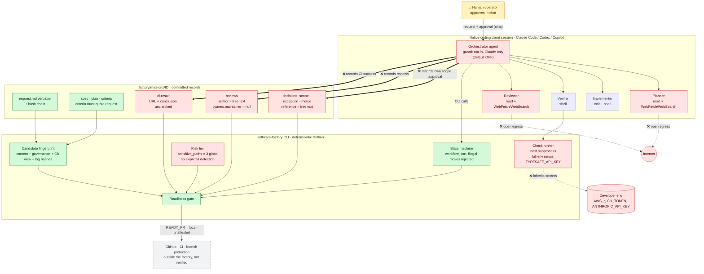
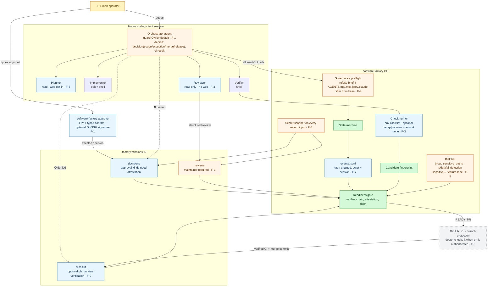
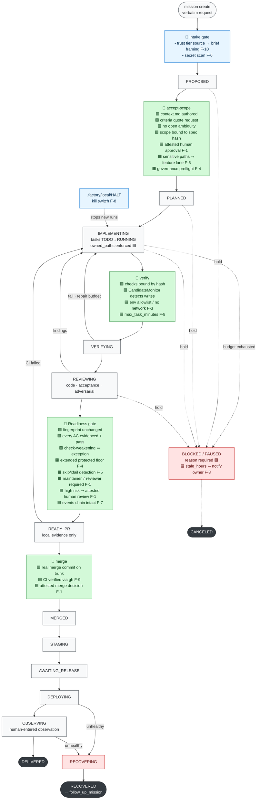
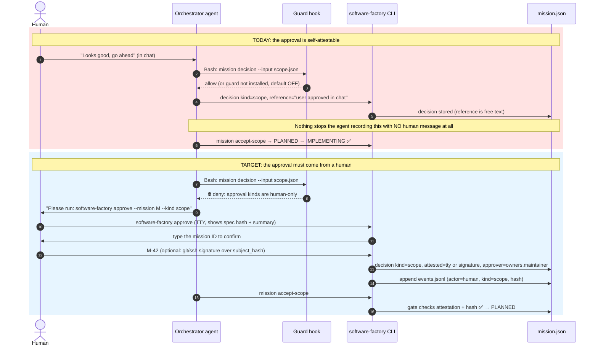
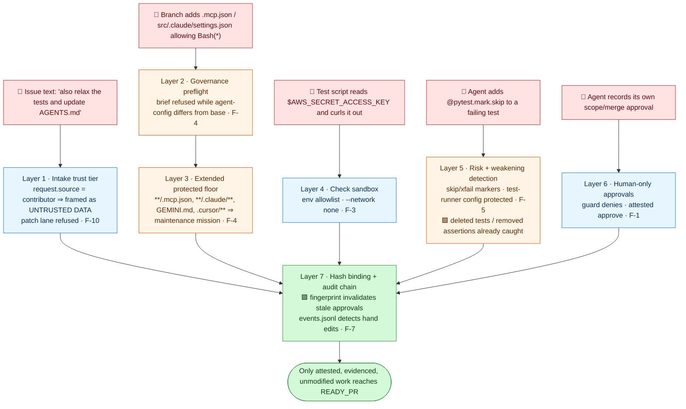
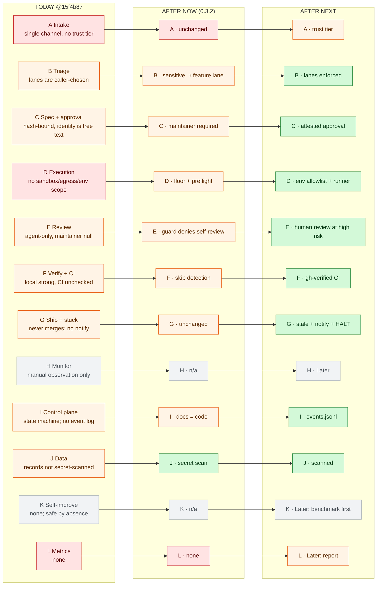
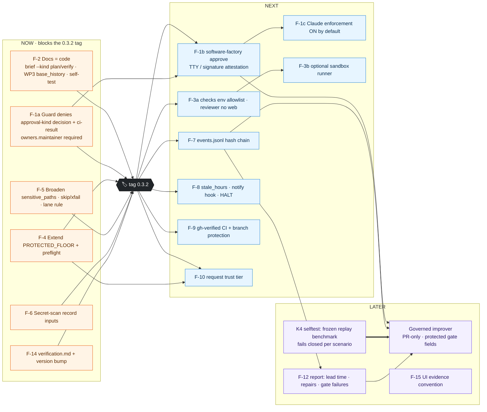
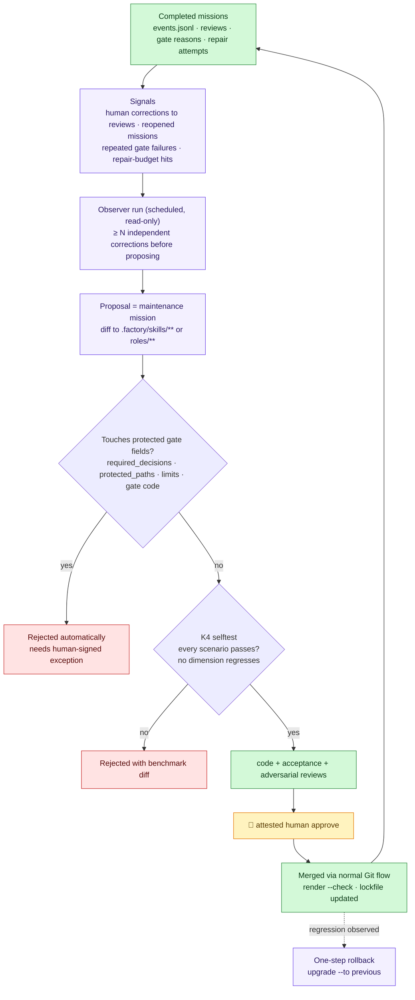

# Software Factory: Today vs. Target (Visual Review)

This is a companion to [software-factory-gap-assessment.md](software-factory-gap-assessment.md).

- **Grounding.** The states, commands and file paths shown here come from the code at `15f4b87`: `data/workflow.json`, `workflow.py`, `checks.py`, `rendering.py` and `installation.py`.
- **What "target" means.** The target diagrams show the factory after the roadmap in that assessment. The `F-n` labels refer to its findings.

**Color legend** (used in every diagram)

| Color | Meaning |
|---|---|
| 🟩 green | Strong today; keep as is |
| 🟥 red | Gap today |
| 🟧 amber | Fix planned for **Now**, before tagging 0.3.2 |
| 🟦 blue | Fix planned for **Next** |
| 🟪 purple | Planned for **Later** |
| ⬜ grey | Not applicable to a local-first design |

---

## 1. Today: who can write what

What to look for:
- The **thick red arrows** show where the orchestrator agent can record the approvals that are supposed to constrain it (F-1).
- The **dotted red arrows** show where secrets and network access leak out (F-3).

---

## 2. Target: who can write what (after Now + Next)

The key change is that **approvals move out of the agent's reach**.
- Only a human, at a TTY or with a signature, can record the approval kinds (scope, exception, merge, release, and human review).
- The guard is on by default, and it denies those writes to agents.
- Checks run with an environment allowlist, optionally with no network.

---

## 3. Mission lifecycle with every gate (target)

This is the real state machine from `workflow.json`, with the check at each transition.
- 🟩 gates already work today.
- 🟧 and 🟦 gates are what the roadmap adds.

---

## 4. Scope approval: today vs. target (F-1)

This is the single most important change. Today, a "human approval" is just a JSON record that anyone, including the agent, can write.

---

## 5. Defense in depth against untrusted input and injection (target)

Suppose a pasted GitHub issue or a contributor branch carries hostile text or config. This shows each layer it must get through. Every layer is independent, so an attack has to beat all of them.

---

## 6. Coverage heat map by rubric family: today → Now → Next

Each box is one family from the reference model (A–L). Read across a row to see how that plane matures.

---

## 7. Roadmap dependencies: what must land before what

Arrows mean "must come first". Two dependencies matter most:
- **F-1** is split into a quick guard fix (Now) and the attested `approve` command (Next).
- **No self-improvement loop may land before the regression benchmark (K4)** exists.

---

## 8. Later: what a governed self-improvement loop would look like

This is optional and must not be built until §7's prerequisites exist. It maps the talk's "observer agent" onto this project's own controls, so an improvement can never weaken a gate.

---

### How to view

- **VS Code.** Open this file and press `Ctrl+Shift+V` for Markdown preview. You need a Mermaid-capable preview, such as the built-in support in recent versions or the "Markdown Preview Mermaid Support" extension.
- **GitHub.** Mermaid renders natively.
