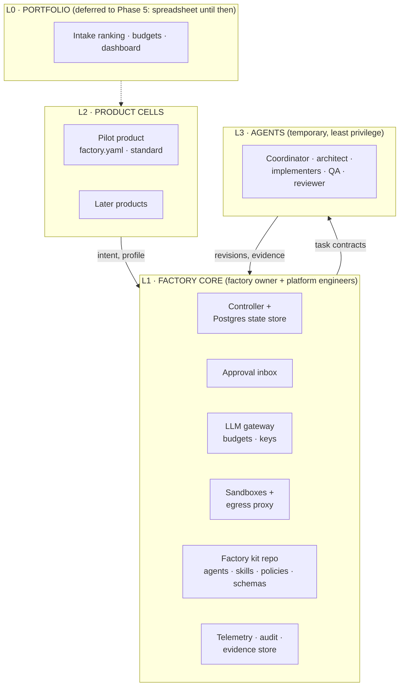
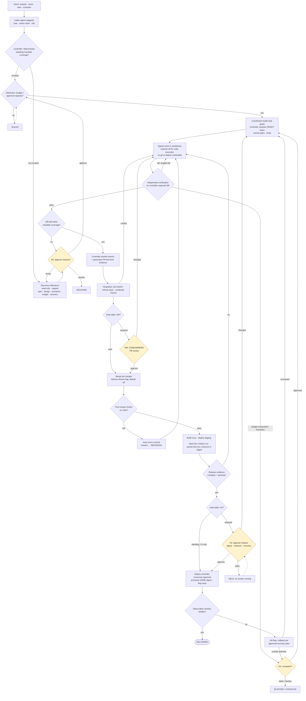
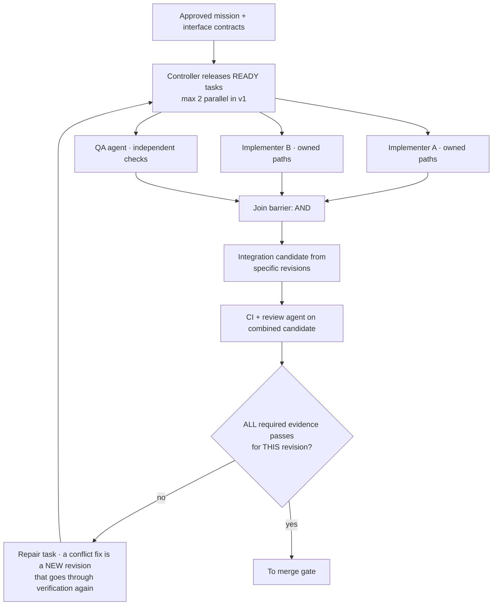
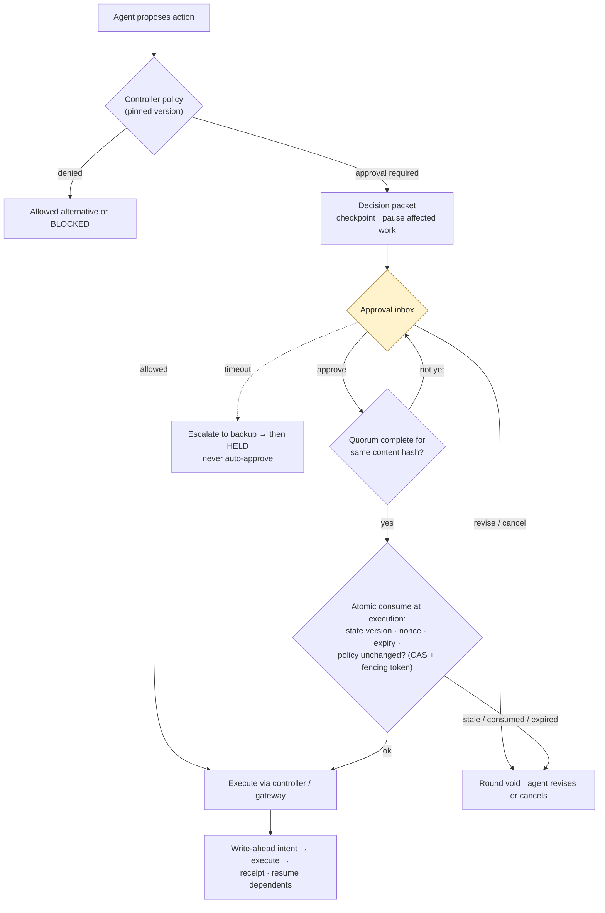
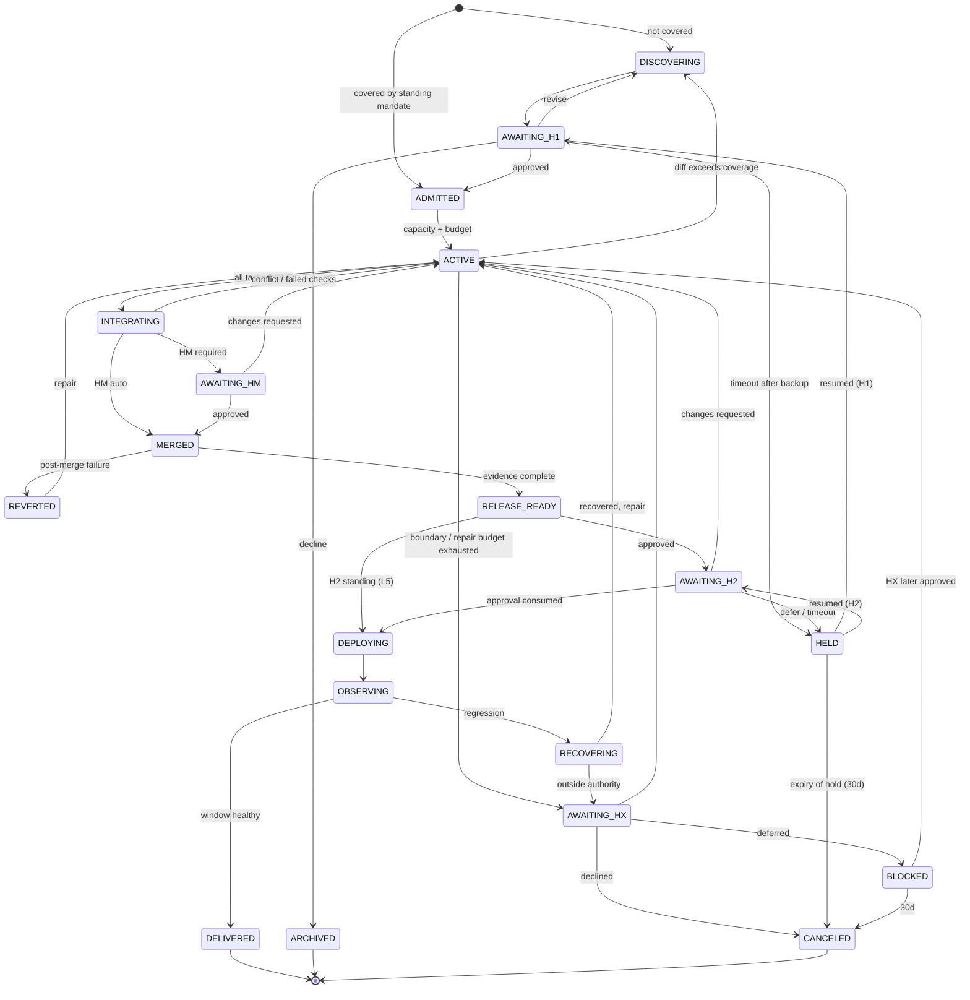
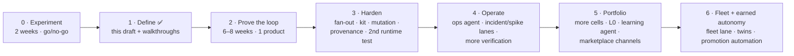

# Software Factory — Final Draft (Revision 2)

> **Status:** Final draft for decision · Phase 1 (workflow and architecture design) · **not implemented yet**
> **Date:** 2026-09-26 · **Revision 2:** applies the three-model critique in [software-factory-critique.md](software-factory-critique.md). The change log is in Appendix A.
> **Inputs:** [claude-software-factory.md](claude-software-factory.md) (v3) · [codex-software-factory.md](codex-software-factory.md) · [software-factory-research.md](software-factory-research.md)
> **Default agent runtime:** Claude. The runtime interface stays neutral (§12.3).

---

## 0. Decision requested

| Ask | Detail |
|---|---|
| **1. Approve Phase 0: a 2-week experiment** | 1 engineer, 2 weeks, **≤ $1,000** for LLM + CI. 10 real backlog items in the pilot repo, using plain Claude Code in CI. **No platform is built.** (§19) |
| **2. Name the people** | A **factory owner** (accountable for the factory itself), the pilot **product owner**, the pilot **tech lead**, and **one backup approver** |
| **3. Pick the pilot product** | A small web app or API with a *standard* risk profile, a measurable outcome, and an existing CI pipeline |
| **4. Pre-approve Phase 2 if Phase 0 passes** | 2 engineers × 6–8 weeks (**10–16 person-weeks**). LLM budget ≤ $1,500/month. Infra ≤ $300/month. |

**90-day milestone (by 2026-12-31):** one small feature moves from approved intent to production with humans acting **only through approvals**. Reviewer time and change-fail rate are measured against a baseline taken before Phase 2.

**Kill or re-plan criteria**. Stop and re-plan if any of these happen:
- Phase 0 fails its decision rule (§19.1).
- Phase 2 goes more than 50% over its person-week estimate.
- After 10 missions, **more than 40%** needed a human intervention outside approvals.
- Reviewer minutes per change exceed the PR-review baseline.
- Change-fail rate is worse than the baseline.

---

## 1. Executive summary

**What:** a software factory for a portfolio of products. Autonomous agents plus deterministic bots research, specify, build, test, review, integrate, release and operate software. Humans supply intent and **approve prepared decisions** through one inbox.

**Human decisions:**

| Decision | Purpose |
|---|---|
| **H1: Mission** | Approve the plan, scope, budget and recovery plan for new work. Recurring work runs under **standing mandates** with deterministic coverage rules. |
| **HM: Merge** | Required where the gate table (§6.2) says so. Uses ordinary PR review with CODEOWNERS. |
| **H2: Release** | Approve a specific artifact digest, the missions it contains, and the recovery plan |
| **HX: Exception** | Any change of authority: budget, scope, access, policy, infra, destructive data operations |

**Key design decisions in Revision 2:**
1. **One gate table with a precedence rule.** The strictest applicable rule wins (§6.2).
2. **Enforcement lives in infrastructure, not prompts:**
   - sandbox and network isolation
   - a controller-only git identity
   - budgets enforced at an LLM gateway
   - CI hardened against agent-authored PRs
   - holdouts in a separate repo
   - single-use approvals
3. **A small real controller from Phase 2:** a Postgres-backed state store. GitHub labels only *mirror* state.
4. **v1 is deliberately small:** one product, patch and feature lanes, verification layers 1–2 plus a black-box holdout. The portfolio layer, fleet lane, marketplace channels, learning agent and advanced verification are **deferred** (§2.2).
5. **The approval workload is budgeted,** and it sets the WIP limit (§6.5).

---

## 2. Scope

### 2.1 In scope

- **v1:** one web app or API product with staging and production.
- **Target:** a portfolio of web apps, APIs, workers and libraries.
- **Out of scope:** mobile store releases, embedded systems, safety-certified software.
- **Existing tools are reused:** Git provider, CI, telemetry and deployment platform.
- **Evidence status:** this design is a synthesis. Company case studies are vendor-reported. Independent data (DORA 2025; METR 2025 and its Feb 2026 update; Faros; GitClear) shows that AI's effect depends on verification and review keeping pace.

### 2.2 v1 vs deferred

| In v1 (Phases 0–3) | Deferred (phase) |
|---|---|
| One product cell, `factory.yaml`, patch and feature lanes | L0 portfolio layer: WSJF, capacity split, dashboard (spreadsheet until Phase 5) |
| Postgres-backed controller, GitHub App identities | Temporal. Only if the Postgres controller proves insufficient (Phase 5+) |
| Approval inbox (small service + Slack) + CODEOWNERS PR review | Fleet orchestrator and FLEET lane (Phase 6) |
| Sandbox with network off, egress proxy, LLM gateway budgets | Stable and beta marketplace channels. A folder in the kit repo until Phase 3; channels in Phase 5. |
| Verification: static, unit, review agent, black-box holdout | Mutation testing (diff-scoped, Phase 3), contract/fuzz/visual (Phase 4), digital twins (Phase 6) |
| Feature flags per mission, auto-revert | SBOM/SLSA/Sigstore (Phase 3), per-role model routing beyond defaults (Phase 3) |
| Manual autonomy promotion | Promotion automation (Phase 6), Learning agent (Phase 5), SPIKE and INCIDENT lanes (Phase 4) |
| Claude runtime | Codex adapter: interface kept, **built only for the Phase 3 exit test** (§16) |

---

## 3. Design principles

1. **Shared core, product profiles.** Don't build one factory per product.
2. **Verification caps autonomy.** Build independent oracles before adding agents.
3. **The controller enforces, agents reason.** An agent's completion message is input to verification, never permission.
4. **Enforce in infrastructure.** Hooks and guidance files are defense in depth, never the control.
5. **Contracts over conversations.** Authoritative state is in the state store and repo, never in chat.
6. **Approve decisions, not activity.** Batch choices, and resolve routine technical choices from conventions.
7. **Approvals are single-use and bound to exact inputs.**
8. **Fail closed.** Missing, skipped or unknown evidence counts as *no*. Silence or a timeout never approves.
9. **Agents can't grant themselves authority** or change the checks that judge them.
10. **The strictest applicable rule wins.**
11. **Budget the humans.** Approval capacity is the WIP limit.
12. **Thinnest viable factory first.** Defer until evidence demands it.

---

## 4. Operating model

### 4.1 Three cooperating parts

| Part | Responsibility | Must never |
|---|---|---|
| **Agent team** | Research, plan, code, test, evaluate, repair, draft decision packets | Hold git, deploy or prod credentials; approve; change policy, tests-under-judgment or evals |
| **Controller** (deterministic service + state store) | State, scheduling, budgets, policy, evidence validation, approvals, **all pushes, merges and PR text** | Take instructions from repo, issue or web text |
| **Human approver** | H1, HM, H2 and HX decisions; accountable for outcomes | Be asked routine technical questions |

### 4.2 Layers



### 4.3 What is central, federated and local

| Concern | Central (not negotiable) | Federated (a cell may only *tighten*) | Local |
|---|---|---|---|
| Policy | Security floor (§13), forbidden actions, the gate table | Stricter gate cells, extra protected paths | Repo rules, CLAUDE.md / AGENTS.md |
| Approvals | Single-use binding, quorum rules, fail closed | Extra approvers | Named approvers |
| Budgets | Gateway caps, kill switch | Lower caps | Spend within caps |
| Assets | Kit versioning, eval regression | Shared skills | Product skills, holdout scenarios |

---

## 5. Organization and ownership

### 5.1 Roles

| Role | Pilot staffing | Responsibilities |
|---|---|---|
| **Factory owner** | 1 person (part-time in Phase 0, about 50% from Phase 2) | Accountable for the factory: roadmap, policy, security floor, kit releases, kill criteria, cost |
| **Platform engineers** | 2 in Phase 2; 1–2 steady state | Build and run the controller, inbox, gateway, sandboxes and kit. **They are on call for the factory.** |
| **Product owner** (per product) | Existing | Intent, H1, acceptance scenarios, the outcome KPI |
| **Tech lead** (per product) | Existing | H1 (design), HM, H2, recovery plans |
| **Security reviewer** | Shared | Protected-path HM, HX for access and credentials, regulated H1 |
| **Backup approver** | 1 per product | Receives escalations when an approval times out |

### 5.2 RACI

R = responsible, A = accountable, C = consulted, I = informed.

| Activity | Factory owner | Platform eng. | PO | TL | Security |
|---|---|---|---|---|---|
| Factory kit and policy changes | **A** | R | I | C | C (policy) |
| Security floor | **A** | R | I | I | C |
| Mission approval (H1) | I | — | **A**/R | R | C (protected) |
| Merge approval (HM) | — | — | I | **A**/R | R (protected paths) |
| Release approval (H2) | I | — | C | **A**/R | C (regulated) |
| Exceptions (HX) | C (budget, policy) | — | **A** (scope) | R | **A** (access) |
| Factory incidents | **A** | R | I | C | C |
| Budgets | **A** | R | C | C | — |

### 5.3 Keeping approvers competent (guarding against comprehension debt)

- Approvers **keep hands-on work**: at least about 20% of their time pairing with agents or doing deep-dives in the codebases they approve.
- **Onboarding** for approvers covers the packet format, the rejection expectation (rejecting is normal and healthy), and practice with seeded "should-reject" packets.
- A **monthly deep-dive:** one approver explains a recently merged agent change to the team.

---

## 6. The approval model

### 6.1 Mandates

A **mandate** is the approved authority for work. It contains:
- the outcome and acceptance scenarios
- the paths and repositories in scope
- access and budget
- the merge and release policy
- the recovery plan (covering code *and* data)
- an expiry
- **the pinned kit and policy versions**

**Standing mandates** cover recurring work, and whether a piece of work is covered is decided **deterministically by the controller, not by a model**:
- The intake agent only *suggests* a classification.
- The controller checks the coverage rules: required labels, the action classes allowed, paths within the mandate's paths, and diff size ≤ the limit.
- The check runs **both before work starts and on the actual diff**. If the diff exceeds the rules, the mission stops and goes to H1.

The **discovery allowance** (to prepare an H1 packet) is itself a standing mandate. It has a $ cap, read-only tools, and no pushes.

### 6.2 Gate resolution: one table and a precedence rule

**Precedence, where the strictest applicable rule wins:**
1. **Forbidden** (AC8) → blocked, always.
2. **Authority change** (AC7) → HX.
3. **Protected paths** (AC6) → the AC6 row, regardless of the class the change otherwise belongs to.
4. **Base table** below, for the product's risk profile (this *is* autonomy level L3).
5. **Autonomy promotions** (§15) may relax **only** the cells they name.
6. **`factory.yaml` overrides** may only tighten.

Lanes are workflow shapes only. **Gates come from this table, never from the lane.**

**Base table (L3).** Cells read experimental / standard / regulated. For a release, the digest's H2 requirement is the **strictest** of all the missions it contains.

| Action class | H1: authorize | HM: merge | H2: release |
|---|---|---|---|
| **AC1** Docs, lint/format, test *additions* | standing | auto / 1 / 1 | 1 / 1 / 2 |
| **AC2** Dependency patch/minor (signed, no license change) | standing | auto / 1 / 1 | 1 / 1 / 2 |
| **AC3** Small fix, ≤150 lines, no protected paths | standing | auto / 1 / 1 | 1 / 1 / 2 |
| **AC4** Feature behind a default-off flag | 1 (PO) / 1 (PO+TL, may be the same person) / 2 (PO+TL+security) | 1 / 1 / 2 | 1 / 1 / 2, per flag ramp |
| **AC5** Additive schema migration | inside H1, with a forward-fix plan | 1 / 1 / 2 | 1 / 1 / 2 + change record |
| **AC6** Protected paths: auth, crypto, payments, migrations, existing tests/fixtures/conftest | H1 + security | 1+sec / 1+sec / 2 incl. sec | 1 / 1 / 2 |
| **AC7** Authority change: budget, scope, access, credentials, infra apply, major or new dependencies, destructive data operations | **HX**: 1 / 1 / 2 (destructive data and credentials always 2) | — | — |
| **AC8** Forbidden (§13): CI workflows (`.github/**`), policies, evals, holdouts, prod secrets/data, disabling checks | blocked | blocked | blocked |

"1" means one approver from the role list. "2" means two **distinct** identities, as defined by the quorum rules in §6.3.

### 6.3 Quorum and separation of duties

- Required approvals are collected against **the same content hash**, and all of them must fall within the expiry window.
- **Distinct identities** per required role. In *regulated* products, one person can't fill two roles and the **requester is excluded**.
- In *experimental* and *standard* products, one person may hold PO and TL (**role collapsing**). Two-person rules apply only to *regulated* products and to AC7 destructive-data and credential actions.
- **No self-approval:** a human who edited code in a mission can't approve that mission's HM.
- A **"revise" or "cancel" from any required approver voids** the decision round. A new hash starts a new round.
- **Timeout:** escalate to the backup approver. The request then expires into HELD. **Nothing is ever approved by default.**

### 6.4 What never needs a human (inside a valid mandate)

- Research, planning, code, tests, reviews, docs and repairs within the repair budget
- Infrastructure retries
- Staging and preview deployments
- Auto-merges where §6.2 says "auto"
- Short-lived credential issuance within an existing grant
- Stopping a rollout and running an **already-approved** recovery plan

### 6.5 Approval budget

Approval capacity is the WIP limit.

| Item (standard profile, L3) | Estimated reviewer minutes |
|---|---|
| Feature mission: H1 (15) + HM for about 2 PRs (2×20) + share of H2 (10) | **≈ 65 min** |
| Patch/small fix: HM (5–10) + share of H2 (2) | **≈ 10 min** |
| HX exception | ≈ 10 min |

With `reviewer_hours_per_week: 10`, the pilot cell can absorb about **6 feature missions + 20 patches per week**. The controller **admits new missions only while the projected approval minutes fit the budget**. Approval latency and rejection rate are tracked, and a rejection rate that trends to 0 triggers a seeded-packet audit.

---

## 7. Main factory flow



**Merge and release units.** Each mission merges **behind its own default-off flag**, so unreleased code on main is dormant. A post-merge failure triggers an **automatic revert**. An H2 packet lists **every mission and commit in the digest**, and flags are ramped per mission.

---

## 8. Lanes (workflow shapes; gates come from §6.2)

| Lane | v1? | Shape |
|---|---|---|
| **PATCH** (AC1–AC3) | ✅ | Standing mandate → implement → verify → HM per table → next release |
| **FEATURE** (AC4–AC6) | ✅ | Discovery → H1 → task graph → verify → HM → H2 with flag ramp |
| **INCIDENT** | Phase 4 | Approved recovery first → hotfix mission (expedited H2) → postmortem |
| **SPIKE** | Phase 4 | Discovery allowance only, never merges. Output: a report + an H1 draft. |
| **FLEET** | Phase 6 | H1 once for the recipe → waves sharded by owner → gate table per repo |

---

## 9. Integration and verification

### 9.1 Fan-out with a join barrier



### 9.2 Verification by phase

| Layer | v1 (Phase 2) | Later |
|---|---|---|
| 1 Static: lint, types, secret scan, dependency audit | ✅ every revision | |
| 2 Unit + coverage (existing suite) | ✅ every revision | |
| Review agent (separate identity, reads the controller-captured diff) | ✅ before merge | Security agent (Phase 3) |
| **Black-box holdout scenarios** (separate repo and runner, against the staging digest, returns pass/fail counts only) | ✅ before release | More scenarios over time |
| 3 Mutation testing | — | **Diff-scoped before merge** (Phase 3); full runs nightly |
| 4–5 Property/fuzz, contract tests | — | Phase 4 |
| 6 E2E on digital twins | — | Before release (Phase 6) |
| 7 Visual regression | — | Phase 4 for UI products |
| 8 Sampled LLM judge | — | Phase 4, never the only gate |

**Test-integrity rules:**
- Agents may **add** new test files.
- Edits to *existing* assertions, fixtures, mocks, conftest or setup files are classed as **AC6** (protected).
- Holdouts and mutation always run against tests the agent didn't touch.
- The evidence gate requires an actual **success** conclusion for every required check, because GitHub treats skipped and neutral as passing.

---

## 10. Durable approval workflow



**How approvals and side effects are recorded:**
- An **approval is single-use.** It is consumed atomically by the component that performs the side effect (the merge bot or deploy controller), using a compare-and-swap on the mission's state version and a fencing token.
- **Expiry means the operation must *start* before the expiry time.** A rollout that has started continues under its approved plan and checks a halt flag at every ramp step.
- **A rollback invalidates every unconsumed approval** for that digest.
- **Side effects use write-ahead intent.** The intent record is written *before* the side effect runs. After a crash, the controller reconciles the intent against the actual target state before retrying.

**What the decision packet contains:**
- the recommendation and alternatives
- the raw diff and a preview
- the evidence: check results and the holdout pass count
- the risk class and **the rule that fired**
- the blast radius
- **every mission in the digest** (for H2)
- the recovery plan (code + data)
- cost
- the untrusted inputs the agents read
- the agent, model and kit versions
- request ID, nonce, required roles and expiry

---

## 11. Agents and bots

Model choices live in `factory.yaml` (§12.1), not in this document.

| Role | Type | Output | Authority limits |
|---|---|---|---|
| Intake | agent (triage tier) | Suggested lane, class and risk | Read-only; **coverage is decided by the controller** |
| Architect / planner | agent (planning tier) | Spec (EARS), ADR, task graph, H1 packet | Discovery allowance; no pushes |
| Coordinator | agent (planning tier) | Assignments, repair plans, packets | Can't change the mandate |
| Implementers (max 2 in v1) | agent (build tier) | Revisions in the sandbox | Owned paths; **no git credentials, no network during code execution** |
| QA | agent (build tier) | Independent checks | No access to implementer sessions |
| Reviewer | agent (planning tier) | Structured findings | Separate identity; can't merge |
| **Push bot** | deterministic (controller GitHub App) | Branches, PR text generated from evidence | The only identity that can push; can't approve |
| **Merge bot** | deterministic (separate GitHub App) | Merges after the evidence hash and quorum check | The only merge identity; **no LLM in this path** |
| Release / deploy controller | deterministic | Digest, staging deploy, prod promotion | **The only holder of prod credentials**; consumes H2 |
| Operations (Phase 4) | agent | Incident evidence, fix proposals | Recovery within the approved plan |
| Learning (Phase 5) | agent | Proposals as kit PRs | Proposals only; kit gate (§13.3) |

---

## 12. Architecture

### 12.1 Contracts (all carry `schema_version`)

**`factory.yaml`** (pilot sample, standard profile):

```yaml
schema_version: 1
product: pilot-api
risk_profile: standard                 # experimental | standard | regulated
autonomy_level: L3                     # L3 | L4 | L5 — promoted manually in v1
kit: { version: "factory-kit@1.0.0", policy_version: "p-2026.10.1" }   # pinned per mandate
runtime: claude
models:                                # tiers → IDs; change here, not in docs
  triage: claude-haiku-4-5-20251001
  build: claude-sonnet-5
  planning: claude-opus-5-5
owners: { factory: "@owner", product: "@po", tech_lead: "@tl", security: "@sec", backup: "@backup" }
approvers: { h1: ["@po", "@tl"], hm: codeowners, h2: ["@tl"], hx: ["@po", "@tl", "@sec"] }
lanes: [patch, feature]
protected_paths: ["src/auth/**", "migrations/**", "tests/**/conftest.py", "tests/fixtures/**"]   # AC6: approval required
forbidden_paths: [".github/**", "policy/**", "evals/**"]                                     # AC8: agents never
budgets:
  patch_task_usd: 2
  feature_task_usd: 12
  patch_mission_usd: 10
  feature_mission_usd: 120
  monthly_usd: 1500
  reviewer_hours_per_week: 10
repair_attempts: { patch: 2, feature: 3 }
infra_retries: 3
verification:
  required: [lint, types, secret_scan, dep_audit, unit, review_agent, holdout_blackbox]
  mutation: off                        # Phase 3: diff_scoped (min score 0.6)
holdout_repo: "org/pilot-api-holdouts" # separate repo, separate runner identity
observation_window: 24h
standing_mandates: [SM-pilot-patch]
```

**Standing mandate:**

```yaml
schema_version: 1
mandate_id: SM-pilot-patch
kind: standing
product: pilot-api
coverage:                              # evaluated by the controller, pre-run AND on actual diff
  labels_any: ["factory:patch"]
  action_classes: [AC1, AC2, AC3]
  paths: ["src/**", "docs/**", "tests/**"]
  exclude_paths_from: factory.yaml#protected_paths
  max_diff_lines: 150
budget: { per_mission_usd: 10, monthly_usd: 300 }
merge_policy: per_gate_table
release_policy: per_gate_table
kit_version: "factory-kit@1.0.0"
policy_version: "p-2026.10.1"
expires: "2027-01-31"
approved_by: ["@po", "@tl"]
content_hash: "sha256:…"
```

**Task contract:**

```yaml
schema_version: 1
ids: { mission: MIS-0042, task: T-3, run: R-17, depends_on: [T-1] }
objective: "Add rate-limit middleware returning 429 + Retry-After"
spec_revision: v3
base_commit: "<sha>"
owned_paths: ["src/billing/middleware/**", "tests/billing/test_rate_limit_new.py"]
action_class: AC4
tools: [read, edit, run_tests]         # enforced by sandbox + controller, not prompt
acceptance_checks: ["pytest tests/billing/test_rate_limit_new.py", "bench/rate_limit_latency.py --p95-max-ms 2"]
limits: { repair_attempts: 3, infra_retries: 3, minutes: 45, usd: 12 }   # counts against mission total
max_diff_lines: 400
```

**Approval record:**

```yaml
schema_version: 1
request_id: REQ-981
gate: H2
mission_ids: [MIS-0042, MIS-0045]       # every mission in the digest
operation: { type: deploy, target: prod, artifact: "sha256:ab12…", config: "cfg-77" }
nonce: "b7f3…"
state_version: 412                      # CAS precondition
content_hash: "sha256:…"
policy_version: "p-2026.10.1"
required_roles: [tech_lead]
decisions: [{ approver: "@tl", role: tech_lead, decision: approve, decided_at: "…", signature: "…" }]
expires: "2026-09-27T18:00Z"            # operation must START before this
consumed: { at: null, by: null, fencing_token: null }
```

### 12.2 Modules (v1 adapters stated honestly)

| # | Module | v1 adapter | Later |
|---|---|---|---|
| M1 | Intake | GitHub Issues + intake agent (suggestions only) | + Slack, Sentry, schedules |
| M2 | Spec & design | Spec files in repo (Spec Kit / OpenSpec style, EARS) | Spec registry |
| M3 | **Controller** | **Small service + Postgres state store** (or DBOS on Postgres). Webhooks through a **GitHub App**. Labels mirror state only. | Temporal only if needed; **one engine** |
| M4 | Fleet orchestrator | — (deferred) | Phase 6 |
| M5 | Policy | **Controller policy module + sandbox/network rules + GitHub rulesets**. Hooks are defense in depth. | OPA/Cedar at a tool gateway |
| M6 | Cost governor | **LLM gateway with a virtual key per mission and hard caps** (external). `max_budget_usd` / `maxBudgetUsd` as a second layer. | Per-product attribution dashboards |
| M7 | Agent runtime | Claude Agent SDK in the sandbox | Claude Managed Agents; Codex adapter (Phase 3 test) |
| M8 | Sandbox | Container per task. **Code runs with network off.** Egress proxy allows only the LLM gateway and a package mirror. No credentials mounted. | Managed Agents sandboxes / E2B |
| M9 | Assets | Factory-kit repo (plugins, schemas, policies) | Marketplace with channels (Phase 5) |
| M10 | Verification | CI (layers 1–2) + review agent + **black-box holdout runner** | Mutation, twins, judge |
| M11 | Release & flags | Build once; deploy controller; **feature-flag service (owned here)**; auto-revert | SLSA/SBOM/Sigstore (Phase 3) |
| M12 | Telemetry & evidence | Postgres evidence index + object store; OpenTelemetry | Portfolio dashboard |
| — | **Approval inbox** | Small web inbox + Slack notifications with signed callbacks (H1/H2/HX). **HM through PR review + CODEOWNERS** with required approval counts in rulesets. | GitHub Environments as an *extra* layer only if on Enterprise |

### 12.3 Runtime interface (M7)

```text
start(task_contract, sandbox, tool_policy)  -> session_id
resume(session_id, message)                 -> events
cancel(session_id)                          -> ack
checkpoint(session_id)                      -> session_state   # persisted OUTSIDE the sandbox
on_tool_approval(callback)                  # runtime asks → controller creates HX, never widens permissions
result(session_id)                          -> {revision_diff, session_log, usage(normalized), status}
```

- **Claude adapter:** Agent SDK. Python uses `permission_mode`, `can_use_tool`, `max_budget_usd`; TypeScript uses `permissionMode`, `canUseTool`, `maxBudgetUsd`. Guidance lives in `CLAUDE.md`.
- **Codex adapter (Phase 3 exit test):** Codex SDK / `codex exec`, with guidance in `AGENTS.md`. Codex has no PreToolUse hooks or in-process budget, which is why enforcement lives in the sandbox, gateway and controller.

### 12.4 Repository layout

Anything without a tag is part of Phase 2. `(P3)`, `(P4)`, `(P5)` mark later phases.

```text
github.com/<org>/
├── factory-controller/      # L1: deterministic service (M3, M5, M6, M8, M11, M12 + inbox)
├── factory-kit/             # L1: agents, skills, policies, schemas, templates, evals (M9); has a kit gate
├── pilot-api/               # L2: first product cell
├── pilot-api-holdouts/      # hidden acceptance scenarios; no agent access
└── (P5) product-b/, product-b-holdouts/, …
```

```text
factory-controller/
├── src/factory/
│   ├── controller/   mission_fsm.py · task_fsm.py · scheduler.py (join barrier, admission)
│   │                 coverage.py (§6.1) · gate_resolver.py (§6.2) · approvals.py (quorum, CAS consume)
│   │                 intents.py (write-ahead, receipts) · approval_budget.py (§6.5)
│   ├── policy/       engine.py · action_classes.py (AC1–AC8 on the actual diff)
│   ├── runtime/      interface.py · claude_adapter.py · codex_adapter.py (P3)
│   ├── sandbox/      runner.py (network-off execution) · diff_capture.py
│   ├── github/       webhooks.py · push_bot.py · merge_bot.py · label_mirror.py
│   ├── verification/ evidence.py · checks.py (skipped = fail) · holdout_client.py
│   ├── release/      build.py · deploy_controller.py · flags.py · auto_revert.py
│   ├── budget/       gateway_keys.py (per-mission hard caps)
│   ├── inbox/        api.py · slack.py · web/
│   └── telemetry/    otel.py · metrics.py
├── migrations/       Postgres: missions, tasks, approvals, intents, receipts, evidence
├── deploy/           litellm/config.yaml · egress-proxy/allowlist.yaml · terraform/
└── tests/walkthroughs/   the 13 §19.3 scenarios as automated tests
```

```text
factory-kit/
├── plugins/factory-core/        # Claude Code plugin
│   ├── agents/   intake · architect · coordinator · implementer · qa · reviewer
│   │             security-reviewer (P3) · ops (P4) · learning (P5)
│   ├── skills/   write-spec-ears · plan-task-graph · tdd-implement · build-decision-packet · write-recovery-plan
│   └── hooks/    defense in depth only
├── guidance/     base.md + render.py → CLAUDE.md and AGENTS.md
├── policies/     gate-table.yaml · autonomy-levels.yaml · floor.yaml · profiles/{experimental,standard,regulated}.yaml
├── schemas/      factory · mandate · task-contract · evidence-bundle · approval-record (.schema.json)
├── templates/    backend-service/ (P5 golden path)
├── workflows/    ci-pr.yml (pull_request, no secrets) · deploy.yml (OIDC)
└── evals/        cases/ · run_evals.py (kit PRs must pass)
```

```text
pilot-api/                                   pilot-api-holdouts/
├── factory.yaml                             ├── CODEOWNERS (PO + security)
├── CLAUDE.md · AGENTS.md (generated)        ├── scenarios/<feature>/*.yaml
├── CODEOWNERS (drives HM)                   ├── runner/run_blackbox.py  (staging digest → pass/fail counts)
├── .claude/settings.json (pins kit plugin)  └── .github/workflows/holdout.yml (controller-triggered)
├── .github/workflows/  ci.yml · deploy.yml   (protected, AC6)
├── mandates/SM-pilot-patch.yaml
├── specs/<area>/*.md  (EARS + ADRs)
├── src/  (src/auth/** protected)
├── tests/  (conftest.py, fixtures/ protected; new test files allowed)
└── migrations/  (protected)
```

**Phase 0** needs none of the above, only the experiment kit in [phase0-experiment/](../phase0-experiment/README.md) copied into the pilot repo.

---

## 13. Security floor

### 13.1 Controls

1. **Prod credentials exist only in the deploy controller.** *(Replit prod-database deletion)*
2. **Code execution is treated as arbitrary code.** Tests and builds run in a container with **network off** and no credentials. Agent tool calls reach only the LLM gateway and a package mirror, through an egress proxy.
3. **Protected records:** existing tests, fixtures and conftest files are AC6 (allowed only with approval). CI workflows, policies, evals, holdouts and acceptance criteria are **AC8: agents can never change them**; humans change them through normal PRs and the kit gate. *(Agents gaming tests / ImpossibleBench)*
4. **Holdouts live in a separate repo,** run by a separate runner identity, black-box against the deployed staging digest. Only pass/fail counts come back.
5. **Agents have no outbound write path:**
   - No git credentials: the controller pushes the diff it captured.
   - PR titles and bodies are generated by the controller from evidence.
   - MCP servers run behind the gateway with their own egress allowlist.

   *(Cross-vendor prompt injection through a PR title)*
6. **Untrusted text is data.** Issue and PR bodies, web content and repo files never carry authority, and agents that read them have no secrets and no egress.
7. **Budgets are enforced externally** at the LLM gateway, with per-mission keys and a tested kill switch. *(The $47k agent loop)*
8. **Approvals are single-use,** consumed with a compare-and-swap, nonce and expiry. A rollback invalidates open approvals.
9. **One identity per agent and bot,** with an immutable audit log. Merges and pushes use **only deterministic identities**.
10. **Supply chain:** pinned kit and MCP versions. SBOM, provenance and signing from Phase 3.

### 13.2 CI hardening against agent-authored PRs

- Agent and bot identities get **no `workflows` permission**. Any agent diff touching `.github/**` is AC8, and the controller rejects it before pushing.
- PR CI uses **`pull_request`** (not `pull_request_target`) and has **no secrets**. **Checking out a PR's head commit under `pull_request_target` is banned.**
- Secrets exist only in deploy jobs, obtained through OIDC or short-lived GitHub App tokens.
- Turn off **"Allow GitHub Actions to create and approve pull requests"**.
- Rulesets protect `main`: required checks, required CODEOWNERS approvals, and merges only through the merge bot.
- The merge bot is a separate GitHub App. It verifies the evidence hash and the quorum record before it merges.

### 13.3 Factory-kit changes (the "kit gate")

Changes to prompts, agents, skills, policies, schemas or eval suites are PRs to the kit repo.

| Change | Required approval |
|---|---|
| Prompts, skills, agents | Factory owner + 1 |
| **Policy, holdout or eval changes** | **Two humans**, including security. The eval suite can't be modified in the same PR that it judges. |

- All kit PRs must pass the kit's own eval regression.
- The Learning agent (Phase 5) can only *open* kit PRs.
- Running missions keep their **pinned kit and policy versions** and re-validate at their next gate.

### 13.4 OWASP Agentic Top 10 (2026) mapping

| Risk | Controls |
|---|---|
| ASI01 Goal hijack / prompt injection | 13.1 #5–6, deterministic coverage (§6.1) |
| ASI02 Tool misuse | 13.1 #2, #5; gate table |
| ASI03 Identity and privilege abuse | 13.1 #1, #9; separate App identities |
| ASI04 Supply chain | 13.1 #10; kit gate |
| ASI05 Unexpected code execution | 13.1 #2 (network-off execution) |
| ASI06 Memory / context poisoning | Kit gate (13.3); pinned versions |
| ASI07 Insecure inter-agent communication | Typed contracts through the controller; no direct agent-to-agent authority |
| ASI08 Cascading failures | Budgets, join barrier, auto-revert, fleet deferred |
| ASI09 Human-trust exploitation | Raw diff in packets, seeded audits, quorum rules |
| ASI10 Rogue agents | Kill switch, no outbound write path, audit |

---

## 14. State machines

### 14.1 Mission



**Transitions that apply from any state:**
- mandate or approval **expiry** → AWAITING_HX
- **budget kill at 100%** → AWAITING_HX
- **factory kill switch** → HELD

**No worker runs while a mission is in HELD, BLOCKED or any AWAITING state.**

### 14.2 Task

| From | Event | To |
|---|---|---|
| WAITING_DEPS | Dependencies DONE and contracts available | READY |
| READY | Controller dispatches (within WIP and budget) | RUNNING |
| RUNNING | Revision produced | VERIFYING |
| RUNNING | Worker crash or infra error (retries left) | READY (restore checkpoint) |
| VERIFYING | Pass | DONE |
| VERIFYING | Fail, repair attempts left | REPAIRING → RUNNING |
| VERIFYING / REPAIRING | Attempts or budget exhausted | FAILED → mission AWAITING_HX |
| any | Mission canceled or held | CANCELED / PAUSED |

---

## 15. Autonomy levels

A level is **only a named set of relaxations of the base table** (§6.2). Promotion is **manual** in v1, by the factory owner and TL, based on metrics.

| Level | Relaxes | Allowed for |
|---|---|---|
| **L3** (start) | Nothing: the base table applies | All products |
| **L4** | HM for **AC1–AC4** → auto + **sampled audit (1 in 5, risk-weighted)** | Experimental and standard. Regulated only for AC1–AC2. |
| **L5** | H2 for **AC1–AC3** → standing release mandate | Experimental and standard only; never regulated |

- **Promotion criteria**, over the last N ≥ 20 missions in the class:
  - change-fail rate ≤ baseline
  - holdout pass rate ≥ target
  - rejection rate > 0 and stable
  - no escaped Sev-1/2 incidents
- **Demotion** is immediate after an incident or a missed seeded packet.
- AC5–AC8 are **never** relaxed.

---

## 16. Risks

| Risk | Mitigation |
|---|---|
| **Vendor:** model deprecation, price change, outage | Model IDs in config; the gateway can switch tier; the controller pauses (HELD) on a runtime outage. **Exit test:** by Phase 3, one lane runs end to end on a second runtime (Codex). |
| **Legal / IP:** licensing of generated code, indemnity | License scanning in layer 1; review provider commercial and indemnity terms before Phase 2; a record of origin per change |
| **Privacy:** agents seeing personal data | Agents get no production data. Test data is synthetic or masked. Data classification is part of `factory.yaml` before any regulated product joins. Use provider no-training and retention settings. |
| **Security:** residual injection or exfiltration | §13 plus red-team walkthroughs (§19.2) before each phase |
| **Organization:** approval fatigue, comprehension debt | Approval budget (§6.5); approvers keep coding (§5.3); seeded audits |
| **Economic:** reviewer cost outweighs gains | Phase 0 experiment; kill criteria (§0) |
| **Single platform dependency** (GitHub as tracker, CI and merge) | Accepted for the pilot. The controller and state store are independent of GitHub. |

---

## 17. Economics and total cost of ownership

**LLM budgets** (starting brakes, calibrated in Phase 2):

| Unit | Patch | Feature |
|---|---|---|
| Task | $2 | $8–15 (default $12) |
| Mission | $10 | $100–150 (default $120) |
| Repair attempts | 2 | 3 |
| Product per month | $1,500 cap | |

**Escalation:** 50% inform → 75% notify → 90% switch to a cheaper tier → 100% stop and send HX.

**Pilot total cost** (estimates, to be replaced by measurements):

| Cost line | Phase 0 (2 weeks) | Phase 2 (6–8 weeks) | Steady state per product per month |
|---|---|---|---|
| Engineering | 1 engineer × 2 weeks | 10–16 person-weeks | 0.1–0.2 FTE platform share |
| LLM | ≤ $500 | ≤ $1,500/month | ≤ $1,500 |
| CI compute + sandboxes | ≤ $500 | Measure (budget $300/month) | Measure. It can exceed LLM spend once mutation is enabled. |
| Controller infra (Postgres, service, inbox) | — | ≤ $300/month | ≤ $300 shared |
| **Reviewer time** | Measured | ≤ 10 h/week | **Usually the largest line** |

**Reference points:**
- Claude Code averages about $13 per developer per active day.
- Prompt caching gives about 90% off cached input; the Batch API about 50% off.

---

## 18. Metrics and baseline

**Before Phase 2, measure a 4-week baseline:** the 5 DORA metrics, PR review minutes per change, rework rate, and cost per change.

| Group | Metrics |
|---|---|
| DORA (5) | Change lead time · deployment frequency · failed-deployment recovery time · change fail rate · deployment rework rate |
| **Autonomy (headline)** | **Human interventions outside approvals per mission** · approvals per delivered change · approval wait time |
| Oversight health | Reviewer minutes per decision (vs baseline) · rejection rate (should be above 0) · seeded-packet catch rate |
| Quality | Holdout pass rate · escaped defects · churn and duplication · (Phase 3+) mutation score |
| Flow | Blocked, failed and HX counts · repair attempts · time in each state |
| Cost | $ per *accepted* change including CI · spend vs caps |
| Outcome | The product KPI from the mandate |

A **note on evidence**. METR's 2025 RCT found experienced developers 19% slower with early-2025 tools. Its Feb 2026 update describes that as historical and estimates about an 18% speedup with newer tools. DORA 2025 finds higher throughput but still weaker stability. **Measure locally; don't assume.**

---

## 19. Roadmap



### 19.1 Phase 0: experiment (go/no-go)

**Assumption tested:** humans can approve agent-prepared packets **without touching code**, **faster than today's PR review**, and with a rejection rate above zero.

**Method:**
1. Take 10 real backlog items (a mix of patch and small feature).
2. Use claude-code-action in plain CI to produce an H1 packet, a PR with evidence, and a release proposal for each.
3. Humans only approve or reject.
4. Measure:
   - reviewer minutes per decision vs baseline
   - rejection rate
   - interventions outside approvals
   - % of items reaching staging untouched
   - $ per item including CI

**Go** if ≥ 6 of 10 reach staging with **no interventions outside approvals** *and* packet review is cheaper than PR review. **Otherwise:** invest in specs and verification first, then repeat.

### 19.2 Phases and proofs

| Phase | Deliverable | Proof before expanding |
|---|---|---|
| **0 Experiment** | §19.1 | The go rule is met |
| **1 Define** (this draft) | Owners named, pilot chosen, schemas, gate table, walkthroughs | All §19.3 walkthroughs pass with **no undefined owner, transition or authority** |
| **2 Prove the loop** | Postgres controller, GitHub Apps (push and merge), approval inbox, CODEOWNERS HM, sandbox with egress proxy, LLM gateway budgets, 1 worker, CI layers 1–2, review agent, black-box holdout, flags + auto-revert, deploy controller | One feature: approved intent → production with humans **only in approvals**. Crash-restart and stale-approval rejection demonstrated. Metrics compared with the baseline. |
| **3 Harden** | 2 parallel workers + join barrier; kit repo + kit gate; diff-scoped mutation; SBOM/provenance; security agent; **one lane on the Codex adapter** | Independent tasks come together without duplicate side effects. A kit upgrade passes evals. The second-runtime lane is green. |
| **4 Operate** | Ops agent, INCIDENT and SPIKE lanes, contract/fuzz/visual layers, standing mandates beyond patch | A controlled failure is detected, recovered and turned into a verified repair |
| **5 Portfolio** | 2–3 more cells with different risk profiles, L0 ranking, per-product attribution, Learning agent, marketplace channels, Temporal only if needed | Each cell onboards in under 1 day; cost attributed per product |
| **6 Fleet + earned autonomy** | Fleet lane, digital twins, promotion automation | Outcomes and speed improve with DORA stability not falling |

### 19.3 Phase 1 walkthroughs (acceptance)

1. Happy path, feature lane (H1 → HM → H2 → delivered)
2. Standing-mandate patch whose **diff exceeds coverage** → re-routed to H1
3. H1 revise, then decline → ARCHIVED
4. **Stale approval:** base or digest changed → consume fails → new round
5. **Replay attempt:** reuse an H2 after a rollback → rejected (nonce consumed / invalidated)
6. Repair budget exhausted → HX with alternatives
7. **Worker and controller crash** between intent and receipt → reconciled, no duplicate effect
8. Approval timeout → backup → HELD, never approved
9. **Post-merge failure on main** → auto-revert → REPAIRING
10. Production regression → flag kill / rollback per plan, with data impact covered
11. **Injection in an issue body** tries to exfiltrate → no egress, no credentials, PR text generated by the controller
12. **Agent diff edits `.github/workflows`** → AC8 → rejected before push; **edits an existing conftest** → AC6 → needs H1 + security and HM
13. **Holdout exfiltration attempt** → holdouts unreachable from the sandbox

---

## 20. Decisions to settle

| Decision | Proposed |
|---|---|
| Pilot product | Standard risk, small web app or API, existing CI |
| People | Factory owner, PO, TL, security reviewer (shared), backup approver |
| GitHub plan | Current plan is OK: HM uses CODEOWNERS + rulesets, and H1/H2/HX use our inbox. Environments only as an extra layer on Enterprise. |
| Controller stack | Small service + Postgres (DBOS or equivalent); Temporal deferred |
| LLM gateway | Pick one with per-key hard budgets (e.g. LiteLLM) |
| Flags | An existing flag service or an OpenFeature-compatible one, owned by M11 |
| Budgets | §17 defaults; review after 10 missions |
| Legal and privacy review | Provider terms, indemnity, retention and no-training settings confirmed before Phase 2 |

---

## Appendix A: Change log (Revision 1 → 2)

| Critique item | Change | Section |
|---|---|---|
| C1 Contradicting gate rules | One gate table + precedence; lanes are shapes only; levels are named relaxations | §6.2, §8, §15 |
| C2 Test execution is arbitrary code | Network-off execution, egress proxy, no credentials | §12.2 M8, §13.1 #2 |
| C3 Lethal trifecta intact | No git credentials; controller push; generated PR text; MCP behind gateway | §11, §13.1 #5 |
| C4 Holdouts not hidden | Separate repo and runner, black-box against staging | §9.2, §13.1 #4 |
| C5 CI hijack | CI hardening section | §13.2 |
| C6 Approval replay / TOCTOU | Single-use, CAS + fencing, nonce, "start before" expiry, rollback invalidates | §10, §12.1 |
| C7 Approval load | Approval budget; role collapsing; admission control | §6.3, §6.5 |
| H1 MVP controller insufficient | Postgres state store; labels mirror; write-ahead intent | §12.2 M3, §10 |
| H2 Environments limits | CODEOWNERS PR review for HM; own inbox for H1/H2/HX | §12.2, §20 |
| H3 Incomplete state machine | Mission diagram + task table + global transitions | §14 |
| H4 Merge/release mismatch | Per-mission flags, auto-revert, H2 lists all missions | §7, §12.1 |
| H5 Integration and Learning escalation | Deterministic push and merge bots; conflict fixes re-verified; kit gate | §11, §13.3 |
| H6 Model decides coverage | Deterministic coverage, pre-run and on the diff | §6.1 |
| H7 Enforcement overstated | Enforcement in infrastructure; hooks as defense in depth; external budgets | §3, §12.2 |
| H8 Phase 2 too big / config contradiction | v1 scope table; standard sample; layers 1–2 + holdout | §2.2, §9.2, §12.1 |
| H9 No owner | Org section, RACI, staffing | §5 |
| H10 Untested assumption | Phase 0 experiment with a go rule | §0, §19.1 |
| M1 Budgets too tight | Recalibrated, tiered by lane | §12.1, §17 |
| M2 Mutation cost | Diff-scoped before merge, nightly full | §9.2 |
| M3 Append-only tests | Edits to existing tests and fixtures are AC6 | §9.2 |
| M4 Quorum | Quorum and separation-of-duties rules | §6.3 |
| M5 Thin M7 | Extended interface; checkpoints outside the sandbox | §12.3 |
| M6 Versioning | `schema_version`; pinned kit and policy per mandate | §12.1, §13.3 |
| M7 Economics | Total cost of ownership incl. CI, reviewers, platform; baseline | §17, §18 |
| M8 Risks | Risks section; second-runtime exit test | §16 |
| M9 Practical gaps | Inbox mechanics, GitHub App identities, flags owned by M11, approver onboarding | §5.3, §12.2 |
| M10 Decision-readiness | "Decision requested" front page | §0 |
| Facts | SDK naming, Environments limits, METR update, OWASP mapping, incident mapping | §12.3, §13, §18 |

**Deferred** (per the critique's "cut or defer" list): L0 portfolio, fleet lane, marketplace channels, Learning agent, SPIKE/INCIDENT lanes, Codex adapter (except the Phase 3 test), verification layers 3–7, SLSA/SBOM, promotion automation. The v3 design ([claude-software-factory.md](claude-software-factory.md)) remains the reference for these later phases.

---

## Appendix B: Glossary

- **Mandate:** approved authority with limits, pinned versions and an expiry. A standing mandate has deterministic coverage rules.
- **Controller:** the deterministic service + state store that enforces state, policy, budgets and approvals, and performs all pushes and merges.
- **Gate table:** the single source of approval requirements (§6.2).
- **Action class (AC1–AC8):** the category of a change that determines its gates.
- **Single-use approval:** an approval consumed atomically at execution, bound to a hash, nonce and state version.
- **Black-box holdout:** acceptance scenarios in a separate repo, run against staging, never visible to agents.
- **Join barrier:** every required parallel output must pass before integration.
- **Write-ahead intent:** a side effect is recorded before it runs, so it can be reconciled after a crash.
- **Approval budget:** reviewer-minute capacity that limits how many missions can be admitted.

---

## Appendix C: Key sources

Full bibliography: [software-factory-research.md §9](software-factory-research.md#9-sources) · critique sources: [software-factory-critique.md](software-factory-critique.md)

- **Factories:** [StrongDM](https://factory.strongdm.ai/) · [Uber](https://newsletter.port.io/p/how-uber-built-a-software-factory) · [Spotify](https://engineering.atspotify.com/2026/6/code-with-claude-coding-is-no-longer-the-constraint) · [Shopify](https://shopify.engineering/under-the-river) · [Stripe](https://stripe.dev/blog/minions-stripes-one-shot-end-to-end-coding-agents-part-2) · [Cursor long-running agents](https://cursor.com/blog/long-running-agents)
- **Thinking:** [Shapiro: Five levels](https://www.danshapiro.com/blog/2026/01/the-five-levels-from-spicy-autocomplete-to-the-software-factory/) · [Osmani](https://addyosmani.com/blog/software-factories/) · [BCG Platinion](https://www.bcgplatinion.com/insights/the-agentic-software-factory) · [Fowler/Böckeler: SDD](https://martinfowler.com/articles/exploring-gen-ai/sdd-3-tools.html) · [Anthropic: Building effective agents](https://www.anthropic.com/engineering/building-effective-agents) · [Anthropic: Harnesses for long-running agents](https://www.anthropic.com/engineering/effective-harnesses-for-long-running-agents)
- **Controls:** [OWASP Agentic Top 10](https://genai.owasp.org/resource/owasp-top-10-for-agentic-applications-for-2026/) · [GitHub protected branches](https://docs.github.com/en/repositories/configuring-branches-and-merges-in-your-repository/managing-protected-branches/about-protected-branches) · [GitHub deployment environments](https://docs.github.com/en/actions/reference/workflows-and-actions/deployments-and-environments) · [Temporal error handling](https://docs.temporal.io/develop/python/best-practices/error-handling) · [CSA: Claude Code Action prompt injection](https://labs.cloudsecurityalliance.org/research/csa-research-note-claude-code-github-action-prompt-injection/) · [SLSA](https://slsa.dev/spec/v1.2/build-track-basics)
- **Runtimes:** [Agent SDK permissions](https://code.claude.com/docs/en/agent-sdk/permissions) · [Agent SDK cost tracking](https://code.claude.com/docs/en/agent-sdk/cost-tracking) · [claude-code-action](https://github.com/anthropics/claude-code-action) · [Claude Managed Agents](https://platform.claude.com/docs/en/managed-agents/overview) · [Claude Code plugins for orgs](https://code.claude.com/docs/en/plugins/org) · [Codex SDK](https://learn.chatgpt.com/docs/codex-sdk)
- **Evidence:** [DORA 2025](https://dora.dev/dora-report-2025/) · [DORA metrics](https://dora.dev/guides/dora-metrics/) · [METR 2025 RCT](https://metr.org/blog/2025-07-10-early-2025-ai-experienced-os-dev-study/) · [METR Feb 2026 update](https://metr.org/blog/2026-02-24-uplift-update/) · [Faros](https://www.faros.ai/blog/lab-vs-reality-ai-productivity-study-findings) · [GitClear](https://www.gitclear.com/ai_assistant_code_quality_2025_research)
