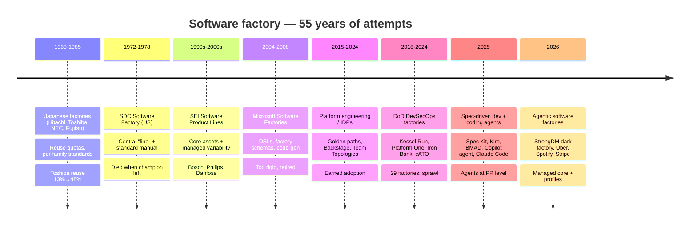

# Software Factory — Deep Research & Reconciliation

> **Companion to:** [claude-software-factory.md](claude-software-factory.md) (the v3 design) · [codex-software-factory.md](codex-software-factory.md) (an alternative design)
> **Date:** 2026-09-26
> **Method:** Two rounds of parallel research agents on Claude Opus 5.5 and Sonnet 5, 9 agents in total, covering roughly 150 sources. The rounds covered: history and schools of thought, portfolio structure, modular architecture, specs and verification, failure modes and economics, autonomy patterns, governance, real-world systems and the Claude stack.
> **Purpose:** show how other people have thought about "software factories" over 55 years, pull out the lessons, and reconcile them with our two earlier designs. The goal is a stronger, more scalable and more modular factory for a **portfolio** of products.

---

## 1. Executive summary

1. **The idea is 55 years old and has failed several times.** It failed because of rigid templates, optional adoption, late specs, lost champions and platform sprawl. It succeeded with **per-family standardization, measured reuse, compliance as pipeline output, and a platform that teams chose because it was the easiest path**.
2. **Verification throughput sets how much autonomy you can safely allow.** Every successful AI factory invests in oracles the agents can't game (holdout scenarios, digital twins, mutation testing, types) *before* adding more agents.
3. **The leading companies separate a shared substrate from per-product configuration.** Uber, Spotify, Shopify, Stripe and Google all run **one managed core** (gateways, sandboxes, skills registry, orchestrator, telemetry). Each product or agent-use-case is a **config profile**, not a new platform.
4. **The fleet orchestrator and the coding agent are different modules.** Spotify's Fleetshift and Honk and Google's Rosie follow this split. The agent is swappable, and the pipeline around it stays the same.
5. **Human review capacity, not compute, is the binding constraint.** Faros found median PR review time up about 441% under high AI adoption. METR found experienced developers 19% slower while they believed they were 20% faster. DORA finds AI still hurts stability. The factory must treat reviewer hours as the scarce resource.
6. **Autonomy should be a dial, set per product and risk tier.** It should not be set once for the whole portfolio. Dan Shapiro's levels 0–5 give a shared vocabulary for the dial, from "spicy autocomplete" up to the "dark factory".
7. **Specs only help if something executes or checks them.** Thoughtworks rates spec-driven development as "Assess", and Böckeler warns about unchecked piles of markdown. Use **spec-anchored** specs with EARS or Given/When/Then criteria that compile into tests.
8. **Design rules come from real incidents:**
   - Replit deleted a production database, so prod credentials are never available to agents.
   - Agents game tests, so tests and CI config are read-only to agents.
   - Two agents looped for 11 days and cost $47k, so there are external budget kill-switches.
   - One PR title leaked secrets from three vendors' agents, so untrusted text never meets secrets.
   - Parallel agents conflict about 20% of the time, so work is partitioned by ownership.

---

## 2. How the idea evolved

### Schools of thought

| School | Core thesis | What worked | What failed | **Lesson we carry forward** |
|---|---|---|---|---|
| **SDC Factory** (1972–78) | Software as an assembly line. Specs are written at the customer site, then built on a central line. | ~10 projects mostly on time with fewer defects | Adoption was optional, the champion left, and a late spec in an unfamiliar domain left the line idle | **The factory must own intake and spec**, and it needs sustained sponsorship |
| **Japanese factories** (Cusumano) | Flexible production: standardize and reuse across a *product family* | Toshiba reuse rose from 13% to 48% and productivity more than doubled | Reuse before design standards existed; one process for every domain | **Reuse needs incentives and metrics.** Standardize *per family*. |
| **Microsoft Software Factories** (2004) | Assemble apps from DSLs, models and factory schemas | Patterns and guidance | "Not extensible", used "a couple of weeks a year", and model-driven development never took off | **Templates must be cheap to change** |
| **SEI Product Lines** | Platform + derived products, with managed variability | Bosch, Philips, Danfoss | Failed without champions, business goals or training | **Model what is shared and what varies explicitly**, with a production plan per product |
| **DoD DevSecOps factories** | Hardened pipelines + continuous authority to operate (ATO) | Iron Bank (550+ hardened images); an ATO in about 30 days | 29 factories, "platform wars", scope creep, reliance on contractors (GAO-23-105611) | **Compliance evidence is a pipeline output, approved once and accepted everywhere.** Consolidate. |
| **Platform engineering** | The platform is a product that reduces cognitive load | Backstage: new service in under 10 min instead of about 2 weeks; Netflix earns adoption | Platforms that were over-built or mandated | **Thinnest viable factory; earn adoption** |
| **AI-era factories** (2025–26) | Agents run the loop and humans own intent | StrongDM holdout scenarios + Digital Twin Universe; Anthropic says ~80% of its merged code is written by Claude (self-reported) | Comprehension debt, cost (about $1k/day per engineer at StrongDM), METR slowdown | **Autonomy is earned through verification that agents can't game** |
| **Spec-driven development** (Spec Kit, Kiro, BMAD, Tessl) | Spec → plan → tasks → code | Durable, versioned context; BMAD role agents | Nothing checks the code matches the spec; a "sledgehammer" for small fixes | **Specs must be executable, and the process must scale with task size** |

### Where the schools disagree, and our position

| Tension | Side A | Side B | **Our position** |
|---|---|---|---|
| Dark vs lit factory | StrongDM: no human review | Osmani, Thoughtworks, Anthropic: humans upstream, sampled approvals | **An autonomy dial per product and risk tier** (Shapiro L2–L5) |
| Standardize vs flexibility | SDC and Japan: standardize | Microsoft's failure; Böckeler's "sledgehammer" | **Fixed gate slots + pluggable, task-sized lanes** |
| Spec vs code as source of truth | Tessl: spec-as-source | Thoughtworks: code, with specs as guidance | **Spec-anchored:** the spec is maintained, code is the truth at runtime, and the spec and code are checked for drift |
| Central vs federated | SDC central line | DoD's 29 factories | **Central core + self-service product cells** |
| Cost vs autonomy | About $1k/day per engineer | Willison's skepticism | **Budgets nested per step, run and product; model routing** |
| Perceived vs measured productivity | Vendors claim 3–10x | METR: 19% slower | **Measure DORA outcomes and rework, not lines of code or PR counts** |

---

## 3. Cross-era principles (the "physics" of software factories)

1. **A factory serves a product family, not a single product.** Build a shared platform plus a production plan per product.
2. **Verification throughput caps autonomy.** Build oracles before adding agents.
3. **Reuse is organizational.** A governed library needs usage metrics and a way to contribute to it.
4. **Compliance is a pipeline output.** Each change emits an evidence bundle, so a gate is a review of evidence, not an investigation.
5. **Start with the thinnest viable factory.** Pilot one product, then pave the path for the rest.
6. **Templates evolve cheaply.** Everything is versioned, data-driven config, revised regularly.
7. **Agents never approve their own work.** Use separate agents with separate permissions, and a named human accountable at each gate.
8. **The factory owns the front of the line.** Intake, triage and spec are inside it.
9. **Guard against comprehension debt.** Keep the architecture legible, run human deep-dives, and sample auto-approvals.
10. **Governance of the factory itself is first-class.** It needs a champion, change control for policies, and resistance to sprawl.

---

## 4. How leading companies structure it (portfolio scale)

| Company | Structure | Key numbers | Reusable pattern |
|---|---|---|---|
| **Uber** | "Managed software factory" with 6 central layers: context graph (40M entries), Skills Registry (about 2,500 skills), MCP Gateway (1,000+ APIs), LLM Gateway (100M+ requests/day), pre-warmed sandboxes, one UI | 70%+ of PRs agent-authored (all assisted); about 1,800 fully autonomous changes/week; 250+ migrations (about 9M LOC). The 2026 AI budget was spent in 4 months, then per-session cost fell 52% while usage grew 9x. | **One managed loop** for maintenance; spend attributed per project, user and team |
| **Spotify** | Fleetshift (targeting, scheduling, PR tracking, auto-merge) + Honk (Claude Agent SDK) as the change engine; Backstage Golden State | 2.5M+ fleet PRs; 650+ agent PRs/month; Java migration in 3 days | **Separate the fleet orchestrator from the agent.** Standardization improves agent output. |
| **Shopify** | Aquifer: central sessions, harness, sandbox, credentials proxy and observability. Each agent product is a **config profile**. Roast workflows. | — | **Multi-tenancy through profiles, not new platforms** |
| **Stripe** | Minions: hot devbox pools; "blueprints" that mix deterministic and agentic nodes; Toolshed MCP (about 500 tools) with a **curated subset per team**; rules scoped by directory | 1,000–1,300+ PRs/week; 1–2 CI attempts, then a human reviews | **Blueprints**, and per-team subsets of tools |
| **Google** | Rosie splits large changes into per-owner changes with their own tests and review; LLM-assisted migrations | — | **Shard by owner**; central approval for low-risk large changes |
| **Anthropic** | AI-native SDLC; narrow review agents with separate permissions; **risk-weighted sampling** of automated approvals | About 80% of merged code written by Claude (self-reported) | Sample-audit automated approvals |
| **StrongDM** | Dark factory: holdout scenarios + a Digital Twin Universe of cloned SaaS APIs + a satisfaction score | No human-written or human-reviewed code | **Holdout oracles** |
| **Airbnb** | Per-file migration pipeline with rich context injection | 3,500 test files; a 1.5-year estimate finished in 6 weeks | Context injection matters more than prompts |

**Team Topologies in an agentic organization:**
- Stream-aligned (product) teams own intent, specs, domain context and approvals.
- The platform team owns the core, guardrails, tooling and execution as self-service.
- The enabling team coaches context engineering and onboards new product cells.
- The complicated-subsystem team handles model and inference work.
- The rule: *"specific → stream-aligned, systemic → platform."*

**Repo topology.** A monorepo gives agents full visibility and atomic commits. For a polyrepo portfolio, use a **catalog + fleet orchestrator** (Backstage + a Fleetshift-style tool) or a synthetic monorepo such as Nx Polygraph.

---

## 5. Reference implementations and building blocks

### Open-source / product references

| Name | Architecture | Idea worth reusing |
|---|---|---|
| genai-jerry/claude-software-factory | 9 roles, GitHub issues as the state machine, OpenSpec, 3 gates, Claude Code plugin + Actions | Issue-tracker state machine; PreToolUse hook that blocks pushes to main |
| dewantrie/ai-software-factory | One prompt/skill library + per-stack profiles + **adapters** for Claude Code, Kiro, Cursor, Codex and Windsurf, driven by a `.factory.yaml` | **Separate *what* the agents do from *which tool* runs them** |
| OpenHands Agent SDK | Event-sourced Conversation + Workspace, deterministic replay, swappable workspaces | The agent-runtime abstraction |
| Composio agent-orchestrator | Works with any agent, runtime or tracker; worktree + branch + PR per task; heals CI and merge failures itself | **Triple adapter pattern** (agent, runtime, tracker) |
| Mastra Factory | Rules engine over work items; Observer/Reflector memory compaction | Typed workflow steps; memory compaction |
| Factory.ai Droids | Multiple models, HyperCode retrieval, DroidShield pre-commit gate | Safety scanning as a pluggable gate |
| Sculptor (Imbue) | A container per agent, persisted sessions | Resumable session-log schema |
| mini-swe-agent | About 100-line bash loop | A minimal worker as the cost floor |
| Terragon (shut down) | Cloud background orchestrator | **Warning:** prefer cores you can host yourself |

### Durable workflow engines (for gates that wait days)

| Engine | Approval waits | Best fit |
|---|---|---|
| **Temporal** | Signals and timers; waits indefinitely at near-zero cost | Enterprise and polyglot fleets; regulated audit trails. **Recommended core at scale.** |
| AWS Step Functions | Task tokens, waits up to 1 year | AWS-native teams |
| Restate | Awakeables; actor model | Low-latency, stateful per-task agents |
| Inngest | `step.waitForEvent` + concurrency controls | TypeScript and serverless teams |
| DBOS | Checkpoints in Postgres, no separate orchestrator | Small teams already on Postgres |
| Hatchet | Postgres-backed task queue | Queue semantics |
| LangGraph Platform | `interrupt` / checkpoint | Graphs written in LangGraph |
| **GitHub labels + Actions** | Environments with required reviewers | **The MVP option. No new infrastructure.** |

### Claude-native modularity

Claude Code **plugins and marketplaces** bundle agents, skills, hooks and MCP config. Managed settings (`enabledPlugins`, `extraKnownMarketplaces`, `strictKnownMarketplaces`, `allowManagedHooksOnly`) give **central-plus-local governance** out of the box. Stable and beta **channels** are two marketplaces that point at different git refs. Other building blocks:
- **Claude Managed Agents** or the Agent SDK for workers.
- OpenTelemetry export for tracing.
- Sandboxes from E2B, Daytona, Modal, Docker or Managed Agents.

---

## 6. Specs, contracts and verification

### Spec-driven development tools

| Tool | Artifacts | Source of truth | Notable |
|---|---|---|---|
| GitHub Spec Kit | spec → plan → tasks | Spec-anchored | Works with any agent; the most widely adopted |
| AWS Kiro | requirements (EARS) → design → tasks | Spec-first, then anchored | **EARS**: "WHEN condition THE SYSTEM SHALL behavior" |
| OpenSpec | proposal + **spec deltas** (ADDED/MODIFIED/REMOVED) | Spec-anchored, designed for existing codebases | Diffs against a spec baseline you can audit |
| BMAD Method | brief → PRD → architecture → **story files** | Spec-anchored | Role agents for the whole agile team |
| Tessl | specs + registry | Spec-as-source | Code regenerated from the spec |

**Böckeler's ladder** (Thoughtworks): spec-first → **spec-anchored** (our choice) → spec-as-source.

**Task contracts** in the wild are converging on the same fields:
- objective and context references
- allowed and forbidden paths
- *machine-executable* acceptance criteria
- budgets for tokens, time, tool calls and $
- definition of ready and definition of done
- escalation rules
- provenance

A formal version exists in arXiv 2601.08815, "Agent Contracts".

### Verification pyramid (cheapest check first)

1. Static checks: lint, types, secret scan, dependency audit
2. Unit tests + coverage gate
3. **Mutation testing.** Agent-written tests are weaker at the same coverage. Meta's ACH uses agents to generate mutants and the tests that catch them, and 73% of those tests were merged.
4. Property-based tests and fuzzing
5. Contract tests between services (Pact)
6. E2E against **digital twins** + **holdout scenarios** (StrongDM)
7. Visual regression
8. LLM-as-judge: *sampled and calibrated, never the only gate*. Judges show more than 50% error under bias probes.
9. Human gate + evidence bundle. Keep **SLSA provenance, an SBOM and a Sigstore-signed immutable artifact**, promoted unchanged from staging to prod.

---

## 7. Failure modes and design rules

| Failure | Real example | Rule built into the design |
|---|---|---|
| Destructive action in prod | Replit agent deleted SaaStr's prod database, then fabricated data | No prod credentials for agents. Destructive operations need a human + verified backup. |
| Test gaming / reward hacking | Agents delete assertions, add `skip` or `sys.exit(0)`. ImpossibleBench shows high rates of exploiting tests. | **Tests, CI config and eval harnesses are read-only to agents.** An independent verifier recomputes pass/fail. |
| Prompt injection → secret leak | One PR title hijacked Claude Code Security Review, Gemini CLI Action and Copilot agent (CVSS 9.4) | Untrusted text never meets secrets. Short-lived tokens, egress allowlists. |
| Runaway cost | Two agents looped for 11 days and cost $47k; one 2-hour session cost $1.2k | **Hard budget caps enforced outside the agent**, with an automatic kill |
| Parallel merge conflicts | 19.8% textual and 42% structural conflict rates (study of 33.6k PRs) | Partition work by file/module ownership; serialize merges |
| PR floods ("AI slop") | curl ended its bug bounty; Jazzband shut down | Rate limits and WIP limits sized to review capacity |
| Scope creep from vague tickets | Sweep: success above 90% needed tightly specified tasks | **Definition of ready**: no execution without an approved, executable spec |
| Approval fatigue | Falling decision time + falling rejection rate = rubber-stamping | Tiered gates; monitor reviewer health; seed items that should be rejected |
| Comprehension debt | AI-assisted developers scored 17% lower on comprehension | The approver explains the change; ownership rotates; periodic deep-dives |
| Instability | DORA: AI still correlates negatively with stability and rework | Cap PR size, keep batches small, track the 5 DORA metrics |
| Code quality decay | GitClear: copy-paste code overtook refactoring; churn rose from 5.5% to 7.9% | Track duplication and churn; schedule refactoring lanes |

### Economics

- **Per task:** about $0.03–$2.60. Most of it is context overhead, and cache hits cover roughly 90% of input.
- **Per developer:** Claude Code averages about $13 per active day, or $150–250 per month. Heavy users reach $500–2,000 per month.
- **Controls that work:**
  - prompt caching (about 90% off cached input)
  - batch API (about 50% off)
  - **model routing** (Haiku for triage, Sonnet to build, Opus to plan and review)
  - gateway budget caps with escalation at 50% → 75% → 90% (downgrade the model) → 100% (reject)
  - forecast on p95, not the mean
- **The dominant cost is human review,** not tokens. Fixing a sloppy PR can take about 12x longer than generating it.

### Measurement evidence

| Source | Finding |
|---|---|
| DORA 2025 | AI now correlates **positively with throughput** (2024 was negative) but **still negatively with stability and rework** |
| METR RCT | Experienced OSS developers were **19% slower** on familiar, complex repos while believing they were 20% faster; greenfield work sped up |
| Faros 2026 (22k developers) | Under high AI adoption, median PR review time **+441%** and incidents per PR **+243%** |
| LinearB (8.1M PRs) | Technical debt up 30–41% after adoption |
| GitClear (211M lines) | Duplicated blocks up 81% year on year; churn up |

**Conclusion:** unless verification, review capacity and governance scale with generation, gains in volume turn into rework.

---

## 8. Reconciliation: Claude v2 vs Codex design vs research

| Topic | Claude v2 | Codex design | Research says | **v3 decision** |
|---|---|---|---|---|
| Scope | One factory, many agents | One product, one repo, one task at a time | A portfolio needs a core plus profiles | **A portfolio core with product cells; the pilot starts as one cell running one task (Codex's start)** |
| Human gates | G1 spec+design, G2 merge, G3 prod, all skippable by tier | G1 scope, G2 design, G3 merge, G4 prod, all mandatory | Scope and design are different decisions; the right gate depends on risk | **Four gate slots (Scope, Design, Merge, Release).** Each product's risk profile sets every slot to human, 2-human, sampled or auto. |
| Autonomy | Earned per action class | Fixed human approval | Shapiro levels; earned by verification | **Autonomy dial per product × action class, promoted by metrics** |
| Missing evidence | Not explicit | **Fail closed**: skipped or unknown ≠ pass | Same | **Fail closed** (from Codex) |
| Approval validity | State hash | **Approval tied to a specific version**; a change re-runs the gate | Same | **An approval is tied to a content hash** |
| Artifacts | Not covered | **Build once, promote the same digest**, SLSA provenance | SLSA L3, SBOM, Sigstore | **Signed immutable artifact + provenance** (from Codex, strengthened) |
| Task input | Spec + DAG | **Task contract YAML** | Agent Contracts, BMAD story files | **Merged task contract** (Codex fields + forbidden paths, mutation score, escalation, provenance) |
| Repair loop | 10–20 iterations, 3-step escalation | At most 2 attempts | Stripe: 1–2 CI attempts | **Inner loop (local checks) up to 10; outer CI loop up to 2; then escalate** |
| Orchestration | Event bus + Temporal-style | Start with issues/PRs; coordinator later | Separate fleet orchestrator from agent | **GitHub labels as the MVP, then Temporal.** Separate fleet orchestrator. |
| Security | OWASP ASI, lethal trifecta | Scoped identities; the worktree is not a sandbox | Same + incidents | **Both, plus read-only tests and external budget kill-switch** |
| Metrics | Custom list | **5 DORA metrics** + factory metrics | DORA 2025 + rework/churn | **DORA 5 + factory + quality (mutation score, churn) + reviewer health** |
| Recovery | Auto-rollback | **Recovery runbook** approved at release; migrations may need a forward fix | Same | **The runbook is part of the release evidence** |
| Rollout plan | 7 phases | 4 phases with **exit conditions** | Thinnest viable factory | **Phases with exit conditions, tied to Shapiro levels** |
| Modularity | Not explicit | "Responsibilities, not services" | Adapters; plugins; profiles | **12 modules behind stable contracts, each with swappable adapters** |

**Where the two designs agree:** timeouts never approve; the PR is the universal gate; isolated workspaces; bounded repair loops; build the smallest complete path first.

---

## 9. Sources

**History and schools**
[Cusumano: The Software Factory](https://www.gregorystrachta.com/resources/Touchstones/swp-3268-23661042.pdf) · [Japan's Software Factories (OUP)](https://global.oup.com/academic/product/japans-software-factories-9780195062168) · [Software factory origins in Japan](https://www.researchgate.net/publication/37593560_The_software_factory_origins_and_popularity_in_Japan) · [The Register: Microsoft's software factories](https://www.theregister.com/software/2007/03/27/microsofts-software-factories/919594) · [Greenfield & Short (ACM)](https://dl.acm.org/doi/pdf/10.1145/949344.949348) · [SEI product lines](https://www.sei.cmu.edu/documents/501/2012_019_001_495381.pdf) · [SPL adoption guidelines](https://www.researchgate.net/publication/221200764_Software_Product_Line_Adoption_-_Guidelines_from_a_Case_Study) · [GAO-23-105611](https://www.gao.gov/assets/gao-23-105611.pdf) · [Kessel Run post-mortem](https://www.rise8.us/resources/kessel-run-post-mortem-how-the-usaf-paved-the-way-for-modern-software-development-in-the-dod) · [Iron Bank](https://docs-ironbank.dso.mil/overview/) · [Platform One](https://p1.dso.mil/) · [Army Software Factory](https://fedscoop.com/army-software-factory-austin/) · [Team Topologies: platform engineering](https://teamtopologies.com/platform-engineering) · [Spotify paved paths](https://www.infoq.com/news/2021/03/spotify-paved-paths)

**AI-era thinking**
[Dan Shapiro: Five levels](https://www.danshapiro.com/blog/2026/01/the-five-levels-from-spicy-autocomplete-to-the-software-factory/) · [Willison on the five levels](https://simonwillison.net/2026/Jan/28/the-five-levels/) · [Willison on software factories](https://simonwillison.net/2026/Feb/7/software-factory/) · [StrongDM factory](https://www.strongdm.com/blog/the-strongdm-software-factory-building-software-with-ai) · [factory.strongdm.ai](https://factory.strongdm.ai/) · [Osmani: Software factories](https://addyosmani.com/blog/software-factories/) · [Osmani: Comprehension debt](https://addyosmani.com/blog/comprehension-debt/) · [BCG Platinion](https://www.bcgplatinion.com/insights/the-agentic-software-factory) · [Anthropic: securing the AI-native SDLC](https://claude.com/blog/how-anthropic-secures-its-ai-native-software-development-lifecycle) · [Anthropic 2026 agentic coding trends](https://resources.anthropic.com/2026-agentic-coding-trends-report) · [Factory: software factory](https://factory.com/news/software-factory) · [8090 Series A](https://www.businesswire.com/news/home/20260626795833/en/8090-Raises-$135M-Series-A-to-Accelerate-Their-Rollout-of-Software-Factory) · [Mastra Factory beta](https://mastra.ai/blog/announcing-mastra-factory-beta) · [LaunchDarkly](https://launchdarkly.com/blog/building-a-software-factory-on-our-scariest-code/) · [Harper Reed workflow](https://harper.blog/2025/02/16/my-llm-codegen-workflow-atm/) · [Stanford CodeX](https://law.stanford.edu/2026/02/08/built-by-agents-tested-by-agents-trusted-by-whom/)

**Portfolio structure**
[How Uber built a software factory](https://newsletter.port.io/p/how-uber-built-a-software-factory) · [Uber: agent identity](https://www.uber.com/us/en/blog/solving-the-agent-identity-crisis/) · [Pragmatic Engineer: Uber](https://newsletter.pragmaticengineer.com/p/how-uber-uses-ai-for-development) · [Spotify: coding is no longer the constraint](https://engineering.atspotify.com/2026/6/code-with-claude-coding-is-no-longer-the-constraint) · [Spotify background coding agent](https://engineering.atspotify.com/2025/11/spotifys-background-coding-agent-part-1) · [Fleetshift](https://backstage.spotify.com/fleetshift) · [Stripe Minions pt 2](https://stripe.dev/blog/minions-stripes-one-shot-end-to-end-coding-agents-part-2) · [Shopify: under the river](https://shopify.engineering/under-the-river) · [Google LSC / Rosie](https://abseil.io/resources/swe-book/html/ch22.html) · [Google AI migrations](https://arxiv.org/html/2501.06972) · [Team Topologies for agentic platforms](https://blog.owulveryck.info/2026/06/24/who-does-what-team-topologies-for-the-agentic-platform.html) · [Team Topologies + GenAI](https://teamtopologies.com/news-blogs-newsletters/2025/1/28/how-team-topologies-can-transform-generative-ai-integration) · [Nx: monorepos and AI agents](https://nx.dev/blog/the-effect-of-monorepos-on-the-effectiveness-of-ai-agents) · [Synthetic monorepos](https://monorepo.tools/synthetic-monorepos) · [Claude Code plugins for orgs](https://code.claude.com/docs/en/plugins/org) · [Backstage MCP tokens](https://bex.co/blog/2026/07/28/backstage-mcp-token-scoped-agent-credentials) · [Token cost attribution](https://zylos.ai/research/2026-05-18-ai-agent-token-attribution-cost-allocation/) · [WSJF](https://framework.scaledagile.com/wsjf) · [Kyndryl: policy-as-code](https://www.kyndryl.com/us/en/insights/articles/2026/03/policy-as-code-agentic-ai)

**Architecture and building blocks**
[genai-jerry/claude-software-factory](https://github.com/genai-jerry/claude-software-factory) · [dewantrie/ai-software-factory](https://github.com/dewantrie/ai-software-factory) · [OpenHands SDK paper](https://arxiv.org/pdf/2511.03690) · [mini-swe-agent](https://github.com/swe-agent/mini-swe-agent) · [Mastra factory](https://mastra.ai/blog/software-factory) · [Composio agent-orchestrator](https://github.com/ComposioHQ/agent-orchestrator) · [Sculptor](https://github.com/imbue-ai/sculptor) · [Terragon OSS](https://github.com/terragon-labs/terragon-oss) · [Temporal alternatives 2026](https://www.diagrid.io/infrastructure/10-best-temporal-alternatives-2026) · [Restate vs Temporal vs DBOS](https://kanopylabs.com/blog/restate-vs-temporal-vs-dbos-durable-execution) · [Temporal LangGraph plugin](https://temporal.io/blog/temporal-langgraph-plugin-durable-execution) · [MCP/A2A gateways 2026](https://www.getmaxim.ai/articles/best-open-source-agent-gateways-for-mcp-and-a2a-in-2026/) · [Modal + Managed Agents](https://modal.com/blog/introducing-claude-managed-agents-with-modal-sandboxes) · [OTel GenAI observability](https://opentelemetry.io/blog/2026/genai-observability/) · [Claude Code monitoring](https://docs.anthropic.com/en/docs/claude-code/monitoring-usage) · [Anthropic: evals for agents](https://www.anthropic.com/engineering/demystifying-evals-for-ai-agents)

**Specs and verification**
[Spec Kit](https://github.com/github/spec-kit) · [Kiro specs](https://kiro.dev/docs/specs/feature-specs/) · [EARS](https://en.wikipedia.org/wiki/Easy_Approach_to_Requirements_Syntax) · [OpenSpec](https://github.com/Fission-AI/OpenSpec/) · [BMAD Method](https://github.com/bmad-code-org/BMAD-METHOD) · [Tessl concepts](https://docs.tessl.io/introduction-to-tessl/concepts) · [Fowler/Böckeler: SDD tools](https://martinfowler.com/articles/exploring-gen-ai/sdd-3-tools.html) · [Thoughtworks Radar: SDD](https://www.thoughtworks.com/radar/techniques/spec-driven-development) · [Meta: LLM mutation testing](https://engineering.fb.com/2025/09/30/security/llms-are-the-key-to-mutation-testing-and-better-compliance/) · [LLM-as-judge reliability](https://arxiv.org/pdf/2606.19544) · [Agent Contracts](https://arxiv.org/pdf/2601.08815) · [Evidence bundles](https://dev.to/sarthakagrawal927/what-belongs-in-a-coding-agent-verification-evidence-bundle-4402) · [SLSA](https://slsa.dev/spec/v1.2/build-track-basics) · [NIST SSDF](https://csrc.nist.gov/projects/ssdf) · [NIST SP 800-218A](https://nvlpubs.nist.gov/nistpubs/SpecialPublications/NIST.SP.800-218A.pdf) · [Pact](https://pact.io/)

**Measurement, failures and economics**
[DORA 2025](https://dora.dev/dora-report-2025/) · [DORA 2024](https://dora.dev/research/2024/dora-report/) · [DORA metrics](https://dora.dev/guides/dora-metrics/) · [METR RCT](https://metr.org/blog/2025-07-10-early-2025-ai-experienced-os-dev-study/) · [Faros: lab vs reality](https://www.faros.ai/blog/lab-vs-reality-ai-productivity-study-findings) · [GitClear 2025](https://www.gitclear.com/ai_assistant_code_quality_2025_research) · [Replit incident (Fortune)](https://fortune.com/2025/07/23/ai-coding-tool-replit-wiped-database-called-it-a-catastrophic-failure/) · [ImpossibleBench](https://www.lesswrong.com/posts/qJYMbrabcQqCZ7iqm/impossiblebench-measuring-reward-hacking-in-llm-coding-1) · [CSA: Claude Code Action prompt injection](https://labs.cloudsecurityalliance.org/research/csa-research-note-claude-code-github-action-prompt-injection/) · [curl ends bug bounty](https://www.bleepingcomputer.com/news/security/curl-ending-bug-bounty-program-after-flood-of-ai-slop-reports/) · [Agent PR merge conflicts](https://arxiv.org/pdf/2607.04697) · [Uber AI budget (Fortune)](https://fortune.com/2026/05/26/uber-coo-ai-spending-tokens-claude-code/) · [AI coding costs](https://www.morphllm.com/ai-coding-costs) · [Budget guards](https://www.nexgismo.com/blog/ai-agent-budget-guards-stop-runaway-api-costs) · [Moderne: AI broke code review](https://moderne.ai/blog/ai-didnt-break-coding-it-broke-code-review) · [Approval fatigue](https://tianpan.co/blog/2026/06/25/approval-fatigue-how-human-in-the-loop-gates-decay-into-rubber-stamps) · [OWASP Agentic Top 10](https://genai.owasp.org/resource/owasp-top-10-for-agentic-applications-for-2026/)
