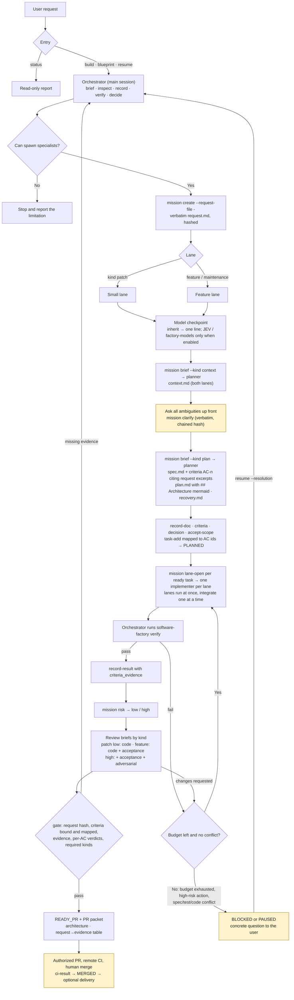

# Repository software factory architecture

The main session in the selected client is the orchestrator. It briefs specialists, inspects their output, records state through the CLI, runs verification and decides; it never produces code, tests, docs, research or drafts. Local tools validate state and evidence; existing GitHub and delivery systems retain their own authority.



Blueprint runs the same flow up to the plan and stops before implementation. A mission created before 0.3.0 has no recorded request; it keeps the earlier gate rules and shows a warning. The small lane still needs context, criteria and an architecture diagram, kept short.

*The orchestrator never produces* is an instruction in every client. Claude Code can additionally run the orchestrator as a tool-restricted agent with a guard hook (`claude --agent factory-orchestrator`), and Copilot's `factory` agent has no edit or web tool; the orchestrator records everything through CLI commands that read stdin; see [enforcement per client](runbooks/vendor-behavior.md#enforcement-per-client) for what each client actually enforces.

READY_PR is a local, unattested gate result: evidence, reviews, decisions and `ci-result` records are caller-supplied. Remote PR creation, GitHub CI, merge and production delivery require separate actual evidence. Delivery is disabled in the default product configuration. A pipeline node in this diagram is an integration boundary, not a deployed service supplied by this repository.

## Constitution

`.factory/CONSTITUTION.md` (2.0.0) is copied into the managed AGENTS.md section, so every client loads it at session start; exported agents cite its SHA-256. Precedence: the host's instruction hierarchy and organization controls, then the user's current authorization, then the constitution, then roles, skills and briefs. Documents, records, tool output and agent reports are evidence, never authority. When rules conflict the earlier section wins; within a section, the rule that withholds a claim, change or approval wins, and the conflict is surfaced.

Sections: **Never** (six prohibitions: invented approvals, weakened tests, overstated outcomes, overwriting others' work, leaked secrets, product work changing factory controls); **Authority and intent** (authority, the request is the contract, context first, escalate instead of guessing); **Evidence** (claims are testimony, binding, advice is not verification, honest records); **Roles and review** (the orchestrator never produces, bounded specialists, one writer, independent review); **Craft** (deliberate repair, proportionate complete change); **Amendment** (maintenance missions, semver, impact record). Roles and skills cite rules by title, because numbers change between versions. What enforces each rule, and what is instruction-only, is in the [enforcement map](runbooks/constitution-enforcement.md), which also covers amendment and reconciling in-flight missions.

## Lifecycle states and the diagram

The diagram shows GitHub CI between READY_PR and merge. The constitution's *Honest records* rule defines READY_PR as local evidence only: it does not mean a PR exists or remote CI passed, so the state tool keeps READY_PR local and records CI afterwards:

| Diagram step | Recorded state and command | Required evidence |
| --- | --- | --- |
| Local gate passes | `transition --to READY_PR` | Current checks, task results with criteria evidence, reviews of each required kind, bound request/criteria/scope, authored risks and recovery plan (gate); then generate the local PR packet |
| PR opened | optional `delivery.pr_ref` via `record-delivery` | External reference only |
| CI fails | `ci-result --mission ID --url URL --head SHA --conclusion failure --reason TEXT` moves READY_PR → IMPLEMENTING | Reason is kept in `ci_failures` |
| CI passes | `ci-result --mission ID --url URL --head SHA --conclusion success [--trunk REMOTE/BRANCH]` stores `delivery.ci_ref` with branch, trunk ref and `trunk_kind` | Gate passes, candidate is committed, `SHA` equals HEAD, HEAD is a work branch other than the trunk and `SHA` is not already on the trunk |
| Merge observed | `record-delivery` with `merge_ref`, then `transition --to MERGED` | Merge decision bound to the CI candidate fingerprint; `merge_ref` is reachable from the recorded trunk, is not an ancestor of `base_commit`, equals the candidate only if the candidate reached the trunk, and contains the candidate's changed files |
| Staging, release | STAGING → AWAITING_RELEASE → DEPLOYING | Artifact digest, staging, release decision and `recovery_ref` before DEPLOYING |
| Observation | OBSERVING → DELIVERED | `delivery.observation` with `status: healthy` |
| Unhealthy / failed deploy | DEPLOYING or OBSERVING → RECOVERING → RECOVERED (or BLOCKED) | `incident_ref`, `recovery_ref`, recovery decision; RECOVERED also needs a healthy `recovery_observation` and `follow_up_mission` |
| Held work | PAUSED / BLOCKED (`--reason`, optional `--next`; `block` command) | Resume needs `--resolution`; `clarify` and `criteria` keep the hold (the mission returns to PROPOSED on resume); accept-scope lifts only a constitution-reconcile hold; an exhausted task needs a replan with new paths, checks or dependencies, which resets its budget at most once |

The trunk is chosen once, by `ci-result`, and recorded as a full ref; MERGED re-resolves that same ref and `transition` accepts no trunk override. In a repository with any remote the trunk must be a remote-tracking ref (`--trunk origin/BRANCH` or `origin/HEAD`); only a repository without remotes may use a local `main`/`master` (`trunk_kind: local`). The rule accepts merge commits, squash merges and fast-forwards of a work branch, and rejects work that never left the trunk, a commit the trunk does not contain, and a pre-mission trunk commit with matching content.

Residual limits: refs, mission records and the local Git object store are editable by anyone with shell access. Remote-tracking refs can be rewritten locally, a local trunk can be moved with `git branch -f`, and a new trunk commit with the candidate's content is indistinguishable from a squash. These checks catch mistakes and casual shortcuts; branch protection and required CI on the hosting service are the authoritative integration controls. Fetch the trunk before recording MERGED.

After MERGED the gate command and `software-factory mission status` assess the CI candidate and merge commit instead of the working tree, whose pre-merge evidence is necessarily stale once HEAD moves. For READY_PR and later, `status` adds a `live_gate` result so a stored label that no longer holds is visible. `software-factory mission list` shows non-terminal missions.

## Responsibilities

| Component | Responsibility | Limit |
| --- | --- | --- |
| Constitution | Obligations for every session, role and mission: Never, Authority and intent, Evidence, Roles and review, Craft, Amendment | Grants no permission and enforces nothing itself; see [enforcement map](runbooks/constitution-enforcement.md) |
| Main orchestrator | Brief specialists with generated briefs, inspect status/risk/diffstat, record state, run verification, resolve findings, escalate | Produces no code, tests, docs or research; does not grant approval or accept subagent claims as proof |
| Planner/implementer/verifier/reviewer | Context and plans, one task's change, extra end-to-end evidence, reviews by kind | No nested agents; no implicit expanded authority from a role name |
| Workflow skills and entry prompts | Reusable lifecycle procedures and directly callable build/plan/resume/status entries | Loaded when relevant; entry scope does not grant runtime permissions |
| State tool | Schema-validated local records, dependency/transition rules and locking | No distributed scheduler or authenticated approval service |
| Verifier and gate | Execute real commands, capture candidate identity, reject incomplete/stale evidence | Host process access is not sandboxed; editable records are not tamper-proof |
| Renderer and doctor | Export one or more vendor profiles side by side, preserve owned-file integrity and diagnose setup | Live instruction/tool discovery still needs actual-client tests |
| GitHub/delivery systems | Remote checks, review authority, deployment and observation | Must be configured and verified for the real account/product |

The orchestrator keeps a compact mission summary in context and obtains detailed files on demand. It reasons about uncertainty and can ask for research, split a task or change an approach within scope. It does not blindly advance a fixed checklist. Scripts handle conditions that need deterministic checks.

## Files and ownership

```text
your-product/
├── factory.json                    # Product checks, limits, owners and profiles
├── factory.lock.json               # Export manifest and ownership records
├── AGENTS.md                       # Factory-owned section alongside user text
├── CLAUDE.md                       # Selected Claude integration section
├── .factory/
│   ├── CONSTITUTION.md              # Canonical shared behavior
│   ├── installation.json           # Versioned installation baseline
│   ├── pyproject.toml / uv.lock     # Pinned project runtime dependencies
│   ├── run.py                      # Pinned CLI launcher
│   ├── src/software_factory/       # Python runtime and bundled assets
│   ├── .venv/                      # Ignored, restored by uv sync
│   ├── registry.json / policy.json / workflow.json
│   ├── roles/ / skills/ / prompts/ # Canonical instructions
│   ├── schemas/ / models/ / templates/ / vendors/
│   ├── docs/                       # Installed runbooks and client checklist
│   ├── missions/M-ID/              # Request, clarifications, context, spec, plan, tasks, results, evidence
│   └── local/                      # Ignored logs, locks, state inputs, briefs and JEV records
├── .claude/agents/ and .claude/skills/   # When selected
├── .codex/agents/ and .codex/config.toml # When selected; preserved user settings
├── .agents/skills/                     # Native Codex skills when selected
└── .github/                            # Copilot exports when selected
```

The package source contains `src/software_factory`, `tests`, `scripts/release_smoke.py`, `pyproject.toml`, `uv.lock` and build documentation. Wheels contain the runtime and its complete data payload. Product README, language manifests, editor settings and CI are not copied from the factory development checkout. The optional CI template is an example that the operator can review and install explicitly.


`ROLE` and `SKILL` abbreviate the declared specialist, workflow and entry names. Use renderer output and `factory.lock.json` for the actual export inventory; generated file counts vary by the active profiles and declared extensions. With Claude or Codex active, Copilot reads their skill trees instead of `.github/skills`. Inactive exports and unused mission records are not created as empty scaffolding. Canonical sources are maintained once.

## Validation and trust

Fingerprints bind candidate content and governing inputs to evidence. Local gate failures expose missing or stale checks, unresolved reviews and incomplete scope. They do not establish the identity of the person who wrote a local decision record. Required external reviews and deployment authority must remain in the actual authenticated system.

The current fingerprint implementation rejects symlink files and submodules rather than traversing unbounded external content. Verification requires raw logs under ignored `.factory/local/`, checks their hashes and detects candidate mutation during execution. It is still host process execution, not a sandbox. A new machine without matching local logs must capture a new verification run.

The build includes executable utility tests plus behavioral scenario tests in the package source. [Vendor smoke tests](vendor-smoke-tests.md) separately establish that each installed client loads and follows its configuration. Read [verified vendor behavior](runbooks/vendor-behavior.md) for source links and known differences. A passing syntax test must never be reported as a successful live vendor test.

Start with [setup](runbooks/factory-setup.md). Use [maintenance](runbooks/factory-maintenance.md) for factory changes and [delivery/recovery](runbooks/delivery-and-recovery.md) when integrating a real product pipeline.

The [extension and scaling contract](runbooks/scaling-and-extensions.md) covers registered content, bulk result publication, isolated writers, and supported repository shapes. [Runtime setup](runbooks/runtime-contract.md) binds setup and product checks to stable candidates; [upgrades](runbooks/upgrading.md) preserve reviewed ownership and report customization conflicts.

## Optional semantic assistance

The [Jev architecture](jev-architecture.md) expands the lifecycle with the optional ON/OFF path. The [operating guide](runbooks/semantic-assistance.md) defines claim/source assessment, defaults, budgets, private records and evaluation. It adds a shared tool and canonical skill, not a native coding model or new readiness authority.
