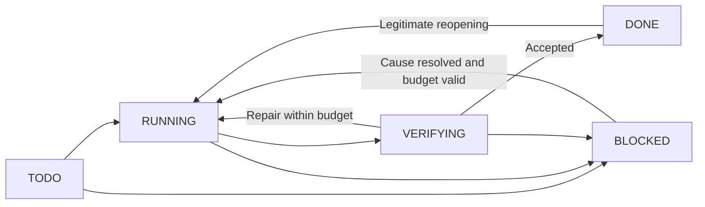

# Jev in the software factory

Implemented first-version scope: optional claim/source assessment through the existing orchestrator, controlled by `jev.enabled`. Default OFF; ON defaults to shadow. The [operating guide](runbooks/semantic-assistance.md) defines exact commands, input/output, budgets and evaluation.

Jev estimates supports, contradicts, not_addressed, mixed or insufficient_context for each eligible supplied claim. Code owns IDs, hashes, quote matching, timestamps, payload/response bounds and coverage. The native agent owns reasoning and action. Existing checks, independent review and actual authority remain in force. Context ranking, failure/skill/intent routing, MCP hosting and automatic hooks are deferred.

See [JEV model routing](jev-routing.md): enabling JEV selects it as the model-choice engine; disabling it selects factory-models. The claim/source assessment path below is separate and uses `jev.claim_mode`; editing `claim_mode` or other claim-helper settings does not invalidate saved model plans. When enabled, model routing sends the request objective and any research `strengths` text to TypeSafe after best-effort secret masking, together with compact candidate metadata. Routing abstention, or a choice below `jev.min_confidence` (default 0.6), leaves an assignment unresolved in a written plan; provider errors, timeouts and missing credentials exit 2 without writing a plan. Neither falls back to factory-models.

## Complete mission lifecycle

This describes supported integration boundaries, not an installed deployment platform. This checkout targets READY_PR with delivery disabled. Resume returns to the recorded phase after reconciliation.

```mermaid
flowchart TD
    SOURCES["Constitution, configuration, registry<br/>Roles, skills, prompts and vendor mappings"] --> RENDER["Render owned native exports"]
    RENDER --> CLIENT["VS Code: Claude Code / native Codex / Copilot"]
    USER["Developer request"] --> CLIENT
    CLIENT --> ENTRY{"Entry scope"}
    ENTRY -->|status| STATUS["Read existing mission and evidence<br/>No startup or Jev calls"]
    ENTRY -->|blueprint| BLUEPRINT["Research and proposed spec/plan<br/>Draft model checkpoint; no implementation"]
    ENTRY -->|build or resume| BOOT["factory-start: doctor, Git, profile, runtime<br/>Reconcile mission and handoff"]
    BOOT --> MODELS["Model checkpoint: JEV ON / factory-models OFF"]
    MODELS -. "Optional vendor-claim assessment" .-> JEV_MODELS["Same optional Jev helper"]
    JEV_MODELS -. "Return to model research; checkpoint still required" .-> MODELS
    BLUEPRINT -. "Optional planning-claim assessment" .-> JEV_PLAN["Same optional Jev helper"]
    JEV_PLAN -. "Return to blueprint; planning scope only" .-> BLUEPRINT
    MODELS --> SETTLED{"Selected or permitted inheritance?"}
    SETTLED -->|No| UNRESOLVED["Hold dependent work; continue independent research"]
    UNRESOLVED -->|New evidence| MODELS
    SETTLED -->|Yes| ORCH["Main orchestrator owns decisions,<br/>delegation, integration and evidence"]
    RECORDS[("Mission: spec, plan, decisions,<br/>results, evidence, handoff")] <--> ORCH
    ORCH -. "Eligible consultation" .-> JEV["Optional Jev helper: ON/OFF flow below"]
    JEV -. "Advice or unavailable status" .-> ORCH
    ORCH -->|New mission| PROPOSED["PROPOSED"]
    PROPOSED --> SPEC["factory-specify: requirements and criteria"]
    SPEC --> PLAN["factory-plan: dependencies, ownership, checks"]
    PLAN --> SCOPE{"Scope decisions settled?"}
    SCOPE -->|Existing authority sufficient| PLANNED["PLANNED"]
    SCOPE -->|Decision missing| DECISION["Concrete decision packet and actual decision"]
    DECISION -->|Proceed or revise| PLAN
    DECISION -->|Decline where allowed| CANCELED["CANCELED: reason and handoff"]
    ORCH -->|Resume| RESUMEPHASE["Continue recorded phase; revalidate evidence"]
    PLANNED --> IMPLEMENTING["IMPLEMENTING: factory-implement<br/>One writer per workspace"]
    IMPLEMENTING --> VERIFYING["VERIFYING: factory-verify<br/>Configured checks and candidate evidence"]
    VERIFYING -->|Pass| REVIEWING["REVIEWING: independent spec, diff, tests, evidence"]
    VERIFYING -->|Fail| REPAIR["factory-repair: diagnosis and attempt budget"]
    REVIEWING -->|Blocking findings| REPAIR
    REPAIR --> BUDGET{"Attempt permitted?"}
    BUDGET -->|Yes| IMPLEMENTING
    BUDGET -->|Exhausted| BLOCKED["BLOCKED: cause, attempts, next action"]
    REVIEWING -->|Complete| GATE{"Current candidate passes local gate?"}
    GATE -->|No| ORCH
    GATE -->|Yes| READY["READY_PR: local evidence and PR packet"]
    READY -->|Local target complete| LOCAL["Report local readiness only"]
    READY -->|Remote work authorized| PR["Actual pull request"]
    PR --> CI["Actual remote CI and required reviews<br/>Bind results to committed candidate"]
    CI -->|Fail| IMPLEMENTING
    CI -->|Pass| MERGE["Actual merge authorization and integration evidence"]
    MERGE --> MERGED["MERGED"]
    MERGED --> ENABLED{"Delivery enabled and authorized?"}
    ENABLED -->|No| HANDOFF["Report boundary and preserve handoff"]
    ENABLED -->|Yes| STAGING["STAGING: identified artifact and staging evidence"]
    STAGING -->|Failure or missing evidence| BLOCKED
    STAGING -->|Pass| AWAITING["AWAITING_RELEASE: artifact, observation, recovery plan"]
    AWAITING --> AUTH{"Release authority and evidence available?"}
    AUTH -->|No| HELD["PAUSED or BLOCKED: reason and next action"]
    AUTH -->|Yes| DEPLOYING["DEPLOYING: configured authorized promotion"]
    DEPLOYING -->|Completed| OBSERVING["OBSERVING: actual environment checks"]
    DEPLOYING -->|Failed| RECOVERYAUTH["Incident, artifact and recovery authorization"]
    OBSERVING -->|Healthy| DELIVERED["DELIVERED"]
    OBSERVING -->|Unhealthy| RECOVERYAUTH
    RECOVERYAUTH -->|Unknown or unauthorized| BLOCKED
    RECOVERYAUTH -->|Authorized| RECOVERING["RECOVERING: factory-recover configured action"]
    RECOVERING --> RECOVERYCHECK{"Healthy recovery observation and follow-up mission?"}
    RECOVERYCHECK -->|Yes| RECOVERED["RECOVERED: original feature is not DELIVERED"]
    RECOVERYCHECK -->|No| BLOCKED
    ORCH -->|Pause or dependency| HELD
    BLOCKED --> RESOLVE["Resolve cause; replan exhausted task when required<br/>Record resolution"]
    HELD --> RESOLVE
    RESOLVE --> BOOT
    SWITCH["Interrupt, restart or vendor switch"] --> SAVE["factory-handoff: save and reconcile actual state"]
    SAVE --> BOOT
```

Constitution and host/user authority apply to every box. Pause/block/cancel are legal only where the existing workflow permits. Local state transitions do not execute deployments. READY_PR does not establish a PR, CI pass or merge; MERGED requires actual integration evidence; DELIVERED requires healthy observation. No new lifecycle state is introduced.

## Jev ON/OFF flow

```mermaid
flowchart TD
    Q["Eligible question at model research,<br/>blueprint planning or review preparation"] --> AUTH{"Orchestrator and host permit<br/>this purpose and transmission?"}
    AUTH -->|No| SKIP["Skip; no advice"]
    AUTH -->|Yes| CONFIG["CLI validates local configuration"]
    CONFIG -->|Invalid| ERROR["Local diagnostic; exit 1<br/>No readiness claim"]
    CONFIG -->|Valid| ON{"Jev enabled?"}
    ON -->|OFF| BYPASS["No input, credential or cache inspection<br/>No request or semantic writes"]
    ON -->|ON| FLAGS{"No-network, pre-canceled,<br/>or shadow with no-persist?"}
    FLAGS -->|Yes| BYPASS
    FLAGS -->|No| OBSERVE["Observe config changes and caller cancellation<br/>through publication and lock release"]
    OBSERVE --> LOCK{"Persistence requested?"}
    LOCK -->|Yes| ACQUIRE["Require ignored, untracked private storage<br/>Acquire exclusive request lock"]
    ACQUIRE -->|Busy| BUSY["Unavailable; no duplicate request"]
    ACQUIRE -->|Unsafe path or local error| ERROR
    ACQUIRE -->|Acquired| INPUT
    LOCK -->|No| INPUT["Snapshot candidate and controls<br/>Read explicitly supplied claims and excerpts"]
    INPUT --> STRUCTURE{"Valid operation, purpose, nonblank content,<br/>IDs, hashes, references, dates and count?"}
    STRUCTURE -->|No| ERROR
    STRUCTURE -->|Yes| CHECK["Check recorded source age, declared context_complete<br/>and presence of supplied quote after whitespace normalization"]
    CHECK --> BAD["Affected claims retained as unresolved rows"]
    CHECK --> GOOD["Eligible pairs with explicit per-index instructions"]
    GOOD --> BOUNDS{"Any eligible pairs within request byte limit?"}
    BOUNDS -->|None or too large| ROWS["Combine all declared claim outcomes and coverage"]
    BAD --> ROWS
    BOUNDS -->|Yes| CACHE{"Cache allowed and matching validated entry?"}
    CACHE -->|Yes| ANSWERS["Validated relationships, distributions and usage"]
    CACHE -->|No| ACCESS{"Credential available?"}
    ACCESS -->|No| FAILURE["Unavailable or invalid assistance<br/>No semantic answer for failed rows"]
    ACCESS -->|Yes| REQUEST["Fixed Jev API; pinned model<br/>One deadline; at most 2 backoff retries<br/>on 408, 429, 500, 502–504, 529<br/>or connection errors"]
    REQUEST -->|Transport error, deadline or cancellation| FAILURE
    REQUEST -->|Response| VALIDATE{"Exact answer IDs, model,<br/>distributions and usage valid?"}
    VALIDATE -->|No| FAILURE
    VALIDATE -->|Yes| ANSWERS
    ANSWERS --> ROWS
    FAILURE --> ROWS
    ROWS --> RECHECK["Recheck candidate, input, controls and freshness<br/>Changed inputs invalidate affected advice"]
    RECHECK --> POLICY{"Config and caller cancellation still permit publication?"}
    POLICY -->|No| DISCARD["Suppress result; skip"]
    POLICY -->|Yes| PERSIST{"Persistence requested?"}
    PERSIST -->|Yes| SAVE["Journal reversible cache update and private report<br/>Release request lock"]
    PERSIST -->|No| FINAL
    SAVE -->|Local write or lock error| ROLLBACK["Reconcile invocation-owned writes<br/>Surface local error without advice"]
    ROLLBACK --> ERROR
    SAVE -->|Success| FINAL["Recheck advice inputs after writes and lock release<br/>Last config and cancellation observation"]
    FINAL -->|Changed or canceled| CLEAN["Remove new owned artifacts; restore prior cache bytes<br/>Preserve previous reports and successor writes"]
    CLEAN -->|Cleanup succeeded| DISCARD
    CLEAN -->|Cleanup failed| ERROR
    FINAL -->|Current| MODE{"Claim assessment mode"}
    MODE -->|shadow| SHADOW["Report path and hash; judgments withheld<br/>Inspect only after baseline work is complete"]
    MODE -->|advisory| ADVICE["Annotations alongside full evidence<br/>Never approval or readiness evidence"]
    BYPASS --> NORMAL["Return to invoking stage within its original scope"]
    SKIP --> NORMAL
    BUSY --> NORMAL
    DISCARD --> NORMAL
    ERROR --> NORMAL
    SHADOW --> NORMAL
    ADVICE --> NORMAL
```

The authorization box is the orchestrator/host's responsibility: the CLI does not authenticate user permission or inspect whether excerpts may be transmitted. It validates the declared operation and purpose. Recorded timestamps, hashes and the caller's `context_complete` flag establish local consistency; they do not prove source authenticity, current remote content or actual completeness.

Invalid input/configuration is a local error, distinct from unresolved claims. An omitted optional quote is valid; a supplied quote that is absent from its sources makes that claim unresolved. Whitespace-only claims, excerpts, supplied quotes and provenance labels are rejected before credential lookup or inference. Other eligible claims in a partly unresolved batch can still be evaluated. Requests exceeding the byte budget become unresolved without truncation; schema and claim-count violations are local errors.

OFF and no-network bypass cache as well as inference. Status never evaluates. No-persist bypasses lock/cache/records, so shadow skips. Cache and report writes are provisional until final observation. Detected changes suppress publication and undo this invocation's writes where ownership still matches. Cleanup failures are local errors requiring inspection. These are best-effort observations and rollback, not an atomic filesystem transaction or a crash-recovery guarantee. Original sources and required review remain available even if every request fails.

## Task lifecycle

Resume/model changes retain attempts. Exhaustion requires the documented replan procedure. A semantic judgment never permits retries or resets counters.

## Components and evidence

- Canonical skill/rubric: `.factory/skills/factory-semantic/`.
- Shared CLI, coordination and cache: `.factory/src/software_factory/semantic.py`.
- Fixed provider transport/response validation: `.factory/src/software_factory/jev.py`.
- Contracts: factory and semantic schemas.
- Private lock/cache/shadow/advisory records: `.factory/local/semantic/`.
- Meaningful transport, workflow and export tests: `tests/test_semantic.py` and `tests/test_jev.py` in the package source.

No new native model provider or specialist permissions. Skill resources use existing Claude/Codex/Copilot exports. Mock transport/local tests establish implementation behavior; paid inference, calibration and actual client discovery remain separate unless explicitly recorded.
