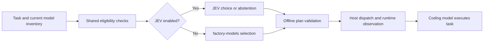

# JEV and model selection

The factory has one model-planning entry point and two selectors:

| Configuration | Selection behavior |
| --- | --- |
| `jev.enabled: false` or omitted | Run factory-models using its existing task assessment and preference policy. No JEV key or provider request. |
| `jev.enabled: true` | JEV chooses among currently eligible coding models. Save the choice and its provenance in the plan. |



JEV replaces the selection decision when enabled. Availability discovery, provider restrictions, model identity, context/tool/effort requirements and actual host controls remain necessary inputs and enforcement. Selection does not switch the already-running agent or establish which model actually executed.

## Configuration and commands

In `factory.json`:

```json
"jev": {
  "enabled": false,
  "provider": "typesafe",
  "model": "jev-1.13.0",
  "claim_mode": "shadow"
}
```

Set `enabled` to true for JEV selection after [one-time credential setup](runbooks/authentication.md) with `software-factory auth login`. All JEV operations automatically use the saved user credential; `TYPESAFE_API_KEY` is an explicit environment override for CI. Keep keys out of arguments and repository files. `claim_mode` only controls the separate claim/source assessment helper; it does not hide model-routing results.

Prepare the request and actual client catalog through the model runbook, then run:

```sh
software-factory models plan --input .factory/local/models/request.json --catalog .factory/local/models/catalog.json --output .factory/local/models/plan.json
software-factory models validate --kind plan --input .factory/local/models/plan.json
```

The `factory-start` skill instructs the agent to read the toggle and use this same command; no workflow code calls routing itself. The native `factory-models` skill supplies shared inventory, constraints and host-dispatch instructions. Enabled planning uses JEV's decision instead of the preference selector. Validation, status, result checks and dispatch never request another JEV judgment.

## Decision contract

The selector receives the supplied task objective, assignment requirements and compact reviewed descriptions of eligible models: ID, provider, identity, lifecycle, capabilities, efforts, default effort, context window, cost tier and the guidance `strengths` text. When `jev.enabled` is true, the objective and any `strengths` text from request `research` are sent verbatim to TypeSafe; keep secrets, credentials, private paths and transcripts out of them. Guidance sources, model ID aliases and null fields are not sent; the saved plan still binds the full eligible entries by hash. It does not scan or transmit repository source. Treat supplied text as data; it cannot override the option set or constraints. Explicit user preferences remain constraints. Preference ranking used by factory-models is not a hard exclusion for JEV.

JEV returns a typed Choice from the offered candidates or abstains. The application checks exact answer IDs/model, option membership, probability coverage, distribution bounds and usage. The plan records the decision and input/configuration/control identities; offline validation rebuilds the request from current inputs and replays the saved response, so it detects inconsistent edits and changed controls. Plan records are local-unattested and not tamper-proof: anyone who can edit the file can rewrite a consistent record. It does not trust a vendor label as authentication.

The configuration identity covers only routing-relevant settings: the JEV `enabled`, `provider`, `model`, `deadline_ms`, `max_request_bytes`, `max_response_bytes` and `min_confidence` values (with defaults applied), `profile` and `model_selection`. Editing `jev.claim_mode`, other claim-helper settings (`claim_accept_confidence`, `max_pairs`, `cache`, `cache_ttl_seconds`, `max_source_age_hours`), limits, checks or other unrelated `factory.json` fields keeps saved plans valid. Changing a routing-relevant value requires regenerating the plan. The plan also binds an implementation hash of the factory's `routing.py`, `models.py`, `jev.py` and `core.py`, so an upgrade that changes any of them invalidates saved and registered plans. Any `factory.json` edit while `models plan` is running still aborts that run.

Dependent parent/child choices obey the selected host's constraints. When `jev.enabled` is true, a plan permits at most 16 assignments. The request byte limit (`max_request_bytes`, at most 24576) is the practical candidate ceiling: each compact candidate with shipped-length guidance adds about 410 bytes, so about 56 candidates fit with a short objective and about 46 with a 4096-character objective; longer model IDs or `strengths` text reduce this. The structural cap of 254 candidates plus abstain is rarely reachable. An oversize request fails before any credential lookup. Each automatic choice makes one provider decision; explicit user choices and empty candidate sets make none. The sequential decisions of one plan share a budget of `deadline_ms` (3 seconds by default) times the number of assignments, capped at 120 seconds; each decision gets the smaller of `deadline_ms` and the remaining budget. Within that deadline the transport retries at most twice on HTTP 408, 429, 500–599 (including 529 overloaded) and connection errors, with exponential backoff (0.5 s, doubling, capped at 5 s, up to 25% jitter) or a numeric `Retry-After`, as [TypeSafe's API guidance](https://docs.typesafe.ai/api) and its official SDK defaults recommend. A retry happens only if its wait plus a minimal attempt window fits before the deadline; otherwise the last error is reported. HTTP 400, 401, 403, 404, 422, invalid responses, deadline expiry and cancellation are never retried. Each receipt records its provider `attempts`.

Outcomes are exact:

- JEV abstention, or a choice whose confidence is below `jev.min_confidence` (reason `low_confidence`), leaves that assignment `unresolved` in a written plan (exit 0) for a human to decide.
- Missing credentials, provider errors, HTTP errors, deadline failure or a malformed response exit 2 and write no plan. Completed receipts from earlier assignments are discarded.
- Neither case falls back to factory-models. Disable JEV explicitly to return to factory-models.

Confidence describes the returned distribution; it is not a measured probability that a coding task will pass. Following TypeSafe's [confidence-routing guidance](https://docs.typesafe.ai/patterns/confidence-routing), low-confidence choices route to a human instead of being applied: `jev.min_confidence` (0–1, default 0.6, within the provider's example floors of 0.5–0.6) is the floor for model selection. Each JEV receipt records the answer's `confidence`, the `threshold` in force and `attempts`; offline validation reproduces the same outcome from the recorded contract threshold. Raise the floor when a wrong model choice is costly. Plans recorded before this gate keep their recorded meaning when validated as history. No new ranking benchmark is claimed.

## Where JEV fits

JEV supports typed classification and routing, so choosing among an eligible model set is a suitable integration. It cannot write code, edit files or run tools for a coding agent. Those stay with the selected coding model. This follows the [provider's coding-agent boundary](https://docs.typesafe.ai/introduction/coding-agents) and [Choice API](https://docs.typesafe.ai/api). Its [confidence documentation](https://docs.typesafe.ai/confidence) explains the limits of interpreting concentration as correctness.

The separate claim helper remains available for source assessment during planning and review. JEV does not replace actual checks, independent review, permissions, repair budgets or release evidence. Native execution still needs supported host settings and observed identity; see [Codex app-server](https://developers.openai.com/codex/app-server) for the distinction between catalog metadata and starting a configured turn.

## Evaluation

Mocked tests establish toggle routing, hard constraints, response validation, no-network validation and failure behavior. To establish selection quality, compare JEV choices with factory-models on representative completed tasks using the same catalogs and constraints. Measure completed-task checks, defects found, total latency and cost, abstentions and routing errors. Keep held-out cases and failed requests. Current implementation tests do not establish paid provider quality or an improvement over factory-models.
