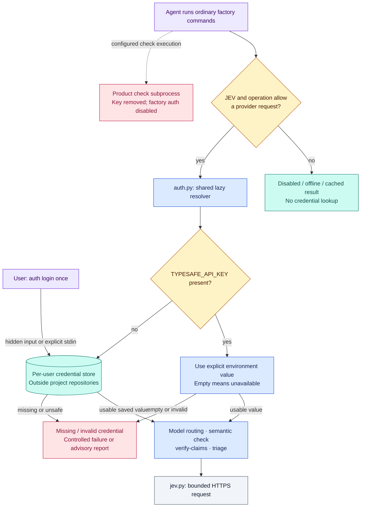

# Set up TypeSafe credentials once

Run this in your own terminal, using Software Factory 0.2.8 or later:

```sh
software-factory auth login
software-factory auth status
```

`login` prompts for the API key with hidden input. It saves a credential for your OS user, outside project repositories. `status` reports whether a credential is available and which source wins; it never prints the key or calls TypeSafe. These commands work without an initialized project. Login does not enable JEV, validate the key remotely, or authorize provider spending.

Then enable `jev.enabled` in the project's `factory.json` under the existing authorization for JEV use, and run `software-factory render`. Ordinary commands automatically find the credential:

```sh
uv run --locked --project .factory software-factory models plan --input .factory/local/models/request.json --catalog .factory/local/models/catalog.json --output .factory/local/models/plan-jev.json
```

The same lookup serves `semantic check`, `semantic verify-claims` and `triage`. Agent Bash calls do not need a credential flag, shell export, IDE restart or special launcher. The agent must run as the same OS user, have the same user-config location, and be permitted to read that store. A container, different account, remote machine or sandbox without that access needs its own credential provisioned once.

## Existing projects must upgrade their pinned runtime

Updating the global CLI alone does not change `.factory/src`. Install the new release, then preview and apply a project upgrade:

```sh
software-factory upgrade /path/to/project --dry-run
software-factory upgrade /path/to/project
```

Handle any ownership conflicts and existing changes through the upgrade procedure. A runtime before 0.2.8 only reads the environment and cannot find this store. `auth` commands always use the invoked CLI's release, while ordinary project commands use the pinned runtime. A project-local CLI can also run `auth` if it is new enough.

## Credential sources and storage

Resolution is deterministic:

1. If `TYPESAFE_API_KEY` is present, it overrides the saved credential. An explicitly empty/whitespace-only variable makes the credential unavailable without falling back to a different account; unset it to use the saved key. Invalid nonempty values produce a controlled failure.
2. Otherwise, use the saved TypeSafe credential for this user.
3. If neither exists, fail with an actionable missing-credential result. Commands never prompt for a key during agent execution.

On Linux and other POSIX systems, the store is `${XDG_CONFIG_HOME:-~/.config}/software-factory/credentials.json`. It is a **plaintext secret file**, restricted to its owner: directory mode 700 and file mode 600. On Windows, `%APPDATA%/software-factory/credentials.json` contains a DPAPI-protected value bound to the user, with interactive protection dialogs disabled. This implementation's Windows branch is covered with simulated tests; real Windows execution requires separate validation.

Relative config locations, Git-repository destinations, symlink/reparse-point stores, unexpected file types and unsafe POSIX permissions are refused. Writes replace the credential atomically. A malformed or insecure existing store fails closed; inspect or move it aside deliberately before logging in again. No repository `.env` files are auto-loaded. Installation, upgrade and project uninstall do not manage or remove the user credential store.

For CI, inject `TYPESAFE_API_KEY` through the runner's secret mechanism, or explicitly pipe a secret to `software-factory auth login --stdin`. There is no token-in-argv option. The key stays out of command results, model receipts, semantic caches, logs generated by the auth commands, and project exports. Never paste it into the agent conversation.

## Rotation and logout

Run `auth login` again to replace the saved key. For removal:

```sh
software-factory auth logout
```

Logout removes only the saved TypeSafe credential. It does not revoke the provider key or unset an environment variable in your parent process. The result indicates if an environment override is still present; unset `TYPESAFE_API_KEY` there when appropriate. Revoke a compromised key through the provider.

## Diagnostics and boundaries

`auth status` exits 0 when a usable local credential is configured, and 2 when missing, blocked or invalid. `provider_validation: not_checked` means no provider authentication or paid inference was attempted. `doctor` and `semantic status` retain their configuration-only credential behavior; use `auth status` specifically for credential inspection.

JEV disabled, offline/no-network operations and valid semantic cache hits bypass credential lookup. Storage failures produce `credential_unavailable`; the factory never silently substitutes another selector. Semantic/triage operations preserve their advisory unavailable reports.

Configured product checks receive neither the key environment variable nor automatic factory credential access: the runner sets `SOFTWARE_FACTORY_AUTH_DISABLED=1` in those child processes. This prevents accidental inherited or nested-factory use. It is not an OS security boundary against arbitrary code running as the same user; use the product's isolated runner for untrusted checks.

## Credential architecture



The diagram shows the credential dependency, not execution isolation. The resolver runs inside the invoked global CLI for `auth`, and inside the project's pinned runtime for project operations. `SOFTWARE_FACTORY_AUTH_DISABLED=1` short-circuits resolution before either source is read.
