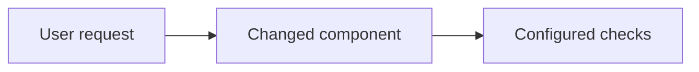

# Mission plan

This template guides planning; the actual task records live in `mission.json`.

## Approach

Explain the chosen implementation and material tradeoffs using current repository evidence. Match detail to the task's uncertainty.

## Architecture

Show the components this change touches and how data or control flows between them. `mission accept-scope` requires this section with at least one fenced `mermaid` block whose first line names a diagram type (flowchart, graph, sequenceDiagram, classDiagram, stateDiagram, stateDiagram-v2, erDiagram, C4Context, C4Container, C4Component, architecture-beta or block-beta), followed by at least one real node or edge line (leading `%%` comments and front matter are allowed), and refuses the unedited example below. The PR packet copies the diagram.

## Task contracts

For each task record its ID, inspectable outcome, dependencies, permitted paths (explicit globs such as `tests/**`), assigned role, acceptance criteria IDs (`criteria`, every `AC-<n>` mapped to at least one task), required check IDs and expected result. Add tasks through the state tool so dependency and scope rules apply.

## Lanes

Group the tasks into waves that can run side by side: wave 1 has no dependencies, each later wave depends only on earlier ones. Name the critical path (the longest chain of dependencies) and say why any task must wait. Tasks in the same wave must own disjoint paths, each with its own tests; put shared files (registries, `__init__.py`, lockfiles, dependency changes) in a final wiring task. `software-factory mission lanes --mission ID` shows the waves the recorded tasks produce.

## Integration and verification

State the integration order and how the lanes merge back. Map acceptance criteria to actual checks or explicit manual validation. Include final verification and independent review.

## Risks

List the material risks of this change: compatibility, data, security, performance or rollout. For each, state its likelihood, impact and mitigation or detection. Write "None identified" with a reason when that is true. The PR packet copies this section and refuses a missing or unedited one.

## Replanning record

Record material changes to the approach, the evidence that caused them and effects on existing tasks. Preserve completed work and decision history.
